# 实时数仓第1天讲义

**学习目标**

- 理解实时数仓项目的基本需求、整体架构
- 了解常用实施方案
- 能够编写Canal客户端采集binlog消息
- 理解google ProtoBuf序列化方式
- 理解Canal采集原理

## 实时计算应用场景及技术选型

### 实时计算在公司的用处

公司内已经采用MR与spark之类的技术，做离线计算，为什么用实时计算？

- 离线的伤痛就是数据出的**太慢**
- 有对实时数据要求高的场景
	- 比如：滴滴的风控、淘宝双十一营销大屏、电商购物推荐、春晚的观众数统计

### 实时计算技术选型

Spark streaming、 Struct streaming、Storm、JStorm（阿里）、Kafka Streaming、Flink技术栈这么多，到底选哪个？

- 公司员工的技术基础
- 流行
- 技术复用
- 场景

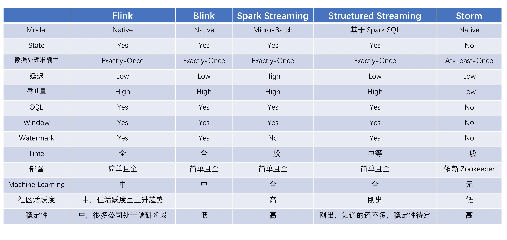

如果对延迟要求不高的情况下，可以使用 Spark Streaming，它拥有丰富的高级 API，使用简单，并且 Spark 生态也比较成熟，吞吐量大，部署简单，社区活跃度较高，从 GitHub 的 star 数量也可以看得出来现在公司用 Spark 还是居多的，并且在新版本还引入了 Structured Streaming，这也会让 Spark 的体系更加完善。

如果对延迟性要求非常高的话，可以使用当下最火的流处理框架 Flink，采用原生的流处理系统，保证了低延迟性，在 API 和容错性方面做的也比较完善，使用和部署相对来说也是比较简单的，加上国内阿里贡献的 Blink，相信接下来 Flink 的功能将会更加完善，发展也会更加好，社区问题的响应速度也是非常快的，另外还有专门的钉钉大群和中文列表供大家提问，每周还会有专家进行直播讲解和答疑。

本次项目：使用**Flink**来搭建实时计算平台

## 项目实施环境

### 数据

- 目前已经存在订单数据，业务系统会将订单写入到mysql
- 流量日志数据（访问日志）

### 硬件

- 4台物理服务器
- 服务配置
	- CPU x 2：志强E5 主频2.8 - 3.6，24核（12核 per CPU）
	- 内存（768GB/1T）
	- 硬盘（1T x 8 SAS盘）
	- 网卡（4口 2000M）

### 人员

- 4人
	- 前端（2人 JavaWeb + UI前端）
	- 大数据（2人）

### 时间

- 一个月左右
- 阶段
	- 需求调研、评审（2周）
	- 设计架构（3天）
	- 编码、集成（1周）
	- 测试、上线（2天）

## 需求分析

### 项目需求

- 目前已经有前端可视化项目，公司需要大屏用于展示订单数据与用户访问数据


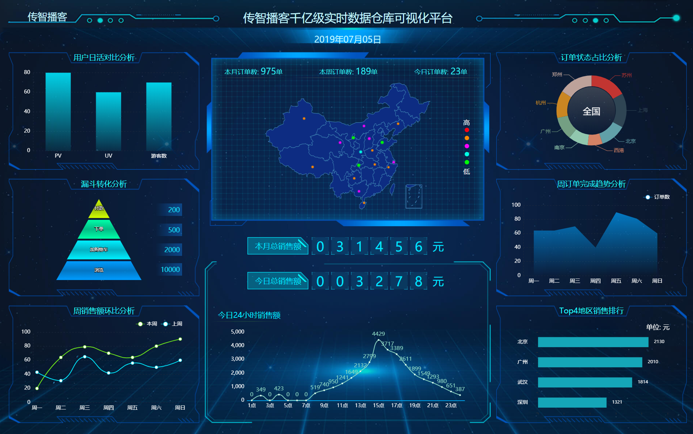

### 数据来源

#### PV/UV数据来源

- 来自于页面埋点数据，将用户访问数据发送到web服务器
- web服务器直接将该部分数据写入到kafka的**click_log** topic 中

#### 销售金额与订单量数据来源

- 订单数据来源于mysql

- 订单数据来自binlog日志，通过canal 实时将数据写入到kafka的**order**的topic中


#### 购物车数据和评论数据

- 购物车数据一般不会直接操作mysql，通过客户端程序写入到kafka（消息队列）中

- 评论数据也是通过客户端程序写入kafka（消息队列）中

## 常见的软件工程模型

### 瀑布模型

- 在一些银行、政府、等传统行业系统中，该模式应用较多

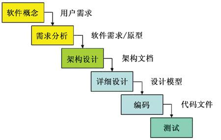

特点

1. 上一项开发活动其成果作为本次活动的输入
2. 给出本次活动的工作成果，作为输出传给下一项开发活动
3. 对本次活动的实施工作成果进行**评审**
	- 评审通过，则继续进行下一项开发活动
	- 评审不通过，则返回前一项，甚至更前项的活动

使用范围

1. 用户需求很清楚，在开发过程中变化较少
2. 开发人员对业务很熟悉
3. 用户的使用环境较稳定；
4. 开发工作对用户参与的要求很低。

优点

1. 人员职责明确、具体，有利于大型软件开发过程中人员的组织、管理
2. 实施步骤清晰、有序，有利于软件开发方法和工具的研究，保障大型项目质量/效率

缺点

1. 开发过程一般不能逆转，否则代价太大
2. 实际的项目开发很难严格按该模型进行
3. 客户很难清楚地给出所有的需求
4. 软件实际情况必须到项目开发的后期才能看到，这要求客户有足够的耐心


### 敏捷开发

#### 介绍

- 以用户的需求进化为核心，采用迭代、循序渐进的方法进行软件开发
- 把一个大项目分为多个相互联系，但也可独立运行的小项目，并分别完成
- 在开发过程中软件一直处于可使用状态

#### 优点

- 敏捷确实是项目进入实质开发迭代阶段，用户很快可以看到一个基线架构版的产品
- 注重市场快速反应能力，也即具体应对能力，客户前期满意度高

#### 缺点

- 敏捷注重人员的沟通，忽略文档的重要性，若项目人员流动大太，又给维护带来不少难度，特别项目存在新手比较多时，老员工比较累
- 需要项目中存在经验较强的人，要不大项目中容易遇到瓶颈问题

## 实现方案

### JAVA 方式实现

- 一些中小企业当中，由于数据量较小（比如核心总量小于20万条），可通过Java程序定时查询mysql实现
- 比较简单，但是粗暴实用
- 仅仅需要对mysql做一些优化即可，比较增加索引

### 通过flink方案实现

- 数据量特别大、无法直接通过mysql查询完成，有时候根本查询不动
- 要求实时性高，比如阿里巴巴双十一监控大屏，要求延迟不超过1秒

### 实时数仓项目架构

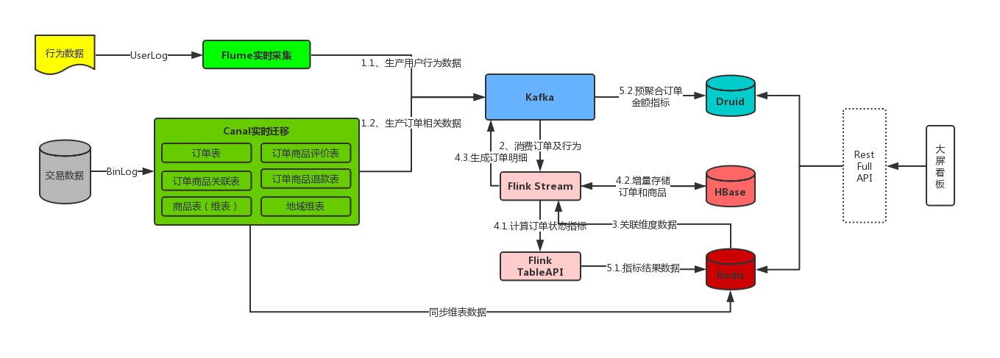


## Canal介绍

### 简介

* 基于 MySQL 数据库增量日志解析，提供增量数据订阅和消费

* 早期阿里巴巴因为杭州和美国双机房部署，存在跨机房同步的业务需求，实现方式主要是基于业务 trigger（触发器） 获取增量变更
* 从 2010 年开始，业务逐步尝试数据库日志解析获取增量变更进行同步，由此衍生出了大量的数据库增量订阅和消费业务，基于日志增量订阅和消费的业务包括
	* 数据库镜像
	* 数据库实时备份
	* 索引构建和实时维护(拆分异构索引、倒排索引等)
	* 业务 cache 刷新
	* 带业务逻辑的增量数据处理

* 当前的 canal 支持源端 MySQL 版本包括 5.1.x , 5.5.x , 5.6.x , 5.7.x , 8.0.x

* github地址：https://github.com/alibaba/canal

## 环境部署

### MySQL

- MySQL需要先开启 Binlog 写入功能，配置 binlog-format 为 ROW 模式，/etc/my.cnf 中配置如下

	```properties
	[mysqld]
	log-bin=mysql-bin # 开启 binlog
	binlog-format=ROW # 选择 ROW 模式
	server_id=1 # 配置 MySQL replaction 需要定义，不要和 canal 的 slaveId 重复
	```

- 授权 canal 链接 MySQL 账号具有作为 MySQL slave 的权限, 如果已有账户可直接 grant

	```sql
	CREATE USER root IDENTIFIED BY '123456';  
	GRANT ALL PRIVILEGES ON *.* TO 'root'@'%' ;
	FLUSH PRIVILEGES;
	```

### Canal安装

重要版本更新说明：

1. canal 1.1.x 版本（[release_note](https://github.com/alibaba/canal/releases)）,性能与功能层面有较大的突破,重要提升包括:
   - 整体性能测试&优化,提升了150%. #726 参考: [Performance](https://github.com/alibaba/canal/wiki/Performance)
   - 原生支持prometheus监控 #765 [Prometheus QuickStart](https://github.com/alibaba/canal/wiki/Prometheus-QuickStart)
   - 原生支持kafka消息投递 #695 [Canal Kafka/RocketMQ QuickStart](https://github.com/alibaba/canal/wiki/Canal-Kafka-RocketMQ-QuickStart)
   - 原生支持aliyun rds的binlog订阅 (解决自动主备切换/oss binlog离线解析) 参考: [Aliyun RDS QuickStart](https://github.com/alibaba/canal/wiki/aliyun-RDS-QuickStart)
   - 原生支持docker镜像 #801 参考: [Docker QuickStart](https://github.com/alibaba/canal/wiki/Docker-QuickStart)
2. canal 1.1.4版本，迎来最重要的WebUI能力，引入canal-admin工程，支持面向WebUI的canal动态管理能力，支持配置、任务、日志等在线白屏运维能力，具体文档：[Canal Admin Guide](https://github.com/alibaba/canal/wiki/Canal-Admin-Guide)

**注意**：本次学习使用的版本canal1.0.24

环境要求：

* 安装好ZooKeeper

- 解压缩

	```shell
	mkdir /export/servers/canal
	tar -zxvf canal.deployer-1.0.24.tar.gz  -C /export/servers/canal/
	```

- 解压完成后，进入 /export/servers/canal/ 目录，可以看到如下结构

	```shell
	drwxr-xr-x. 2 root root 4096 2月   1 14:07 bin
	drwxr-xr-x. 4 root root 4096 2月   1 14:07 conf
	drwxr-xr-x. 2 root root 4096 2月   1 14:07 lib
	drwxrwxrwx. 2 root root 4096 4月   1 2017 logs
	```

- canal server的conf下有几个配置文件

  ~~~
  [root@node1 canal]# tree conf/ 
  conf/
  ├── canal.properties
  ├── example
  │   └── instance.properties
  ├── logback.xml
  └── spring
      ├── default-instance.xml
      ├── file-instance.xml
      ├── group-instance.xml
      ├── local-instance.xml
      └── memory-instance.xml
  ~~~

  - 先来看`canal.properties`的**common**属性前四个配置项：

    ~~~properties
    canal.id= 1
    canal.ip=
    canal.port= 11111
    canal.zkServers=
    ~~~

    canal.id是canal的编号，在集群环境下，不同canal的id不同，注意它和mysql的server_id不同。

    ip这里不指定，默认为本机，比如上面是192.168.1.120，端口号是11111。zk用于canal cluster。

  - 再看下`canal.properties`下**destinations**相关的配置：

    ~~~properties
    #################################################
    #########       destinations        ############# 
    #################################################
    canal.destinations = example
    canal.conf.dir = ../conf
    canal.auto.scan = true
    canal.auto.scan.interval = 5
    
    canal.instance.global.mode = spring 
    canal.instance.global.lazy = false
    canal.instance.global.spring.xml = classpath:spring/file-instance.xml
    ~~~

    这里的canal.destinations = example可以设置多个，比如example1,example2，
    则需要创建对应的两个文件夹，并且每个文件夹下都有一个instance.properties文件。

    全局的canal实例管理用spring，这里的`file-instance.xml`最终会实例化所有的destinations instances:

  - 全局的canal实例管理用spring，这里的`file-instance.xml`最终会实例化所有的destinations instances:

    ~~~xml
    <!-- properties -->
    <bean class="com.alibaba.otter.canal.instance.spring.support.PropertyPlaceholderConfigurer" lazy-init="false">
    	<property name="ignoreResourceNotFound" value="true" />
        <property name="systemPropertiesModeName" value="SYSTEM_PROPERTIES_MODE_OVERRIDE"/><!-- 允许system覆盖 -->
        <property name="locationNames">
        	<list>
            	<value>classpath:canal.properties</value>                     <value>classpath:${canal.instance.destination:}/instance.properties</value>
             </list>
        </property>
    </bean>
    
    <bean id="socketAddressEditor" class="com.alibaba.otter.canal.instance.spring.support.SocketAddressEditor" />
    <bean class="org.springframework.beans.factory.config.CustomEditorConfigurer"> 
       <property name="propertyEditorRegistrars">
    	   <list>
        		<ref bean="socketAddressEditor" />
           </list>
       </property>
    </bean>
    <bean id="instance" class="com.alibaba.otter.canal.instance.spring.CanalInstanceWithSpring">
    	<property name="destination" value="${canal.instance.destination}" />
        <property name="eventParser">
        	<ref local="eventParser" />
        </property>
        <property name="eventSink">
            <ref local="eventSink" />
        </property>
        <property name="eventStore">
            <ref local="eventStore" />
        </property>
        <property name="metaManager">
            <ref local="metaManager" />
        </property>
        <property name="alarmHandler">
            <ref local="alarmHandler" />
        </property>
    </bean>
    ~~~

    比如`canal.instance.destination`等于example，就会加载`example/instance.properties`配置文件

- 修改instance 配置文件 

  vi conf/example/instance.properties
  ```properties
  ## mysql serverId，这里的slaveId不能和myql集群中已有的server_id一样
  canal.instance.mysql.slaveId = 1234
  
  #  按需修改成自己的数据库信息
  #################################################
  ...
  canal.instance.master.address=192.168.1.120:3306
  # username/password,数据库的用户名和密码
  ...
  canal.instance.dbUsername = root
  canal.instance.dbPassword = 123456
  #################################################
  ```

- 启动

  ```
  sh bin/startup.sh
  ```

- 查看 server 日志

  ```shell
  vi logs/canal/canal.log
  ```

  ```shell
  2013-02-05 22:45:27.967 [main] INFO  com.alibaba.otter.canal.deployer.CanalLauncher - ## start the canal server.
  2013-02-05 22:45:28.113 [main] INFO  com.alibaba.otter.canal.deployer.CanalController - ## start the canal server[10.1.29.120:11111]
  2013-02-05 22:45:28.210 [main] INFO  com.alibaba.otter.canal.deployer.CanalLauncher - ## the canal server is running now ......
  ```

- 查看 instance 的日志

  ```shell
  vi logs/example/example.log
  ```

  ```shell
  2013-02-05 22:50:45.636 [main] INFO  c.a.o.c.i.spring.support.PropertyPlaceholderConfigurer - Loading properties file from class path resource [canal.properties]
  2013-02-05 22:50:45.641 [main] INFO  c.a.o.c.i.spring.support.PropertyPlaceholderConfigurer - Loading properties file from class path resource [example/instance.properties]
  2013-02-05 22:50:45.803 [main] INFO  c.a.otter.canal.instance.spring.CanalInstanceWithSpring - start CannalInstance for 1-example 
  2013-02-05 22:50:45.810 [main] INFO  c.a.otter.canal.instance.spring.CanalInstanceWithSpring - start successful....
  ```

- 关闭

  ```shell
  sh bin/stop.sh
  ```

## Canal客户端开发

### 创建client_demo项目

### Maven依赖

```xml
<dependencies>
	<dependency>
    	<groupId>com.alibaba.otter</groupId>
        <artifactId>canal.client</artifactId>
        <version>1.0.24</version>
    </dependency>
    <dependency>
        <groupId>com.alibaba</groupId>
        <artifactId>fastjson</artifactId>
        <version>1.2.58</version>
    </dependency>
</dependencies>
```

### 在canal_demo模块创建包结构

| 包名                   | 说明         |
| ---------------------- | ------------ |
| com.itheima.canal_demo | 代码存放目录 |

### 开发步骤

1. 创建Connector
2. 连接Cannal服务器，并订阅
3. 解析Canal消息，并打印

#### Canal消息格式

```java
Entry  
    Header  
        logfileName [binlog文件名]  
        logfileOffset [binlog position]  
        executeTime [binlog里记录变更发生的时间戳,精确到秒]  
        schemaName   
        tableName  
        eventType [insert/update/delete类型]  
    entryType   [事务头BEGIN/事务尾END/数据ROWDATA]  
    storeValue  [byte数据,可展开，对应的类型为RowChange]  
RowChange
    isDdl       [是否是ddl变更操作，比如create table/drop table]
    sql         [具体的ddl sql]
rowDatas    [具体insert/update/delete的变更数据，可为多条，1个binlog event事件可对应多条变更，比如批处理]
    beforeColumns [Column类型的数组，变更前的数据字段]
    afterColumns [Column类型的数组，变更后的数据字段]
    Column
    index
    sqlType     [jdbc type]
    name        [column name]
    isKey       [是否为主键]
    updated     [是否发生过变更]
    isNull      [值是否为null]
    value       [具体的内容，注意为string文本]
```

参考代码：

```json
public class CanalClientEntrance {
    public static void main(String[] args) {
        // 1. 创建链接
        CanalConnector connector = CanalConnectors.newSingleConnector(new InetSocketAddress("192.168.88.120",
                11111), "example", "canal", "canal");

        // 指定一次性获取数据的条数
        int batchSize = 5 * 1024;
        boolean running = true;

        try {
            while(running) {
                // 2. 建立连接
                connector.connect();
                // 回滚上次的get请求，重新获取数据
                connector.rollback();
                // 订阅匹配日志
                connector.subscribe("itcast_shop.*");
                while(running) {
                    // 批量拉取binlog日志，一次性获取多条数据
                    Message message = connector.getWithoutAck(batchSize);
                    // 获取batchId
                    long batchId = message.getId();
                    // 获取binlog数据的条数
                    int size = message.getEntries().size();
                    if(batchId == -1 || size == 0) {

                    }
                    else {
                        printSummary(message);
                    }
                    // 确认指定的batchId已经消费成功
                    connector.ack(batchId);
                }
            }
        } finally {
            // 断开连接
            connector.disconnect();
        }
    }

    private static void printSummary(Message message) {
        // 遍历整个batch中的每个binlog实体
        for (CanalEntry.Entry entry : message.getEntries()) {
            // 事务开始
            if(entry.getEntryType() == CanalEntry.EntryType.TRANSACTIONBEGIN || entry.getEntryType() == CanalEntry.EntryType.TRANSACTIONEND) {
                continue;
            }

            // 获取binlog文件名
            String logfileName = entry.getHeader().getLogfileName();
            // 获取logfile的偏移量
            long logfileOffset = entry.getHeader().getLogfileOffset();
            // 获取sql语句执行时间戳
            long executeTime = entry.getHeader().getExecuteTime();
            // 获取数据库名
            String schemaName = entry.getHeader().getSchemaName();
            // 获取表名
            String tableName = entry.getHeader().getTableName();
            // 获取事件类型 insert/update/delete
            String eventTypeName = entry.getHeader().getEventType().toString().toLowerCase();

            System.out.println("logfileName" + ":" + logfileName);
            System.out.println("logfileOffset" + ":" + logfileOffset);
            System.out.println("executeTime" + ":" + executeTime);
            System.out.println("schemaName" + ":" + schemaName);
            System.out.println("tableName" + ":" + tableName);
            System.out.println("eventTypeName" + ":" + eventTypeName);

            CanalEntry.RowChange rowChange = null;

            try {
                // 获取存储数据，并将二进制字节数据解析为RowChange实体
                rowChange = CanalEntry.RowChange.parseFrom(entry.getStoreValue());
            } catch (InvalidProtocolBufferException e) {
                e.printStackTrace();
            }

            // 迭代每一条变更数据
            for (CanalEntry.RowData rowData : rowChange.getRowDatasList()) {
                // 判断是否为删除事件
                if(entry.getHeader().getEventType() == CanalEntry.EventType.DELETE) {
                    System.out.println("---delete---");
                    printColumnList(rowData.getBeforeColumnsList());
                    System.out.println("---");
                }
                // 判断是否为更新事件
                else if(entry.getHeader().getEventType() == CanalEntry.EventType.UPDATE) {
                    System.out.println("---update---");
                    printColumnList(rowData.getBeforeColumnsList());
                    System.out.println("---");
                    printColumnList(rowData.getAfterColumnsList());
                }
                // 判断是否为插入事件
                else if(entry.getHeader().getEventType() == CanalEntry.EventType.INSERT) {
                    System.out.println("---insert---");
                    printColumnList(rowData.getAfterColumnsList());
                    System.out.println("---");
                }
            }
        }
    }

    // 打印所有列名和列值
    private static void printColumnList(List<CanalEntry.Column> columnList) {
        for (CanalEntry.Column column : columnList) {
            System.out.println(column.getName() + "\t" + column.getValue());
        }
    }
}
```


### 转换为JSON数据

* 复制上述代码，将binlog日志封装在一个Map结构中，使用fastjson转换为JSON格式

参考代码：

```java
    // binlog解析为json字符串
    private static String binlogToJson(Message message) throws InvalidProtocolBufferException {
        // 1. 创建Map结构保存最终解析的数据
        Map rowDataMap = new HashMap<String, Object>();

        // 2. 遍历message中的所有binlog实体
        for (CanalEntry.Entry entry : message.getEntries()) {
            // 只处理事务型binlog
            if(entry.getEntryType() == CanalEntry.EntryType.TRANSACTIONBEGIN ||
            entry.getEntryType() == CanalEntry.EntryType.TRANSACTIONEND) {
                continue;
            }

            // 获取binlog文件名
            String logfileName = entry.getHeader().getLogfileName();
            // 获取logfile的偏移量
            long logfileOffset = entry.getHeader().getLogfileOffset();
            // 获取sql语句执行时间戳
            long executeTime = entry.getHeader().getExecuteTime();
            // 获取数据库名
            String schemaName = entry.getHeader().getSchemaName();
            // 获取表名
            String tableName = entry.getHeader().getTableName();
            // 获取事件类型 insert/update/delete
            String eventType = entry.getHeader().getEventType().toString().toLowerCase();

            rowDataMap.put("logfileName", logfileName);
            rowDataMap.put("logfileOffset", logfileOffset);
            rowDataMap.put("executeTime", executeTime);
            rowDataMap.put("schemaName", schemaName);
            rowDataMap.put("tableName", tableName);
            rowDataMap.put("eventType", eventType);

            // 封装列数据
            Map columnDataMap = new HashMap<String, Object>();
            // 获取所有行上的变更
            CanalEntry.RowChange rowChange = CanalEntry.RowChange.parseFrom(entry.getStoreValue());
            List<CanalEntry.RowData> columnDataList = rowChange.getRowDatasList();
            for (CanalEntry.RowData rowData : columnDataList) {
                if(eventType.equals("insert") || eventType.equals("update")) {
                    for (CanalEntry.Column column : rowData.getAfterColumnsList()) {
                        columnDataMap.put(column.getName(), column.getValue());
                    }
                }
                else if(eventType.equals("delete")) {
                    for (CanalEntry.Column column : rowData.getBeforeColumnsList()) {
                        columnDataMap.put(column.getName(), column.getValue());
                    }
                }
            }

            rowDataMap.put("columns", columnDataMap);
        }

        return JSON.toJSONString(rowDataMap);
    }
```


## Protocol Buffers

### Protocol Buffers介绍

* Protocal Buffers(简称protobuf)是谷歌的一项技术，用于结构化的数据序列化、反序列化，常用于RPC 系统和持续数据存储系统。
* 其类似于XML生成和解析，但protobuf的效率高于XML，不过protobuf生成的是**字节码**，可读性比XML差，类似的还有json、Java的Serializable等。
* 很适合做数据存储或 RPC 数据交换格式。可用于通讯协议、数据存储等领域的语言无关、平台无关、可扩展的序列化结构数据格式。
* 参考：https://zhuanlan.zhihu.com/p/53339153

### Idea 安装protobuf插件

 安装插件protobuf Support，之后重启 

* 找到资料包中的protobuf-jetbrains-plugin-0.13.0.zip，在IDEA中安装插件即可

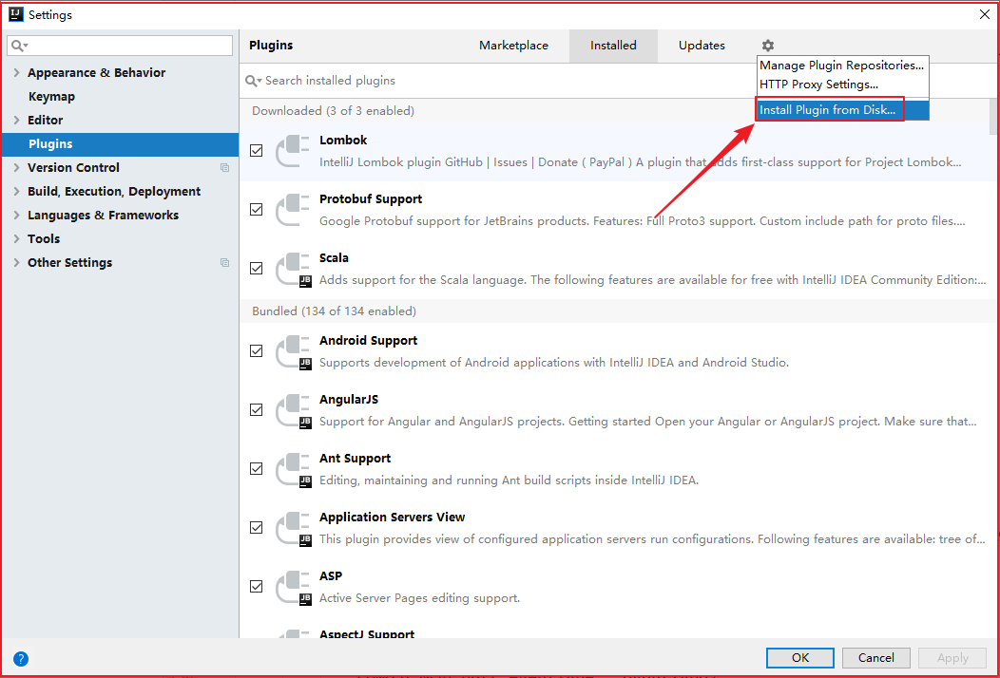

### 使用ProtoBuf序列化数据

#### 配置Maven依赖与插件

```xml
<dependencies>
        <dependency>
            <groupId>com.google.protobuf</groupId>
            <artifactId>protobuf-java</artifactId>
            <version>3.4.0</version>
        </dependency>
</dependencies>

    <build>
        <extensions>
            <extension>
                <groupId>kr.motd.maven</groupId>
                <artifactId>os-maven-plugin</artifactId>
                <version>1.6.2</version>
            </extension>
        </extensions>
        <plugins>
            <!-- Protobuf插件 -->
            <plugin>
                <groupId>org.xolstice.maven.plugins</groupId>
                <artifactId>protobuf-maven-plugin</artifactId>
                <version>0.5.0</version>
                <configuration>
                    <protoSourceRoot>${project.basedir}/src/main/proto</protoSourceRoot>
                    <protocArtifact>
                        com.google.protobuf:protoc:3.1.0:exe:${os.detected.classifier}
                    </protocArtifact>
                </configuration>
                <executions>
                    <execution>
                        <goals>
                            <goal>compile</goal>
                        </goals>
                    </execution>
                </executions>
            </plugin>
        </plugins>
    </build>
```

#### 编写 proto 文件

* protobuf3的语法参考讲义中的「 protobuf3 语法」

* 在main文件夹下，创建 proto 目录，并编写proto文件

```protobuf
syntax = "proto3";
option java_package = "com.itheima.protobuf";
option java_outer_classname = "DemoModel";

message User {
    int32 id = 1;
    string name = 2;
    string sex = 3;
}
```

>  注意：classname不能与message name一样

#### protobuf与java类型对照表

| .proto Type | Java Type  | 备注                                                         |
| ----------- | ---------- | ------------------------------------------------------------ |
| double      | double     |                                                              |
| float       | float      |                                                              |
| int32       | int        | 使用可变长度编码。负数编码效率低下–如果您的字段可能具有负值，请改用sint32。 |
| int64       | long       | 使用可变长度编码。负数编码效率低下–如果您的字段可能具有负值，请改用sint64。 |
| uint32      | int        | 使用可变长度编码。                                           |
| uint64      | long       | 使用可变长度编码。                                           |
| sint32      | int        | 使用可变长度编码。有符号的int值。与常规int32相比，它们更有效地编码负数。 |
| sint64      | long       | 使用可变长度编码。有符号的int值。与常规int64相比，它们更有效地编码负数。 |
| fixed32     | int        | 始终为四个字节。如果值通常大于2^28，则比uint32更有效。       |
| fixed64     | long       | 始终为八个字节。如果值通常大于2^56，则比uint64更有效。       |
| sfixed32    | int        | 始终为四个字节。                                             |
| sfixed64    | long       | 始终为八个字节。                                             |
| bool        | boolean    |                                                              |
| string      | String     | 字符串必须始终包含UTF-8编码或7位ASCII文本。                  |
| bytes       | ByteString | 可以包含任意字节序列。                                       |


#### 执行protobuf:compile编译命令

* 将 proto 文件编译成java代码

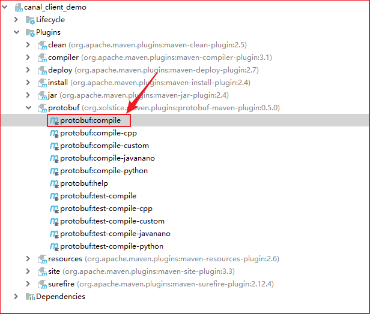

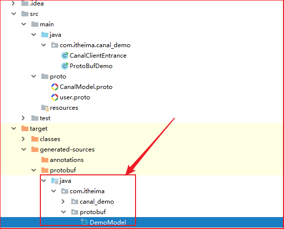

#### 编写代码使用ProtoBuf序列化、反序列化

```java
public class ProtoBufDemo {
    public static void main(String[] args) throws InvalidProtocolBufferException {
        DemoModel.User.Builder builder = DemoModel.User.newBuilder();
        builder.setId(1);
        builder.setName("张三");
        builder.setSex("男");

        byte[] bytes = builder.build().toByteArray();
        System.out.println("--protobuf---");
        for (byte b : bytes) {
            System.out.print(b);
        }
        System.out.println();
        System.out.println("---");

        DemoModel.User user = DemoModel.User.parseFrom(bytes);

        System.out.println(user.getName());
    }
}
```

### BINLOG转换为ProtoBuf消息

#### 编写proto描述文件：CanalModel.proto

```protobuf
syntax = "proto3";
option java_package = "com.itheima.canal_demo";
option java_outer_classname = "CanalModel";

/* 行数据 */
message RowData {
    string logfilename = 15;
    uint64 logfileoffset = 14;
    uint64 executeTime = 1;
    string schemaName = 2;
    string tableName = 3;
    string eventType = 4;

    /* 列数据 */
    map<string, string> columns = 5;
}
```
#### 添加binglogToProtoBuf序列化消息为Protobuf

```java
    // binlog解析为ProtoBuf
    private static byte[] binlogToProtoBuf(Message message) throws InvalidProtocolBufferException {
        // 1. 构建CanalModel.RowData实体
        CanalModel.RowData.Builder rowDataBuilder = CanalModel.RowData.newBuilder();

        // 1. 遍历message中的所有binlog实体
        for (CanalEntry.Entry entry : message.getEntries()) {
            // 只处理事务型binlog
            if(entry.getEntryType() == CanalEntry.EntryType.TRANSACTIONBEGIN ||
                    entry.getEntryType() == CanalEntry.EntryType.TRANSACTIONEND) {
                continue;
            }

            // 获取binlog文件名
            String logfileName = entry.getHeader().getLogfileName();
            // 获取logfile的偏移量
            long logfileOffset = entry.getHeader().getLogfileOffset();
            // 获取sql语句执行时间戳
            long executeTime = entry.getHeader().getExecuteTime();
            // 获取数据库名
            String schemaName = entry.getHeader().getSchemaName();
            // 获取表名
            String tableName = entry.getHeader().getTableName();
            // 获取事件类型 insert/update/delete
            String eventType = entry.getHeader().getEventType().toString().toLowerCase();

            rowDataBuilder.setLogfilename(logfileName);
            rowDataBuilder.setLogfileoffset(logfileOffset);
            rowDataBuilder.setExecuteTime(executeTime);
            rowDataBuilder.setSchemaName(schemaName);
            rowDataBuilder.setTableName(tableName);
            rowDataBuilder.setEventType(eventType);

            // 获取所有行上的变更
            CanalEntry.RowChange rowChange = CanalEntry.RowChange.parseFrom(entry.getStoreValue());
            List<CanalEntry.RowData> columnDataList = rowChange.getRowDatasList();
            for (CanalEntry.RowData rowData : columnDataList) {
                if(eventType.equals("insert") || eventType.equals("update")) {
                    for (CanalEntry.Column column : rowData.getAfterColumnsList()) {
                        rowDataBuilder.putColumns(column.getName(), column.getValue().toString());
                    }
                }
                else if(eventType.equals("delete")) {
                    for (CanalEntry.Column column : rowData.getBeforeColumnsList()) {
                        rowDataBuilder.putColumns(column.getName(), column.getValue().toString());
                    }
                }
            }
        }

        return rowDataBuilder.build().toByteArray();
    } 
```

## Canal原理

### MySQL主备复制原理

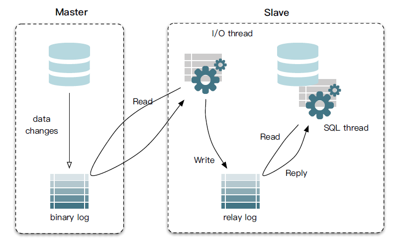

- MySQL master 将数据变更写入二进制日志( binary log, 其中记录叫做二进制日志事件  log events，可以通过 show binlog events 进行查看)
- MySQL slave 将 master 的 binary log events 拷贝到它的中继日志(relay log)
- MySQL slave 重放 relay log 中事件，将数据变更反映它自己的数据，以此来达到数据一致。

>**mysql的binlog**
>
>它记录了所有的DDL和DML(除了数据查询语句)语句，以事件形式记录，还包含语句所执行的消耗的时间。主要用来备份和数据同步。
>
>binlog 有三种： STATEMENT、ROW、MIXED 
>
>*  STATEMENT 记录的是执行的sql语句  
>* ROW 记录的是真实的行数据记录  
>*  MIXED 记录的是1+2，优先按照1的模式记录 

> **名词解释**：
>
> *什么是中继日志*
>
> 从服务器I/O线程将主服务器的二进制日志读取过来记录到从服务器本地文件，然后从服务器SQL线程会读取relay-log日志的内容并应用到从服务器，从而使从服务器和主服务器的数据保持一致

### canal 工作原理

 

- canal 模拟 MySQL slave 的交互协议，伪装自己为 MySQL slave ，向 MySQL master 发送dump 协议
- MySQL master 收到 dump 请求，开始推送 binary log 给 slave (即 canal )
- canal 解析 binary log 对象(原始为 byte 流)

### 架构

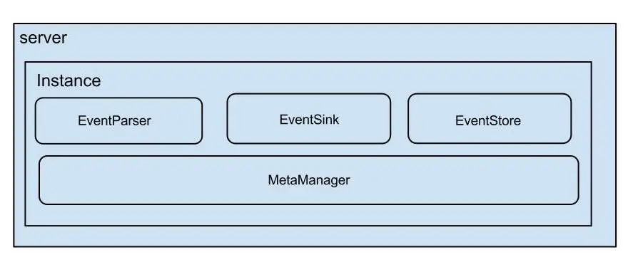 

- server 代表一个 canal 运行实例，对应于一个 jvm
- instance 对应于一个数据队列 （1个 canal server 对应 1..n 个 instance )
- instance 下的子模块
  - eventParser: 数据源接入，模拟 slave 协议和 master 进行交互，协议解析
  - eventSink: Parser 和 Store 链接器，进行数据过滤，加工，分发的工作
  - eventStore: 数据存储
  - metaManager: 增量订阅 & 消费信息管理器

EventParser在向mysql发送dump命令之前会先从Log Position中获取上次解析成功的位置(如果是第一次启动，则**获取初始指定位置**或者当前数据段binlog位点)。mysql接受到dump命令后，由EventParser从mysql上pull binlog数据进行解析并传递给EventSink(*传递给EventSink模块进行数据存储，是一个阻塞操作，直到存储成功* )，传送成功之后更新Log Position。流程图如下：


- EventSink起到一个类似channel的功能，可以对数据进行*过滤、分发/路由(1:n)、归并(n:1)和加工*。EventSink是连接EventParser和EventStore的桥梁。
- EventStore实现模式是内存模式，内存结构为环形队列，由三个指针(Put、Get和Ack)标识数据存储和读取的位置。
- MetaManager是增量订阅&消费信息管理器，增量订阅和消费之间的协议包括get/ack/rollback，分别为：
  -  Message getWithoutAck(int batchSize)，允许指定batchSize，一次可以获取多条，每次返回的对象为Message，包含的内容为：batch id[唯一标识]和entries[具体的数据对象]
  - void rollback(long batchId)，顾名思义，回滚上次的get请求，重新获取数据。基于get获取的batchId进行提交，避免误操作
  - void ack(long batchId)，顾名思议，确认已经消费成功，通知server删除数据。基于get获取的batchId进行提交，避免误操作

### server/client交互协议

#### canal client & server

[canal client](https://github.com/alibaba/canal/blob/master/example/src/main/java/com/alibaba/otter/canal/example/AbstractCanalClientTest.java)与canal server之间是C/S模式的通信，客户端采用NIO，服务端采用Netty。
canal server启动后，如果没有canal client，那么canal server不会去mysql拉取binlog。
即Canal客户端主动发起拉取请求，服务端才会模拟一个MySQL Slave节点去主节点拉取binlog。
通常Canal客户端是一个死循环，这样客户端一直调用get方法，服务端也就会一直拉取binlog

~~~
BIO、NIO、AIO的区别
IO的方式通常分为几种，同步阻塞的BIO、同步非阻塞的NIO、异步非阻塞的AIO。

同步阻塞IO：在此种方式下，用户进程在发起一个IO操作以后，必须等待IO操作的完成，只有当真正完成了IO操作以后，用户进程才能运行。JAVA传统的IO模型属于此种方式！

同步非阻塞IO:在此种方式下，用户进程发起一个IO操作以后边可返回做其它事情，但是用户进程需要时不时的询问IO操作是否就绪，这就要求用户进程不停的去询问，从而引入不必要的CPU资源浪费。其中目前JAVA的NIO就属于同步非阻塞IO。

异步阻塞IO：此种方式下是指应用发起一个IO操作以后，不等待内核IO操作的完成，等内核完成IO操作以后会通知应用程序，这其实就是同步和异步最关键的区别，同步必须等待或者主动的去询问IO是否完成，那么为什么说是阻塞的呢？因为此时是通过select系统调用来完成的，而select函数本身的实现方式是阻塞的，而采用select函数有个好处就是它可以同时监听多个文件句柄，从而提高系统的并发性！

异步非阻塞IO:在此种模式下，用户进程只需要发起一个IO操作然后立即返回，等IO操作真正的完成以后，应用程序会得到IO操作完成的通知，此时用户进程只需要对数据进行处理就好了，不需要进行实际的IO读写操作，因为真正的IO读取或者写入操作已经由内核完成了。目前Java中还没有支持此种IO模型。

参考资料：https://www.cnblogs.com/straybirds/p/9479158.html
~~~


```java
public class AbstractCanalClientTest {
    protected void process() {
        int batchSize = 5 * 1024; // 一次请求拉取多条记录
        try {
            connector.connect(); // 先连接服务端
            connector.subscribe(); // 订阅
            // keep send request to canal server, thus canal server can fetch binlog from mysql
            while (running) { 
                Message message = connector.getWithoutAck(batchSize); // 获取指定数量的数据
                long batchId = message.getId();
                int size = message.getEntries().size();
                printSummary(message, batchId, size);
                printEntry(message.getEntries());
                connector.ack(batchId); // 提交确认
                //connector.rollback(batchId); // 处理失败, 回滚数据
            }
        } finally {
            connector.disconnect();
        }
    }
}
```

canal client与canal server之间属于增量订阅/消费，流程图如下：（其中C端是canal client，S端是canal server）


canal client调用[`connect()`](https://github.com/alibaba/canal/blob/master/client/src/main/java/com/alibaba/otter/canal/client/impl/SimpleCanalConnector.java#L129)方法时，发送的数据包（PacketType）类型为：

1. [**handshake**](https://github.com/alibaba/canal/blob/master/server/src/main/java/com/alibaba/otter/canal/server/netty/handler/HandshakeInitializationHandler.java)，
2. [**ClientAuthentication**](https://github.com/alibaba/canal/blob/master/server/src/main/java/com/alibaba/otter/canal/server/netty/handler/ClientAuthenticationHandler.java)。

canal client调用`subscribe()`方法，类型为[**subscription**]。

对应服务端采用netty处理RPC请求（[`CanalServerWithNetty`](https://github.com/alibaba/canal/blob/master/server/src/main/java/com/alibaba/otter/canal/server/netty/CanalServerWithNetty.java)）:

~~~java
public class CanalServerWithNetty extends AbstractCanalLifeCycle implements CanalServer {
    public void start() {
        bootstrap.setPipelineFactory(new ChannelPipelineFactory() {
            public ChannelPipeline getPipeline() throws Exception {
                ChannelPipeline pipelines = Channels.pipeline();
                pipelines.addLast(FixedHeaderFrameDecoder.class.getName(), new FixedHeaderFrameDecoder());
                // 处理客户端的HANDSHAKE请求
                pipelines.addLast(HandshakeInitializationHandler.class.getName(),
                    new HandshakeInitializationHandler(childGroups));
                // 处理客户端的CLIENTAUTHENTICATION请求
                pipelines.addLast(ClientAuthenticationHandler.class.getName(),
                    new ClientAuthenticationHandler(embeddedServer));

                // 处理客户端的会话请求，包括SUBSCRIPTION，GET等
                SessionHandler sessionHandler = new SessionHandler(embeddedServer);
                pipelines.addLast(SessionHandler.class.getName(), sessionHandler);
                return pipelines;
            }
        });
    }
}
~~~

ClientAuthenticationHandler处理鉴权后，会移除HandshakeInitializationHandler和[ClientAuthenticationHandler](https://github.com/alibaba/canal/blob/master/server/src/main/java/com/alibaba/otter/canal/server/netty/handler/ClientAuthenticationHandler.java#L81)。
最重要的是会话处理器[**SessionHandler**](https://github.com/alibaba/canal/blob/master/server/src/main/java/com/alibaba/otter/canal/server/netty/handler/SessionHandler.java)。

以client发送GET，server从mysql得到binlog后，返回**MESSAGES**给client为例，说明client和server的rpc交互过程：

SimpleCanalConnector发送[**GET**](https://github.com/alibaba/canal/blob/master/client/src/main/java/com/alibaba/otter/canal/client/impl/SimpleCanalConnector.java#L272)请求，并读取响应结果的流程：

~~~java
public Message getWithoutAck(int batchSize, Long timeout, TimeUnit unit) throws CanalClientException {
    waitClientRunning();
    int size = (batchSize <= 0) ? 1000 : batchSize;
    long time = (timeout == null || timeout < 0) ? -1 : timeout; // -1代表不做timeout控制
    if (unit == null) unit = TimeUnit.MILLISECONDS;  //默认是毫秒

    // client发送GET请求
    writeWithHeader(Packet.newBuilder()
        .setType(PacketType.GET)
        .setBody(Get.newBuilder()
            .setAutoAck(false)
            .setDestination(clientIdentity.getDestination())
            .setClientId(String.valueOf(clientIdentity.getClientId()))
            .setFetchSize(size)
            .setTimeout(time)
            .setUnit(unit.ordinal())
            .build()
            .toByteString())
        .build()
        .toByteArray());
    // client获取GET结果    
    return receiveMessages();
}

private Message receiveMessages() throws IOException {
    // 读取server发送的数据包
    Packet p = Packet.parseFrom(readNextPacket());
    switch (p.getType()) {
        case MESSAGES: {
            Messages messages = Messages.parseFrom(p.getBody());
            Message result = new Message(messages.getBatchId());
            for (ByteString byteString : messages.getMessagesList()) {
                result.addEntry(Entry.parseFrom(byteString));
            }
            return result;
        }
    }
}
~~~

服务端SessionHandler处理客户端发送的[**GET**](https://github.com/alibaba/canal/blob/master/server/src/main/java/com/alibaba/otter/canal/server/netty/handler/SessionHandler.java#L105)请求流程：

~~~java
case GET:
    // 读取客户端发送的数据包，封装为Get对象
    Get get = CanalPacket.Get.parseFrom(packet.getBody());
    // destination表示canal instance
    if (StringUtils.isNotEmpty(get.getDestination()) && StringUtils.isNotEmpty(get.getClientId())) {
        clientIdentity = new ClientIdentity(get.getDestination(), Short.valueOf(get.getClientId()));
        Message message = null;
        if (get.getTimeout() == -1) {// 是否是初始值
            message = embeddedServer.getWithoutAck(clientIdentity, get.getFetchSize());
        } else {
            TimeUnit unit = convertTimeUnit(get.getUnit());
            message = embeddedServer.getWithoutAck(clientIdentity, get.getFetchSize(), get.getTimeout(), unit);
        }
        // 设置返回给客户端的数据包类型为MESSAGES   
        Packet.Builder packetBuilder = CanalPacket.Packet.newBuilder();
        packetBuilder.setType(PacketType.MESSAGES);
        // 构造Message
        Messages.Builder messageBuilder = CanalPacket.Messages.newBuilder();
        messageBuilder.setBatchId(message.getId());
        if (message.getId() != -1 && !CollectionUtils.isEmpty(message.getEntries())) {
            for (Entry entry : message.getEntries()) {
                messageBuilder.addMessages(entry.toByteString());
            }
        }
        packetBuilder.setBody(messageBuilder.build().toByteString());
        // 输出数据，返回给客户端
        NettyUtils.write(ctx.getChannel(), packetBuilder.build().toByteArray(), null);
    }
~~~

具体的网络协议格式，可参见：[CanalProtocol.proto](https://github.com/alibaba/canal/blob/master/protocol/src/main/java/com/alibaba/otter/canal/protocol/CanalProtocol.proto)

get/ack/rollback协议介绍：

- Message getWithoutAck(int batchSize)
	- 允许指定batchSize，一次可以获取多条，每次返回的对象为Message，包含的内容为：
		* batch id 唯一标识
		* entries 具体的数据对象，对应的数据对象格式：[EntryProtocol.proto](https://github.com/alibaba/canal/blob/master/protocol/src/main/java/com/alibaba/otter/canal/protocol/EntryProtocol.proto)
- getWithoutAck(int batchSize, Long timeout, TimeUnit unit)
	- 相比于getWithoutAck(int batchSize)，允许设定获取数据的timeout超时时间
		* 拿够batchSize条记录或者超过timeout时间
		* timeout=0，阻塞等到足够的batchSize
- void rollback(long batchId)
	- 回滚上次的get请求，重新获取数据。基于get获取的batchId进行提交，避免误操作
- void ack(long batchId)
	- 确认已经消费成功，通知server删除数据。基于get获取的batchId进行提交，避免误操作

EntryProtocol.protod对应的canal消息结构如下：

~~~xml
Entry  
    Header  
        logfileName [binlog文件名]  
        logfileOffset [binlog position]  
        executeTime [binlog里记录变更发生的时间戳,精确到秒]  
        schemaName   
        tableName  
        eventType [insert/update/delete类型]  
    entryType   [事务头BEGIN/事务尾END/数据ROWDATA]  
    storeValue  [byte数据,可展开，对应的类型为RowChange]  
      
RowChange  
    isDdl       [是否是ddl变更操作，比如create table/drop table]  
    sql         [具体的ddl sql]  
    rowDatas    [具体insert/update/delete的变更数据，可为多条，1个binlog event事件可对应多条变更，比如批处理]  
        beforeColumns [Column类型的数组，变更前的数据字段]  
        afterColumns [Column类型的数组，变更后的数据字段]  
          
Column   
    index         
    sqlType     [jdbc type]  
    name        [column name]  
    isKey       [是否为主键]  
    updated     [是否发生过变更]  
    isNull      [值是否为null]  
    value       [具体的内容，注意为string文本]
~~~

SessionHandler中服务端处理客户端的其他类型请求，都会调用[CanalServerWithEmbedded](https://github.com/alibaba/canal/blob/master/server/src/main/java/com/alibaba/otter/canal/server/embedded/CanalServerWithEmbedded.java)的相关方法：

~~~java
case SUBSCRIPTION:
        Sub sub = Sub.parseFrom(packet.getBody());
        embeddedServer.subscribe(clientIdentity);
case GET:
        Get get = CanalPacket.Get.parseFrom(packet.getBody());
        message = embeddedServer.getWithoutAck(clientIdentity, get.getFetchSize());
case CLIENTACK:
        ClientAck ack = CanalPacket.ClientAck.parseFrom(packet.getBody());
        embeddedServer.ack(clientIdentity, ack.getBatchId());
case CLIENTROLLBACK:
        ClientRollback rollback = CanalPacket.ClientRollback.parseFrom(packet.getBody());
        embeddedServer.rollback(clientIdentity);// 回滚所有批次

~~~

所以真正的处理逻辑在CanalServerWithEmbedded中，下面重点来了。。。

#### **CanalServerWithEmbedded**

CanalServer包含多个Instance，它的成员变量`canalInstances`记录了instance名称与[实例](https://github.com/alibaba/canal/blob/master/instance/core/src/main/java/com/alibaba/otter/canal/instance/core/AbstractCanalInstance.java)的映射关系。
因为是一个Map，所以同一个Server不允许出现相同instance名称（本例中实例名称为example），
比如不能同时有两个example在一个server上。但是允许一个Server上有example1和example2。

> 注意：`CanalServer`中最重要的是`CanalServerWithEmbedded`，而CanalServerWithEmbedded中最重要的是`CanalInstance`。

~~~java
public class CanalServerWithEmbedded extends AbstractCanalLifeCycle implements CanalServer, CanalService {
    private Map<String, CanalInstance> canalInstances;
    private CanalInstanceGenerator     canalInstanceGenerator;
}
~~~

下图表示一个server配置了两个Canal实例（instance），每个Client连接一个Instance。
每个Canal实例模拟为一个MySQL的slave，所以每个Instance的slaveId必须不一样。
比如图中两个Instance的id分别是1234和1235，它们都会拉取MySQL主节点的binlog。

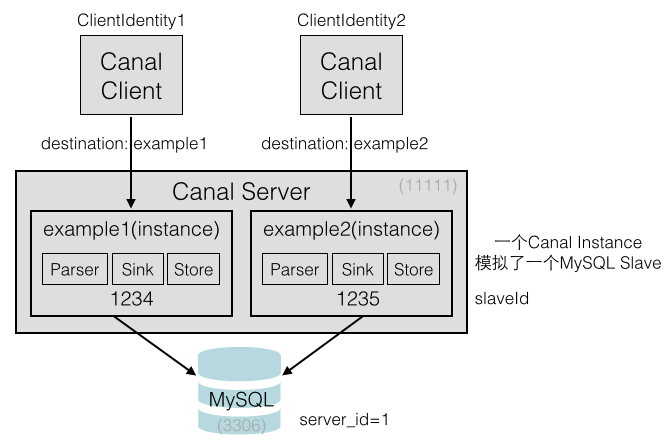

这里每个Canal Client都对应一个Instance，每个Client在启动时，
都会指定一个Destination，这个Destination就表示Instance的名称。
所以CanalServerWithEmbedded处理各种请求时的参数都有ClientIdentity，
从ClientIdentity中获取destination，就可以获取出对应的CanalInstance。

理解下各个组件的对应关系：

- Canal Client通过destination找出Canal Server中对应的Canal Instance。
- 一个Canal Server可以配置多个Canal Instances。

下面以CanalServerWithEmbedded的订阅方法为例：

1. 根据客户端标识获取CanalInstance
2. 向CanalInstance的元数据管理器订阅当前客户端
3. 从元数据管理中获取客户端的游标
4. 通知CanalInstance订阅关系发生变化

>注意：提供订阅方法的作用是：MySQL新增了一张表，客户端原先没有同步这张表，现在需要同步，所以需要重新订阅。

~~~java
public void subscribe(ClientIdentity clientIdentity) throws CanalServerException {
    // ClientIdentity表示Canal Client客户端，从中可以获取出客户端指定连接的Destination
    // 由于CanalServerWithEmbedded记录了每个Destination对应的Instance，可以获取客户端对应的Instance
    CanalInstance canalInstance = canalInstances.get(clientIdentity.getDestination());
    if (!canalInstance.getMetaManager().isStart()) {
        canalInstance.getMetaManager().start(); // 启动Instance的元数据管理器
    }
    canalInstance.getMetaManager().subscribe(clientIdentity); // 执行一下meta订阅
    Position position = canalInstance.getMetaManager().getCursor(clientIdentity);
    if (position == null) {
        position = canalInstance.getEventStore().getFirstPosition();// 获取一下store中的第一条
        if (position != null) {
            canalInstance.getMetaManager().updateCursor(clientIdentity, position); // 更新一下cursor
        }
    }
    // 通知下订阅关系变化
    canalInstance.subscribeChange(clientIdentity);
}
~~~

每个CanalInstance中包括了四个组件：**EventParser、EventSink、EventStore、MetaManager**。

服务端主要的处理方法包括get/ack/rollback，这三个方法都会用到Instance上面的几个内部组件，主要还是EventStore和MetaManager：

在这之前，要先理解EventStore的含义，EventStore是一个RingBuffer，有三个指针：**Put、Get、Ack**。

- Put: Canal Server从MySQL拉取到数据后，放到内存中，Put增加
- Get: 消费者（Canal Client）从内存中消费数据，Get增加
- Ack: 消费者消费完成，Ack增加。并且会删除Put中已经被Ack的数据

这三个操作与Instance组件的关系如下：

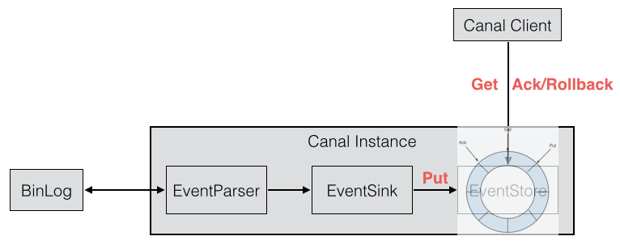

客户端通过canal server获取mysql binlog有几种方式（get方法和getWithoutAck）：

- 如果timeout为null，则采用tryGet方式，即时获取
- 如果timeout不为null
  1. timeout为0，则采用get阻塞方式，获取数据，不设置超时，直到有足够的batchSize数据才返回
  2. timeout不为0，则采用get+timeout方式，获取数据，超时还没有batchSize足够的数据，有多少返回多少

~~~java
private Events<Event> getEvents(CanalEventStore eventStore, Position start, int batchSize, Long timeout,
                                TimeUnit unit) {
    if (timeout == null) {
        return eventStore.tryGet(start, batchSize); // 即时获取
    } else if (timeout <= 0){
        return eventStore.get(start, batchSize); // 阻塞获取
    } else {
        return eventStore.get(start, batchSize, timeout, unit); // 异步获取
    }
}
~~~

> 注意：EventStore的实现采用了类似Disruptor的RingBuffer环形缓冲区。RingBuffer的实现类是MemoryEventStoreWithBuffer

get方法和getWithoutAck方法的区别是：

- get方法会立即调用ack
- getWithoutAck方法不会调用ack


#### **EventStore**

以10条数据为例，初始时current=-1，第一个元素起始next=0，end=9，循环`[0,9]`所有元素。
List元素为(A,B,C,D,E,F,G,H,I,J)

| next | entries[next] | next-current-1 | list element |
| :--: | :-----------: | :------------: | :----------: |
|  0   |  entries[0]   |   0-(-1)-1=0   |      A       |
|  1   |  entries[1]   |   1-(-1)-1=1   |      B       |
|  2   |  entries[2]   |   2-(-1)-1=2   |      C       |
|  3   |  entries[3]   |   3-(-1)-1=3   |      D       |
|  .   |     ……….      |      ……….      |      .       |
|  9   |  entries[9]   |   9-(-1)-1=9   |      J       |

第一批10个元素put完成后，putSequence设置为end=9。假设第二批又Put了5个元素:(K,L,M,N,O)

current=9，起始next=9+1=10，end=9+5=14，在Put完成后，putSequence设置为end=14。

| next | entries[next] | next-current-1 | list element |
| :--: | :-----------: | :------------: | :----------: |
|  10  |  entries[10]  |   10-(9)-1=0   |      K       |
|  11  |  entries[11]  |   11-(9)-1=1   |      L       |
|  12  |  entries[12]  |   12-(9)-1=2   |      M       |
|  13  |  entries[13]  |   13-(9)-1=3   |      N       |
|  14  |  entries[14]  |   14-(9)-1=3   |      O       |

这里假设环形缓冲区的最大大小为15个（源码中是16MB），那么上面两批一共产生了15个元素，刚好填满了环形缓冲区。
如果又有Put事件进来，由于环形缓冲区已经满了，没有可用的slot，则Put操作会被阻塞，直到被消费掉。

下面是Put填充环形缓冲区的代码，检查可用slot（checkFreeSlotAt方法）在几个put方法中。

~~~java
public class MemoryEventStoreWithBuffer extends AbstractCanalStoreScavenge implements CanalEventStore<Event>, CanalStoreScavenge {
    private static final long INIT_SQEUENCE = -1;
    private int               bufferSize    = 16 * 1024;
    private int               bufferMemUnit = 1024;                         // memsize的单位，默认为1kb大小
    private int               indexMask;
    private Event[]           entries;

    // 记录下put/get/ack操作的三个下标
    private AtomicLong        putSequence   = new AtomicLong(INIT_SQEUENCE); // 代表当前put操作最后一次写操作发生的位置
    private AtomicLong        getSequence   = new AtomicLong(INIT_SQEUENCE); // 代表当前get操作读取的最后一条的位置
    private AtomicLong        ackSequence   = new AtomicLong(INIT_SQEUENCE); // 代表当前ack操作的最后一条的位置

    // 启动EventStore时，创建指定大小的缓冲区，Event数组的大小是16*1024
    // 也就是说算个数的话，数组可以容纳16000个事件。算内存的话，大小为16MB
    public void start() throws CanalStoreException {
        super.start();
        indexMask = bufferSize - 1;
        entries = new Event[bufferSize];
    }

    // EventParser解析后，会放入内存中（Event数组，缓冲区）
    private void doPut(List<Event> data) {
        long current = putSequence.get(); // 取得当前的位置，初始时为-1，第一个元素为-1+1=0
        long end = current + data.size(); // 最末尾的位置，假设Put了10条数据，end=-1+10=9
        // 先写数据，再更新对应的cursor,并发度高的情况，putSequence会被get请求可见，拿出了ringbuffer中的老的Entry值
        for (long next = current + 1; next <= end; next++) {
            entries[getIndex(next)] = data.get((int) (next - current - 1));
        }
        putSequence.set(end);
    } 
}
~~~

Put是生产数据，Get是消费数据，Get一定不会超过Put。比如Put了10条数据，Get最多只能获取到10条数据。但有时候为了保证Get处理的速度，Put和Get并不会相等。
可以把Put看做是生产者，Get看做是消费者。生产者速度可以很快，消费者则可以慢慢地消费。比如Put了1000条，而Get我们只需要每次处理10条数据。

仍然以前面的示例来说明Get的流程，初始时current=-1，假设Put了两批数据一共15条，maxAbleSequence=14，而Get的BatchSize假设为10。
初始时next=current=-1，end=-1。通过startPosition，会设置next=0。最后end又被赋值为9，即循环缓冲区[0,9]一共10个元素。

~~~java
private Events<Event> doGet(Position start, int batchSize) throws CanalStoreException {
    LogPosition startPosition = (LogPosition) start;

    long current = getSequence.get();
    long maxAbleSequence = putSequence.get();
    long next = current;
    long end = current;
    // 如果startPosition为null，说明是第一次，默认+1处理
    if (startPosition == null || !startPosition.getPostion().isIncluded()) { // 第一次订阅之后，需要包含一下start位置，防止丢失第一条记录
        next = next + 1;
    }

    end = (next + batchSize - 1) < maxAbleSequence ? (next + batchSize - 1) : maxAbleSequence;
    // 提取数据并返回
    for (; next <= end; next++) {
        Event event = entries[getIndex(next)];
        if (ddlIsolation && isDdl(event.getEntry().getHeader().getEventType())) {
            // 如果是ddl隔离，直接返回
            if (entrys.size() == 0) {
                entrys.add(event);// 如果没有DML事件，加入当前的DDL事件
                end = next; // 更新end为当前
            } else {
                // 如果之前已经有DML事件，直接返回了，因为不包含当前next这记录，需要回退一个位置
                end = next - 1; // next-1一定大于current，不需要判断
            }
            break;
        } else {
            entrys.add(event);
        }
    }
    // 处理PositionRange，然后设置getSequence为end
    getSequence.compareAndSet(current, end)
}
~~~

ack操作的上限是Get，假设Put了15条数据，Get了10条数据，最多也只能Ack10条数据。Ack的目的是清空缓冲区中已经被Get过的数据

~~~java
public void ack(Position position) throws CanalStoreException {
    cleanUntil(position);
}

public void cleanUntil(Position position) throws CanalStoreException {
    long sequence = ackSequence.get();
    long maxSequence = getSequence.get();

    boolean hasMatch = false;
    long memsize = 0;
    for (long next = sequence + 1; next <= maxSequence; next++) {
        Event event = entries[getIndex(next)];
        memsize += calculateSize(event);
        boolean match = CanalEventUtils.checkPosition(event, (LogPosition) position);
        if (match) {// 找到对应的position，更新ack seq
            hasMatch = true;

            if (batchMode.isMemSize()) {
                ackMemSize.addAndGet(memsize);
                // 尝试清空buffer中的内存，将ack之前的内存全部释放掉
                for (long index = sequence + 1; index < next; index++) {
                    entries[getIndex(index)] = null;// 设置为null
                }
            }

            ackSequence.compareAndSet(sequence, next)
        }
    }
}
~~~

rollback回滚方法的实现则比较简单，将getSequence回退到ack位置。

~~~java
public void rollback() throws CanalStoreException {
    getSequence.set(ackSequence.get());
    getMemSize.set(ackMemSize.get());
}
~~~

下图展示了RingBuffer的几个操作示例：

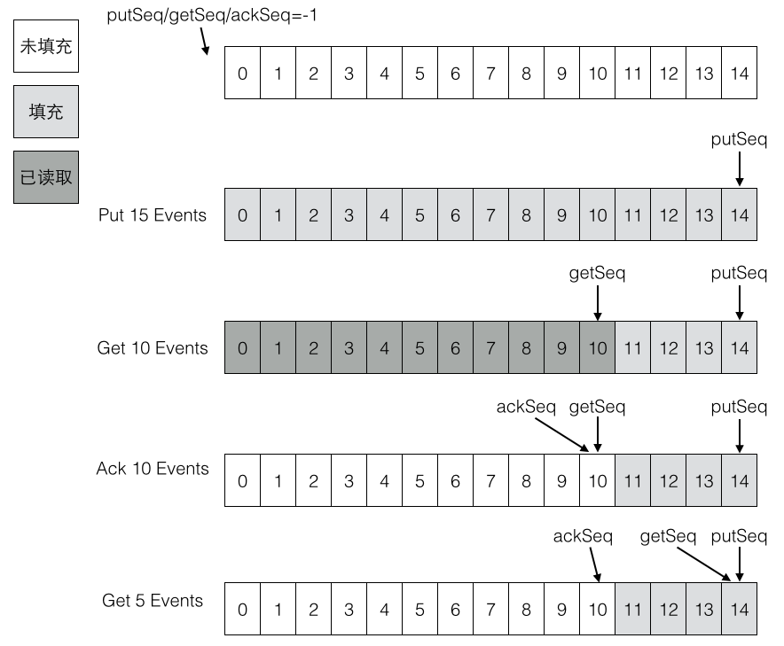

#### **EventParser WorkFlow**

EventStore负责存储解析后的Binlog事件，而解析动作负责拉取Binlog，它的流程比较复杂。需要和MetaManager进行交互。
比如要记录每次拉取的Position，这样下一次就可以从上一次的最后一个位置继续拉取。所以MetaManager应该是有状态的。

EventParser的流程如下：

1. Connection获取上一次解析成功的位置 (如果第一次启动，则获取初始指定的位置或者是当前数据库的binlog位点)
2. Connection建立链接，发送BINLOG_DUMP指令
3. Mysql开始推送Binaly Log
4. 接收到的Binaly Log的通过Binlog parser进行协议解析，补充一些特定信息
5. 传递给EventSink模块进行数据存储，是一个阻塞操作，直到存储成功
6. 存储成功后，定时记录Binaly Log位置

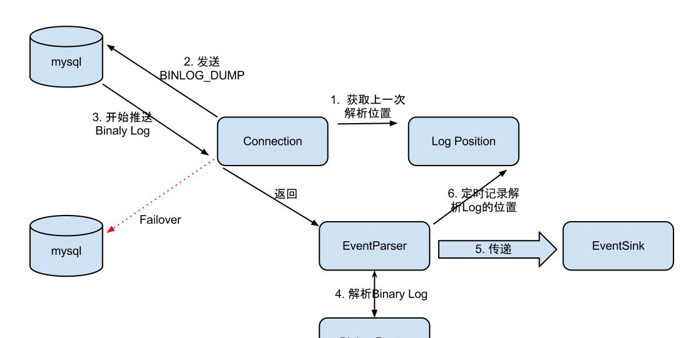


