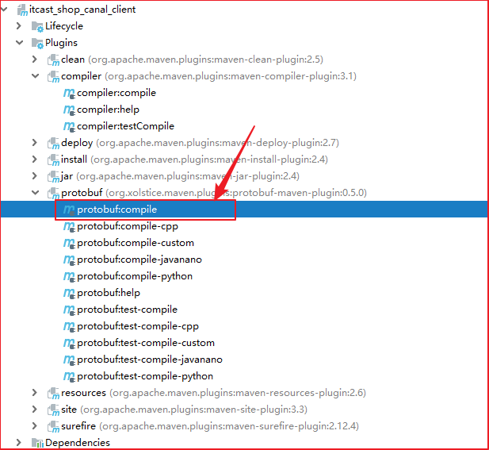

# 实时数仓第2天讲义

**学习目标**

- 能够掌握Canal高可用环境搭建
- 能够搭建flink实时ETL项目开发环境
- 能够针对etl的业务处理进行封装公共接口


## Canal HA模式配置

### 服务器端HA模式配置

canal是支持HA的，其实现机制也是依赖zookeeper来实现的，用到的特性有watcher和EPHEMERAL节点(和session生命周期绑定)，与HDFS的HA类似。

canal的ha分为两部分，canal server和canal client分别有对应的ha实现

- canal server: 为了减少对mysql dump的请求，*不同*server上的instance(不同server上的相同instance)要求同一时间只能有一个处于running，其他的处于standby状态(standby是instance的状态)。
- *canal client*: 为了保证有序性，一份instance同一时间只能由一个canal client进行get/ack/rollback操作，否则客户端接收无法保证有序。


#### 机器准备

* 运行canal的机器： node1 ,  node2
* zookeeper地址为 node1:2181,node2:2181,node3:2181
* mysql地址：node1:3306

#### Canal HA服务器配置

按照部署和配置，在单台机器上各自完成配置，演示时instance name为example

修改canal.properties，加上zookeeper配置

```properties
canal.zkServers=node1:2181,node2,node3
canal.instance.global.spring.xml = classpath:spring/default-instance.xml
```

 创建example目录，并修改instance.properties

```properties
canal.instance.mysql.slaveId = 1234 ##另外一台机器改成1235，保证slaveId不重复即可
canal.instance.master.address = node1:3306
```

  

> 注意： 两台机器上的instance目录的名字需要保证完全一致，HA模式是依赖于instance name进行管理，同时必须都选择default-instance.xml配置

#### 启动两台机器的canal

```
-------
ssh node1
sh bin/startup.sh
--------
ssh node2
sh bin/startup.sh
```

 启动后，可以查看logs/example/example.log，只会看到一台机器上出现了启动成功的日志。

 比如这里启动成功的是node1

```shell
2013-03-19 18:18:20.590 [main] INFO  c.a.o.c.i.spring.support.PropertyPlaceholderConfigurer - Loading properties file from class path resource [canal.properties]
2013-03-19 18:18:20.596 [main] INFO  c.a.o.c.i.spring.support.PropertyPlaceholderConfigurer - Loading properties file from class path resource [example/instance.properties]
2013-03-19 18:18:20.831 [main] INFO  c.a.otter.canal.instance.spring.CanalInstanceWithSpring - start CannalInstance for 1-example 
2013-03-19 18:18:20.845 [main] INFO  c.a.otter.canal.instance.spring.CanalInstanceWithSpring - start successful...
```

  查看一下zookeeper中的节点信息，也可以知道当前工作的节点为node1:11111

```json
[zk: localhost:2181(CONNECTED) 15] get /otter/canal/destinations/example/running  
{"active":true,"address":"192.168.88.120:11111","cid":1}
```

#### 客户端链接, 消费数据

  1、可以直接指定zookeeper地址和instance name，canal client会自动从zookeeper中的running节点，获取当前服务的工作节点，然后与其建立链接：

```
CanalConnector connector = CanalConnectors.newClusterConnector("node1:2181", "example", "canal", "canal");
```

2、链接成功后，canal server会记录当前正在工作的canal client信息，比如客户端ip，链接的端口信息等

```json
[zk: localhost:2181(CONNECTED) 17] get /otter/canal/destinations/example/1001/running
{"active":true,"address":"192.168.88.1:60957","clientId":1001}
```

3、数据消费成功后，canal server会在zookeeper中记录下当前最后一次消费成功的binlog位点.  (下次重启client时，会从这最后一个位点继续进行消费)

```json
[zk: localhost:2181(CONNECTED) 16] get /otter/canal/destinations/example/1001/cursor
{"@type":"com.alibaba.otter.canal.protocol.position.LogPosition","identity":{"slaveId":-1,"sourceAddress":{"address":"node1","port":3306}},"postion":{"included":false,"journalName":"mysql-bin.000025","position":51944693,"serverId":1,"timestamp":1575424854000}}
```

####  重启一下canal server

  停止正在工作的node1的canal server

```
ssh node1 
sh bin/stop.sh
```

  这时node2会立马启动example instance，提供新的数据服务

```
[zk: localhost:2181(CONNECTED) 19] get /otter/canal/destinations/example/running
{"active":true,"address":"192.168.88.121:11111","cid":1}
```

与此同时，客户端也会随着canal server的切换，通过获取zookeeper中的最新地址，与新的canal server建立链接，继续消费数据，整个过程自动完成

#### Canal Server HA的流程图

1. canal server要启动某个canal instance时都先向zookeeper进行一次尝试启动判断 (实现：创建EPHEMERAL节点，谁创建成功就允许谁启动)
2. 创建zookeeper节点成功后，对应的canal server就启动对应的canal instance，没有创建成功的canal instance就会处于standby状态
3. 一旦zookeeper发现canal server A创建的节点消失后，立即通知其他的canal server再次进行步骤1的操作，重新选出一个canal server启动instance.
4. canal client每次进行connect时，会首先向zookeeper询问当前是谁启动了canal instance，然后和其建立链接，一旦链接不可用，会重新尝试connect.


### 客户端HA模式配置

Canal Client的方式和canal server方式类似，也是利用zookeeper的抢占EPHEMERAL节点的方式进行控制。

> HA的实现，客户端是ClientRunningMonitor，服务端是ServerRunningMonitor。

直接取若干个Canal客户端，如果同时启动，只有一个客户端能从Canal服务器端获取到binlog消息，其他客户端不能拉取到binlog消息。

从运行配置中，复制一个同样的配置。然后启动运行。


关掉之前的客户端，然后稍微等待一会，查看另外一个客户端是否能够获取到binlog日志消息。

Client1的日志：

```
****************************************************
* Batch Id: [3] ,count : [3] , memsize : [198] , Time : 2017-10-12 17:59:59
* Start : [mysql-bin.000004:1656:1507802398000(2017-10-12 17:59:58)] 
* End : [mysql-bin.000004:1831:1507802398000(2017-10-12 17:59:58)] 
****************************************************

================> binlog[mysql-bin.000004:1656] , executeTime : 1507802398000 , delay : 1188ms
 BEGIN ----> Thread id: 768
----------------> binlog[mysql-bin.000004:1782] , name[canal_test,test] , eventType : UPDATE , executeTime : 1507802398000 , delay : 1199ms
uid : 1    type=int(4)
name : zqh    type=varchar(10)    update=true
----------------
 END ----> transaction id: 0
================> binlog[mysql-bin.000004:1831] , executeTime : 1507802398000 , delay : 1236ms
## stop the canal client## canal client is down.
```

停止Client1后，Client2的日志：

```
****************************************************
* Batch Id: [4] ,count : [3] , memsize : [198] , Time : 2017-10-12 18:02:15
* Start : [mysql-bin.000004:1906:1507802534000(2017-10-12 18:02:14)] 
* End : [mysql-bin.000004:2081:1507802534000(2017-10-12 18:02:14)] 
****************************************************

================> binlog[mysql-bin.000004:1906] , executeTime : 1507802534000 , delay : 1807ms
 BEGIN ----> Thread id: 768
----------------> binlog[mysql-bin.000004:2032] , name[canal_test,test] , eventType : UPDATE , executeTime : 1507802534000 , delay : 1819ms
uid : 1    type=int(4)
name : zqhx    type=varchar(10)    update=true
----------------
 END ----> transaction id: 0
================> binlog[mysql-bin.000004:2081] , executeTime : 1507802534000 , delay : 1855ms
```

观察ZK节点中instance对应的client节点，在Client切换时，会进行变更。
比如下面的客户端从56806端口切换到了56842端口。
把所有客户端都关闭后，1001下没有running。表示instance没有客户端消费binlog了。

```
启动两个客户端，第一个客户端（56806）正在运行
[zk: 192.168.6.52:2181(CONNECTED) 29] get /otter/canal/destinations/example/1001/running
{"active":true,"address":"10.57.241.44:56806","clientId":1001}

停止第一个客户端，删除节点
[zk: 192.168.6.52:2181(CONNECTED) 30] get /otter/canal/destinations/example/1001/running
Node does not exist: /otter/canal/destinations/example/1001/running

第二个客户端（56842）成为主
[zk: 192.168.6.52:2181(CONNECTED) 31] get /otter/canal/destinations/example/1001/running
{"active":true,"address":"10.57.241.44:56842","clientId":1001}

[zk: 192.168.6.52:2181(CONNECTED) 32] ls /otter/canal/destinations/example/1001
[cursor]
```

具体实现相关类有：ClientRunningMonitor/ClientRunningListener/ClientRunningData。

client running相关控制，主要为解决client自身的failover机制。
canal client允许同时启动多个canal client，
通过running机制，可保证只有一个client在工作，其他client做为冷备.
当运行中的client挂了，running会控制让冷备中的client转为工作模式，
这样就可以确保canal client也不会是单点. 保证整个系统的高可用性.

下图左边是客户端的HA实现，右边是服务端的HA实现


## 项目开发

### 搭建工程

| groupid   | artifact                     | 模块                  |
| --------- | ---------------------------- | --------------------- |
| cn.itcast | itcast_shop_parent           | 父工程                |
| cn.itcast | itcast_shop_common           | 公共模块              |
| cn.itcast | itcast_shop_canal_client     | canal客户端采集模块   |
| cn.itcast | itcast_shop_realtime_etl     | Flink实时计算模块     |
| cn.itcast | itcast_shop_data_simulator   | 数据模拟器模块        |
| cn.itcast | itcast_flinkcep              | flinkcep模块          |
| cn.itcast | itcast_shop_realtime_riskctl | Flink实时风控计算模块 |


### 导入依赖

#### 父工程依赖

```xml
<?xml version="1.0" encoding="UTF-8"?>
<project xmlns="http://maven.apache.org/POM/4.0.0"
         xmlns:xsi="http://www.w3.org/2001/XMLSchema-instance"
         xsi:schemaLocation="http://maven.apache.org/POM/4.0.0 http://maven.apache.org/xsd/maven-4.0.0.xsd">
    <modelVersion>4.0.0</modelVersion>

    <groupId>cn.itcast</groupId>
    <artifactId>itcast_shop_parent</artifactId>
    <packaging>pom</packaging>
    <version>1.0-SNAPSHOT</version>
    <modules>
        <module>itcast_shop_canal_client</module>
        <module>itcast_shop_common</module>
        <module>itcast_shop_realtime_etl</module>
        <module>itcast_shop_data_simulator</module>
        <module>itcast_shop_realtime_course_code</module>
        <module>itcast_shop_realtime_riskctl</module>
    </modules>


    <repositories>
        <repository>
            <id>ali-repo</id>
            <name>ali-repo</name>
            <url>http://maven.aliyun.com/nexus/content/groups/public/</url>
        </repository>
        <repository>
            <id>mvn-repo</id>
            <name>mvn-repo</name>
            <url>https://mvnrepository.com</url>
            <layout>default</layout>
        </repository>
        <repository>
            <id>cloudera</id>
            <url>https://repository.cloudera.com/artifactory/cloudera-repos</url>
        </repository>
    </repositories>

    <properties>
        <!-- project compiler -->
        <project.build.sourceEncoding>UTF-8</project.build.sourceEncoding>
        <maven.compiler.encoding>UTF-8</maven.compiler.encoding>
        <project.reporting.outputEncoding>UTF-8</project.reporting.outputEncoding>
        <maven.build.timestamp.format>yyyyMMddHHmmss</maven.build.timestamp.format>
        <!-- sdk -->
        <java.version>1.8</java.version>
        <scala.version>2.11</scala.version>
        <!-- junit -->
        <junit.version>4.12</junit.version>
        <!-- logger -->
        <log4j.version>2.11.0</log4j.version>
        <slf4j.version>1.7.25</slf4j.version>
        <!-- bigdata -->
        <cdh.version>cdh5.14.0</cdh.version>
        <hadoop.version>2.6.0</hadoop.version>
        <hbase.version>1.2.0</hbase.version>
        <protobuf.version>3.4.0</protobuf.version>
        <flink.version>1.8.0</flink.version>
        <kafka.client.version>1.0.0</kafka.client.version>
        <kafka.version>0.11.0.2</kafka.version>
        <canal.version>1.0.24</canal.version>
        <!-- j2ee -->
        <javax.servlet-api.version>4.0.0</javax.servlet-api.version>
        <jstl.version>1.2</jstl.version>
        <javax.servlet.jsp.jstl-api.version>1.2.1</javax.servlet.jsp.jstl-api.version>
        <spring.version>5.0.0.RELEASE</spring.version>
        <aspectjweaver.version>1.9.0</aspectjweaver.version>
        <!-- commons -->
        <fileupload.version>1.3.3</fileupload.version>
        <commons-io.version>2.6</commons-io.version>
        <commons-codec.version>1.11</commons-codec.version>
        <commons-lang3.version>3.7</commons-lang3.version>
        <!-- json -->
        <fastjson.version>1.2.44</fastjson.version>
        <jackson.version>2.9.7</jackson.version>
        <!-- db driver or pool -->
        <jedis.version>3.0.1</jedis.version>
        <mysql.version>5.1.44</mysql.version>
        <avatica.version>1.10.0</avatica.version>
        <druid.version>1.1.9</druid.version>
        <!-- http client -->
        <http.client.version>4.5.2</http.client.version>
        <!-- maven plugins -->
        <maven-surefire-plugin.version>2.19.1</maven-surefire-plugin.version>
        <maven-compiler-plugin.version>3.1</maven-compiler-plugin.version>
        <maven-war-plugin.version>3.2.1</maven-war-plugin.version>
        <jetty-maven-plugin.version>9.4.10.v20180503</jetty-maven-plugin.version>
    </properties>

    <dependencyManagement>
        <dependencies>
            <!-- junit -->
            <dependency>
                <groupId>junit</groupId>
                <artifactId>junit</artifactId>
                <version>${junit.version}</version>
            </dependency>
            <!-- log4j-core -->
            <dependency>
                <groupId>org.apache.logging.log4j</groupId>
                <artifactId>log4j-core</artifactId>
                <version>${log4j.version}</version>
            </dependency>
            <!-- log4j-api -->
            <dependency>
                <groupId>org.apache.logging.log4j</groupId>
                <artifactId>log4j-api</artifactId>
                <version>${log4j.version}</version>
            </dependency>
            <!-- log4j-web -->
            <dependency>
                <groupId>org.apache.logging.log4j</groupId>
                <artifactId>log4j-web</artifactId>
                <version>${log4j.version}</version>
            </dependency>
            <!-- slf4j-api -->
            <dependency>
                <groupId>org.slf4j</groupId>
                <artifactId>slf4j-api</artifactId>
                <version>${slf4j.version}</version>
            </dependency>
            <!-- jcl-over-slf4j -->
            <dependency>
                <groupId>org.slf4j</groupId>
                <artifactId>jcl-over-slf4j</artifactId>
                <version>${slf4j.version}</version>
                <scope>runtime</scope>
            </dependency>
            <!-- log4j-slf4j-impl -->
            <dependency>
                <groupId>org.apache.logging.log4j</groupId>
                <artifactId>log4j-slf4j-impl</artifactId>
                <version>${log4j.version}</version>
            </dependency>
            <!-- hadoop -->
            <dependency>
                <groupId>org.apache.hadoop</groupId>
                <artifactId>hadoop-common</artifactId>
                <version>${hadoop.version}-${cdh.version}</version>
            </dependency>
            <dependency>
                <groupId>org.apache.hadoop</groupId>
                <artifactId>hadoop-hdfs</artifactId>
                <version>${hadoop.version}-${cdh.version}</version>
            </dependency>
            <dependency>
                <groupId>org.apache.hadoop</groupId>
                <artifactId>hadoop-client</artifactId>
                <version>${hadoop.version}</version>
            </dependency>
            <!--hbase-shaded , 用来更改hbase中的一些报名，解决protobuf的冲突问题-->
            <dependency>
                <groupId>org.apache.hbase</groupId>
                <artifactId>hbase-shaded-client</artifactId>
                <version>1.2.1</version>
            </dependency>

            <dependency>
                <groupId>org.apache.hbase</groupId>
                <artifactId>hbase-shaded-server</artifactId>
                <version>1.2.1</version>
            </dependency>
            <dependency>
                <groupId>org.apache.htrace</groupId>
                <artifactId>htrace-core</artifactId>
                <version>3.1.0-incubating</version>
            </dependency>
            <!-- flink -->
            <dependency>
                <groupId>org.apache.flink</groupId>
                <artifactId>flink-core</artifactId>
                <version>${flink.version}</version>
            </dependency>
            <dependency>
                <groupId>org.apache.flink</groupId>
                <artifactId>flink-scala_${scala.version}</artifactId>
                <version>${flink.version}</version>
            </dependency>
            <dependency>
                <groupId>org.apache.flink</groupId>
                <artifactId>flink-runtime_${scala.version}</artifactId>
                <version>${flink.version}</version>
            </dependency>
            <dependency>
                <groupId>org.apache.flink</groupId>
                <artifactId>flink-connector-kafka-0.11_${scala.version}</artifactId>
                <version>${flink.version}</version>
            </dependency>
            <dependency>
                <groupId>org.apache.flink</groupId>
                <artifactId>flink-table-planner_${scala.version}</artifactId>
                <version>${flink.version}</version>
            </dependency>
            <dependency>
                <groupId>org.apache.flink</groupId>
                <artifactId>flink-streaming-scala_${scala.version}</artifactId>
                <version>${flink.version}</version>
            </dependency>
            <dependency>
                <groupId>org.apache.flink</groupId>
                <artifactId>flink-streaming-java_${scala.version}</artifactId>
                <version>${flink.version}</version>
            </dependency>
            <dependency>
                <groupId>org.apache.flink</groupId>
                <artifactId>flink-hbase_${scala.version}</artifactId>
                <version>${flink.version}</version>
            </dependency>
            <dependency>
                <groupId>org.apache.bahir</groupId>
                <artifactId>flink-connector-redis_${scala.version}</artifactId>
                <version>1.0</version>
            </dependency>
            <dependency>
                <groupId>org.apache.flink</groupId>
                <artifactId>flink-statebackend-rocksdb_${scala.version}</artifactId>
                <version>${flink.version}</version>
            </dependency>
            <dependency>
                <groupId>org.apache.flink</groupId>
                <artifactId>flink-cep_${scala.version}</artifactId>
                <version>${flink.version}</version>
            </dependency>
            <!-- kafka -->
            <dependency>
                <groupId>org.apache.kafka</groupId>
                <artifactId>kafka_2.11</artifactId>
                <version>${kafka.version}</version>
            </dependency>
            <dependency>
                <groupId>org.apache.kafka</groupId>
                <artifactId>kafka-clients</artifactId>
                <version>${kafka.client.version}</version>
            </dependency>
            <!-- canal -->
            <dependency>
                <groupId>com.alibaba.otter</groupId>
                <artifactId>canal.common</artifactId>
                <version>${canal.version}</version>
            </dependency>
            <dependency>
                <groupId>com.alibaba.otter</groupId>
                <artifactId>canal.client</artifactId>
                <version>${canal.version}</version>
            </dependency>
            <!-- servlet -->
            <dependency>
                <groupId>javax.servlet</groupId>
                <artifactId>javax.servlet-api</artifactId>
                <version>${javax.servlet-api.version}</version>
                <scope>provided</scope>
            </dependency>
            <dependency>
                <groupId>javax.servlet</groupId>
                <artifactId>jstl</artifactId>
                <version>${jstl.version}</version>
            </dependency>
            <dependency>
                <groupId>javax.servlet.jsp.jstl</groupId>
                <artifactId>javax.servlet.jsp.jstl-api</artifactId>
                <version>${javax.servlet.jsp.jstl-api.version}</version>
            </dependency>
            <!-- spring -->
            <dependency>
                <groupId>org.springframework</groupId>
                <artifactId>spring-webmvc</artifactId>
                <version>${spring.version}</version>
            </dependency>
            <dependency>
                <groupId>org.springframework</groupId>
                <artifactId>spring-jdbc</artifactId>
                <version>${spring.version}</version>
            </dependency>
            <dependency>
                <groupId>org.springframework</groupId>
                <artifactId>spring-test</artifactId>
                <version>${spring.version}</version>
            </dependency>
            <dependency>
                <groupId>org.springframework</groupId>
                <artifactId>spring-aspects</artifactId>
                <version>${spring.version}</version>
            </dependency>
            <dependency>
                <groupId>org.springframework.integration</groupId>
                <artifactId>spring-integration-mail</artifactId>
                <version>${spring.version}</version>
            </dependency>
            <!-- spring aop depend aspectjweaver -->
            <dependency>
                <groupId>org.aspectj</groupId>
                <artifactId>aspectjweaver</artifactId>
                <version>${aspectjweaver.version}</version>
            </dependency>
            <!-- druid -->
            <dependency>
                <groupId>com.alibaba</groupId>
                <artifactId>druid</artifactId>
                <version>${druid.version}</version>
            </dependency>
            <!-- druid-sql -->
            <dependency>
                <groupId>org.apache.calcite.avatica</groupId>
                <artifactId>avatica-core</artifactId>
                <version>${avatica.version}</version>
            </dependency>
            <!-- redis -->
            <dependency>
                <groupId>redis.clients</groupId>
                <artifactId>jedis</artifactId>
                <version>${jedis.version}</version>
            </dependency>
            <!-- mysql -->
            <dependency>
                <groupId>mysql</groupId>
                <artifactId>mysql-connector-java</artifactId>
                <version>${mysql.version}</version>
            </dependency>
            <!-- fastjson -->
            <dependency>
                <groupId>com.alibaba</groupId>
                <artifactId>fastjson</artifactId>
                <version>${fastjson.version}</version>
            </dependency>
            <!-- http client -->
            <dependency>
                <groupId>org.apache.httpcomponents</groupId>
                <artifactId>httpclient</artifactId>
                <version>${http.client.version}</version>
            </dependency>
            <!-- jackson -->
            <dependency>
                <groupId>com.fasterxml.jackson.core</groupId>
                <artifactId>jackson-annotations</artifactId>
                <version>${jackson.version}</version>
            </dependency>
            <dependency>
                <groupId>com.fasterxml.jackson.core</groupId>
                <artifactId>jackson-core</artifactId>
                <version>${jackson.version}</version>
            </dependency>
            <dependency>
                <groupId>com.fasterxml.jackson.core</groupId>
                <artifactId>jackson-databind</artifactId>
                <version>${jackson.version}</version>
            </dependency>
            <dependency>
                <groupId>com.fasterxml.jackson.datatype</groupId>
                <artifactId>jackson-datatype-guava</artifactId>
                <version>${jackson.version}</version>
            </dependency>
            <dependency>
                <groupId>com.fasterxml.jackson.datatype</groupId>
                <artifactId>jackson-datatype-joda</artifactId>
                <version>${jackson.version}</version>
            </dependency>
            <dependency>
                <groupId>com.fasterxml.jackson.dataformat</groupId>
                <artifactId>jackson-dataformat-smile</artifactId>
                <version>${jackson.version}</version>
            </dependency>
            <dependency>
                <groupId>com.fasterxml.jackson.jaxrs</groupId>
                <artifactId>jackson-jaxrs-json-provider</artifactId>
                <version>${jackson.version}</version>
            </dependency>
            <dependency>
                <groupId>com.fasterxml.jackson.jaxrs</groupId>
                <artifactId>jackson-jaxrs-smile-provider</artifactId>
                <version>${jackson.version}</version>
            </dependency>
            <!-- commons -->
            <dependency>
                <groupId>commons-fileupload</groupId>
                <artifactId>commons-fileupload</artifactId>
                <version>${fileupload.version}</version>
            </dependency>
            <dependency>
                <groupId>commons-io</groupId>
                <artifactId>commons-io</artifactId>
                <version>${commons-io.version}</version>
            </dependency>
            <dependency>
                <groupId>commons-codec</groupId>
                <artifactId>commons-codec</artifactId>
                <version>${commons-codec.version}</version>
            </dependency>
            <dependency>
                <groupId>org.apache.commons</groupId>
                <artifactId>commons-lang3</artifactId>
                <version>${commons-lang3.version}</version>
            </dependency>
            <dependency>
                <groupId>com.google.protobuf</groupId>
                <artifactId>protobuf-java</artifactId>
                <version>${protobuf.version}</version>
            </dependency>
            <dependency>
                <groupId>nl.basjes.parse.httpdlog</groupId>
                <artifactId>httpdlog-parser</artifactId>
                <version>5.2</version>
            </dependency>
            <!-- 导入flinkcep的依赖包-->
            <dependency>
                <groupId>org.apache.flink</groupId>
                <artifactId>flink-cep_${scala.version}</artifactId>
                <version>${flink.version}</version>
            </dependency>
            <dependency>
                <groupId>org.apache.flink</groupId>
                <artifactId>flink-cep-scala_${scala.version}</artifactId>
                <version>${flink.version}</version>
            </dependency>
        </dependencies>
    </dependencyManagement>

    <build>
        <finalName>${project.name}</finalName>
        <plugins>
            <plugin>
                <groupId>org.apache.maven.plugins</groupId>
                <artifactId>maven-compiler-plugin</artifactId>
                <version>${maven-compiler-plugin.version}</version>
                <configuration>
                    <encoding>UTF-8</encoding>
                    <source>1.8</source>
                    <target>1.8</target>
                    <verbose>true</verbose>
                    <fork>true</fork>
                </configuration>
            </plugin>
            <plugin>
                <groupId>org.apache.maven.plugins</groupId>
                <artifactId>maven-surefire-plugin</artifactId>
                <version>${maven-surefire-plugin.version}</version>
                <configuration>
                    <argLine>-Dfile.encoding=UTF-8</argLine>
                    <skip>true</skip>
                </configuration>
            </plugin>
            <plugin>
                <groupId>org.apache.maven.plugins</groupId>
                <artifactId>maven-war-plugin</artifactId>
                <version>${maven-war-plugin.version}</version>
                <configuration>
                    <failOnMissingWebXml>false</failOnMissingWebXml>
                </configuration>
            </plugin>
            <plugin>
                <groupId>org.eclipse.jetty</groupId>
                <artifactId>jetty-maven-plugin</artifactId>
                <version>${jetty-maven-plugin.version}</version>
                <configuration>
                    <scanIntervalSeconds>10</scanIntervalSeconds>
                    <httpConnector>
                        <port>8080</port>
                    </httpConnector>
                    <webApp>
                        <contextPath>/${project.name}</contextPath>
                    </webApp>
                </configuration>
            </plugin>
        </plugins>
    </build>
</project>
```

#### 导入common模块依赖

```xml
<?xml version="1.0" encoding="UTF-8"?>
<project xmlns:xsi="http://www.w3.org/2001/XMLSchema-instance"
         xmlns="http://maven.apache.org/POM/4.0.0"
         xsi:schemaLocation="http://maven.apache.org/POM/4.0.0 http://maven.apache.org/xsd/maven-4.0.0.xsd">
    <parent>
        <artifactId>itcast_shop_parent</artifactId>
        <groupId>cn.itcast</groupId>
        <version>1.0-SNAPSHOT</version>
    </parent>
    <modelVersion>4.0.0</modelVersion>

    <artifactId>itcast_shop_common</artifactId>
    <packaging>jar</packaging>

    <dependencies>
        <dependency>
            <groupId>com.alibaba.otter</groupId>
            <artifactId>canal.client</artifactId>
        </dependency>
        <dependency>
            <groupId>com.alibaba</groupId>
            <artifactId>fastjson</artifactId>
        </dependency>
        <dependency>
            <groupId>com.google.protobuf</groupId>
            <artifactId>protobuf-java</artifactId>
        </dependency>
        <dependency>
            <groupId>org.apache.kafka</groupId>
            <artifactId>kafka-clients</artifactId>
        </dependency>
        <dependency>
            <groupId>junit</groupId>
            <artifactId>junit</artifactId>
        </dependency>
    </dependencies>

    <build>
        <extensions>
            <extension>
                <groupId>kr.motd.maven</groupId>
                <artifactId>os-maven-plugin</artifactId>
                <version>1.4.1.Final</version>
            </extension>
        </extensions>
        <plugins>
            <!-- Protobuf插件 -->
            <plugin>
                <groupId>org.xolstice.maven.plugins</groupId>
                <artifactId>protobuf-maven-plugin</artifactId>
                <version>0.5.0</version>
                <configuration>
                    <protoSourceRoot>${project.basedir}/src/main/proto</protoSourceRoot>
                    <protocArtifact>
                        com.google.protobuf:protoc:3.1.0:exe:${os.detected.classifier}
                    </protocArtifact>
                </configuration>
                <executions>
                    <execution>
                        <goals>
                            <goal>compile</goal>
                        </goals>
                    </execution>
                </executions>
            </plugin>
        </plugins>
    </build>
</project>
```

#### 导入数据生成模拟器模块依赖

```xml
<dependencies>
        <dependency>
            <groupId>org.apache.kafka</groupId>
            <artifactId>kafka-clients</artifactId>
        </dependency>
        <!-- mysql -->
        <dependency>
            <groupId>mysql</groupId>
            <artifactId>mysql-connector-java</artifactId>
            <version>${mysql.version}</version>
        </dependency>


        <!-- fastjson -->
        <dependency>
            <groupId>com.alibaba</groupId>
            <artifactId>fastjson</artifactId>
            <version>${fastjson.version}</version>
        </dependency>

        <dependency>
            <groupId>org.apache.commons</groupId>
            <artifactId>commons-lang3</artifactId>
            <version>3.7</version>
        </dependency>

        <dependency>
            <groupId>commons-io</groupId>
            <artifactId>commons-io</artifactId>
            <version>2.2</version>
        </dependency>
        <!-- https://mvnrepository.com/artifact/com.belerweb/pinyin4j -->
        <dependency>
            <groupId>com.belerweb</groupId>
            <artifactId>pinyin4j</artifactId>
            <version>2.5.0</version>
        </dependency>

        <dependency>
            <groupId>junit</groupId>
            <artifactId>junit</artifactId>
            <version>4.12</version>
            <scope>test</scope>
            <exclusions>
                <exclusion>
                    <artifactId>*</artifactId>
                    <groupId>*</groupId>
                </exclusion>
            </exclusions>
        </dependency>

        <!-- https://mvnrepository.com/artifact/org.hamcrest/hamcrest-core -->
        <dependency>
            <groupId>org.hamcrest</groupId>
            <artifactId>hamcrest-core</artifactId>
            <version>1.3</version>
            <scope>test</scope>
        </dependency>
        <dependency>
            <groupId>org.apache.hbase</groupId>
            <artifactId>hbase-shaded-server</artifactId>
        </dependency>
    </dependencies>
```


#### 导入itcast_shop_canal_client模块依赖

```xml
    <dependencies>
        <dependency>
            <groupId>cn.itcast</groupId>
            <artifactId>itcast_shop_common</artifactId>
            <version>1.0-SNAPSHOT</version>
        </dependency>
    </dependencies>
```

#### 导入Flink实时ETL计算模块依赖

```xml
<properties>
        <project.build.sourceEncoding>UTF-8</project.build.sourceEncoding>
        <lombok.version>1.18.4</lombok.version>
    </properties>

    <dependencies>
        <dependency>
            <groupId>junit</groupId>
            <artifactId>junit</artifactId>
        </dependency>
        <!-- hadoop -->
        <dependency>
            <groupId>org.apache.hadoop</groupId>
            <artifactId>hadoop-common</artifactId>
            <exclusions>
                <exclusion>
                    <groupId>com.google.protobuf</groupId>
                    <artifactId>protobuf-java</artifactId>
                </exclusion>
            </exclusions>
        </dependency>
        <dependency>
            <groupId>org.apache.hadoop</groupId>
            <artifactId>hadoop-hdfs</artifactId>
            <exclusions>
                <exclusion>
                    <groupId>com.google.protobuf</groupId>
                    <artifactId>protobuf-java</artifactId>
                </exclusion>
            </exclusions>
        </dependency>
        <dependency>
            <groupId>org.apache.hadoop</groupId>
            <artifactId>hadoop-client</artifactId>
            <exclusions>
                <exclusion>
                    <groupId>com.google.protobuf</groupId>
                    <artifactId>protobuf-java</artifactId>
                </exclusion>
            </exclusions>
        </dependency>
        <!-- hbase -->
        <dependency>
            <groupId>org.apache.hbase</groupId>
            <artifactId>hbase-shaded-server</artifactId>
        </dependency>
        <dependency>
            <groupId>org.apache.hbase</groupId>
            <artifactId>hbase-shaded-client</artifactId>
        </dependency>
        <!-- flink -->
        <dependency>
            <groupId>org.apache.flink</groupId>
            <artifactId>flink-core</artifactId>
        </dependency>
        <dependency>
            <groupId>org.apache.flink</groupId>
            <artifactId>flink-scala_${scala.version}</artifactId>
        </dependency>
        <dependency>
            <groupId>org.apache.flink</groupId>
            <artifactId>flink-runtime_${scala.version}</artifactId>
        </dependency>
        <dependency>
            <groupId>org.apache.flink</groupId>
            <artifactId>flink-connector-kafka-0.11_${scala.version}</artifactId>
        </dependency>
        <dependency>
            <groupId>org.apache.flink</groupId>
            <artifactId>flink-table-planner_${scala.version}</artifactId>
        </dependency>
        <dependency>
            <groupId>org.apache.flink</groupId>
            <artifactId>flink-streaming-scala_${scala.version}</artifactId>
        </dependency>
        <dependency>
            <groupId>org.apache.flink</groupId>
            <artifactId>flink-streaming-java_${scala.version}</artifactId>
        </dependency>
        <dependency>
            <groupId>org.apache.flink</groupId>
            <artifactId>flink-hbase_${scala.version}</artifactId>
        </dependency>
        <dependency>
            <groupId>org.apache.bahir</groupId>
            <artifactId>flink-connector-redis_${scala.version}</artifactId>
            <version>1.0</version>
        </dependency>
        <dependency>
            <groupId>org.apache.flink</groupId>
            <artifactId>flink-statebackend-rocksdb_${scala.version}</artifactId>
        </dependency>
        <dependency>
            <groupId>org.apache.flink</groupId>
            <artifactId>flink-cep_${scala.version}</artifactId>
        </dependency>
        <!-- kafka -->
        <dependency>
            <groupId>org.apache.kafka</groupId>
            <artifactId>kafka_2.11</artifactId>
        </dependency>
        <!-- druid-sql -->
        <dependency>
            <groupId>org.apache.calcite.avatica</groupId>
            <artifactId>avatica-core</artifactId>
            <exclusions>
                <exclusion>
                    <groupId>com.google.protobuf</groupId>
                    <artifactId>protobuf-java</artifactId>
                </exclusion>
            </exclusions>
        </dependency>
        <!-- redis -->
        <dependency>
            <groupId>redis.clients</groupId>
            <artifactId>jedis</artifactId>
        </dependency>
        <!-- mysql -->
        <dependency>
            <groupId>mysql</groupId>
            <artifactId>mysql-connector-java</artifactId>
        </dependency>
        <!-- fastjson -->
        <dependency>
            <groupId>com.alibaba</groupId>
            <artifactId>fastjson</artifactId>
        </dependency>
        <!-- http client -->
        <dependency>
            <groupId>org.apache.httpcomponents</groupId>
            <artifactId>httpclient</artifactId>
        </dependency>
        <dependency>
            <groupId>cn.itcast</groupId>
            <artifactId>itcast_shop_common</artifactId>
            <version>1.0-SNAPSHOT</version>
        </dependency>
        <dependency>
            <groupId>nl.basjes.parse.httpdlog</groupId>
            <artifactId>httpdlog-parser</artifactId>
        </dependency>
        <dependency>
            <groupId>org.projectlombok</groupId>
            <artifactId>lombok</artifactId>
            <version>${lombok.version}</version>
        </dependency>
        <dependency>
            <groupId>org.apache.flink</groupId>
            <artifactId>flink-cep_${scala.version}</artifactId>
        </dependency>
        <dependency>
            <groupId>org.apache.flink</groupId>
            <artifactId>flink-cep-scala_${scala.version}</artifactId>
        </dependency>
    </dependencies>
    <build>
        <sourceDirectory>src/main/scala</sourceDirectory>
    </build>
```

#### 导入FlinkCEP模块依赖

```xml
<properties>
        <project.build.sourceEncoding>UTF-8</project.build.sourceEncoding>
    </properties>

    <dependencies>
        <!-- flink -->
        <dependency>
            <groupId>org.apache.flink</groupId>
            <artifactId>flink-core</artifactId>
        </dependency>
        <dependency>
            <groupId>org.apache.flink</groupId>
            <artifactId>flink-scala_${scala.version}</artifactId>
        </dependency>
        <dependency>
            <groupId>org.apache.flink</groupId>
            <artifactId>flink-runtime_${scala.version}</artifactId>
        </dependency>
        <dependency>
            <groupId>org.apache.flink</groupId>
            <artifactId>flink-table-planner_${scala.version}</artifactId>
        </dependency>
        <dependency>
            <groupId>org.apache.flink</groupId>
            <artifactId>flink-streaming-scala_${scala.version}</artifactId>
        </dependency>
        <dependency>
            <groupId>org.apache.flink</groupId>
            <artifactId>flink-streaming-java_${scala.version}</artifactId>
        </dependency>
        <dependency>
            <groupId>org.apache.flink</groupId>
            <artifactId>flink-cep_${scala.version}</artifactId>
        </dependency>
        <dependency>
            <groupId>org.apache.flink</groupId>
            <artifactId>flink-cep-scala_${scala.version}</artifactId>
        </dependency>
    </dependencies>

    <build>
        <sourceDirectory>src/main/scala</sourceDirectory>
    </build>
```


#### 导入Flink实时风控计算模块依赖

```xml
<properties>
        <project.build.sourceEncoding>UTF-8</project.build.sourceEncoding>
        <lombok.version>1.18.4</lombok.version>
    </properties>

    <dependencies>
        <dependency>
            <groupId>junit</groupId>
            <artifactId>junit</artifactId>
        </dependency>
        <!-- hadoop -->
        <dependency>
            <groupId>org.apache.hadoop</groupId>
            <artifactId>hadoop-common</artifactId>
            <exclusions>
                <exclusion>
                    <groupId>com.google.protobuf</groupId>
                    <artifactId>protobuf-java</artifactId>
                </exclusion>
            </exclusions>
        </dependency>
        <dependency>
            <groupId>org.apache.hadoop</groupId>
            <artifactId>hadoop-hdfs</artifactId>
            <exclusions>
                <exclusion>
                    <groupId>com.google.protobuf</groupId>
                    <artifactId>protobuf-java</artifactId>
                </exclusion>
            </exclusions>
        </dependency>
        <dependency>
            <groupId>org.apache.hadoop</groupId>
            <artifactId>hadoop-client</artifactId>
            <exclusions>
                <exclusion>
                    <groupId>com.google.protobuf</groupId>
                    <artifactId>protobuf-java</artifactId>
                </exclusion>
            </exclusions>
        </dependency>
        <!-- hbase -->
        <dependency>
            <groupId>org.apache.hbase</groupId>
            <artifactId>hbase-shaded-server</artifactId>
        </dependency>
        <dependency>
            <groupId>org.apache.hbase</groupId>
            <artifactId>hbase-shaded-client</artifactId>
        </dependency>
        <!-- flink -->
        <dependency>
            <groupId>org.apache.flink</groupId>
            <artifactId>flink-core</artifactId>
        </dependency>
        <dependency>
            <groupId>org.apache.flink</groupId>
            <artifactId>flink-scala_${scala.version}</artifactId>
        </dependency>
        <dependency>
            <groupId>org.apache.flink</groupId>
            <artifactId>flink-runtime_${scala.version}</artifactId>
        </dependency>
        <dependency>
            <groupId>org.apache.flink</groupId>
            <artifactId>flink-connector-kafka-0.11_${scala.version}</artifactId>
        </dependency>
        <dependency>
            <groupId>org.apache.flink</groupId>
            <artifactId>flink-table-planner_${scala.version}</artifactId>
        </dependency>
        <dependency>
            <groupId>org.apache.flink</groupId>
            <artifactId>flink-streaming-scala_${scala.version}</artifactId>
        </dependency>
        <dependency>
            <groupId>org.apache.flink</groupId>
            <artifactId>flink-streaming-java_${scala.version}</artifactId>
        </dependency>
        <dependency>
            <groupId>org.apache.flink</groupId>
            <artifactId>flink-hbase_${scala.version}</artifactId>
        </dependency>
        <dependency>
            <groupId>org.apache.bahir</groupId>
            <artifactId>flink-connector-redis_${scala.version}</artifactId>
            <version>1.0</version>
        </dependency>
        <dependency>
            <groupId>org.apache.flink</groupId>
            <artifactId>flink-statebackend-rocksdb_${scala.version}</artifactId>
        </dependency>
        <dependency>
            <groupId>org.apache.flink</groupId>
            <artifactId>flink-cep_${scala.version}</artifactId>
        </dependency>
        <!-- kafka -->
        <dependency>
            <groupId>org.apache.kafka</groupId>
            <artifactId>kafka_2.11</artifactId>
        </dependency>
        <!-- druid-sql -->
        <dependency>
            <groupId>org.apache.calcite.avatica</groupId>
            <artifactId>avatica-core</artifactId>
            <exclusions>
                <exclusion>
                    <groupId>com.google.protobuf</groupId>
                    <artifactId>protobuf-java</artifactId>
                </exclusion>
            </exclusions>
        </dependency>
        <!-- redis -->
        <dependency>
            <groupId>redis.clients</groupId>
            <artifactId>jedis</artifactId>
        </dependency>
        <!-- mysql -->
        <dependency>
            <groupId>mysql</groupId>
            <artifactId>mysql-connector-java</artifactId>
        </dependency>
        <!-- fastjson -->
        <dependency>
            <groupId>com.alibaba</groupId>
            <artifactId>fastjson</artifactId>
        </dependency>
        <!-- http client -->
        <dependency>
            <groupId>org.apache.httpcomponents</groupId>
            <artifactId>httpclient</artifactId>
        </dependency>
        <dependency>
            <groupId>cn.itcast</groupId>
            <artifactId>itcast_shop_common</artifactId>
            <version>1.0-SNAPSHOT</version>
        </dependency>
        <dependency>
            <groupId>nl.basjes.parse.httpdlog</groupId>
            <artifactId>httpdlog-parser</artifactId>
        </dependency>
        <dependency>
            <groupId>org.projectlombok</groupId>
            <artifactId>lombok</artifactId>
            <version>${lombok.version}</version>
        </dependency>
        <dependency>
            <groupId>org.apache.flink</groupId>
            <artifactId>flink-cep_${scala.version}</artifactId>
        </dependency>
        <dependency>
            <groupId>org.apache.flink</groupId>
            <artifactId>flink-cep-scala_${scala.version}</artifactId>
        </dependency>
    </dependencies>
    <build>
        <sourceDirectory>src/main/scala</sourceDirectory>
    </build>
```


### 开发Canal客户端订阅binlog消息

#### 在canal_client模块创建包结构

| 包名                          | 说明                          |
| ----------------------------- | ----------------------------- |
| com.itcast.canal_client       | 存放入口、Canal客户端核心实现 |
| com.itcast.canal_client.util  | 存放工具类                    |
| com.itcast.canal_client.kafka | 存放Kafka生产者实现           |

#### 添加配置文件config.properties

```properties
# canal配置
canal.server.ip=node1
canal.server.port=11111
canal.server.destination=example
canal.server.username=canal
canal.server.password=canal
canal.subscribe.filter=itcast_shop.*

# zookeeper配置
zookeeper.server.ip=node1:2181,node2:2181,node3:2181

# kafka配置
kafka.bootstrap_servers_config=node1:9092,node2:9092,node3:9092
kafka.batch_size_config=1024
kafka.acks=all
kafka.retries=0
kafka.client_id_config=itcast_shop_canal_click
kafka.key_serializer_class_config=org.apache.kafka.common.serialization.StringSerializer
kafka.value_serializer_class_config=cn.itcast.canal.protobuf.ProtoBufSerializer
kafka.topic=ods_itcast_shop_mysql
```

#### 编写读取配置文件工具类

```java
/**
 * 读取 config.properties配置文件
 */
public class ConfigUtil {
    private static Properties properties;

    static {
        try {
            properties = new Properties();
            properties.load(ConfigUtil.class.getClassLoader().getResourceAsStream("config.properties"));
        } catch (IOException e) {
            throw new RuntimeException(e);
        }
    }

    public static String canalServerIp() {
        return properties.getProperty("canal.server.ip");
    }

    public static int canalServerPort() {
        return Integer.parseInt(properties.getProperty("canal.server.port"));
    }

    public static String canalServerDestination() {
        return properties.getProperty("canal.server.destination");
    }

    public static String canalServerUsername() {
        return properties.getProperty("canal.server.username");
    }

    public static String canalServerPassword() {
        return properties.getProperty("canal.server.password");
    }

    public static String canalSubscribeFilter() {
        return properties.getProperty("canal.subscribe.filter");
    }

    public static String zookeeperServerIp() {
        return properties.getProperty("zookeeper.server.ip");
    }

    public static String kafkaBootstrap_servers_config() {
        return properties.getProperty("kafka.bootstrap_servers_config");
    }

    public static String kafkaBatch_size_config() {
        return properties.getProperty("kafka.batch_size_config");
    }

    public static String kafkaAcks() {
        return properties.getProperty("kafka.acks");
    }

    public static String kafkaRetries() {
        return properties.getProperty("kafka.retries");
    }

    public static String kafkaBatch() {
        return properties.getProperty("kafka.batch");
    }

    public static String kafkaClient_id_config() {
        return properties.getProperty("kafka.client_id_config");
    }

    public static String kafkaKey_serializer_class_config() {
        return properties.getProperty("kafka.key_serializer_class_config");
    }

    public static String kafkaValue_serializer_class_config() {
        return properties.getProperty("kafka.value_serializer_class_config");
    }

    public static String kafkaTopic() {
        return properties.getProperty("kafka.topic");
    }

    public static void main(String[] args) {
        System.out.println(canalServerIp());
        System.out.println(canalServerPort());
        System.out.println(canalServerDestination());
        System.out.println(canalServerUsername());
        System.out.println(canalServerPassword());
    }
}
```


#### 编写CanalClient客户端核心实现类

```java
/**
 * Canal客户端
 */
public class CanalClient {

    // 一次性读取BINLOG数据条数
    private static final int BATCH_SIZE = 5 * 1024;
    // Canal客户端连接器
    private CanalConnector canalConnector;
    // Canal配置项
    private Properties properties;
    private KafkaSender kafkaSender;

    public CanalClient() {
        // 初始化连接
        canalConnector = CanalConnectors.newClusterConnector(ConfigUtil.zookeeperServerIp(),
                ConfigUtil.canalServerDestination(),
                ConfigUtil.canalServerIp(),
                ConfigUtil.canalServerPassword());

        kafkaSender = new KafkaSender();
    }

    // 开始监听
    public void start() {
        try {
            while(true) {
                // 建立连接
                canalConnector.connect();
                // 回滚上次的get请求，重新获取数据
                canalConnector.rollback();
                // 订阅匹配日志
                canalConnector.subscribe(ConfigUtil.canalSubscribeFilter());
                while(true) {
                    // 批量拉取binlog日志，一次性获取多条数据
                    Message message = canalConnector.getWithoutAck(BATCH_SIZE);
                    // 获取batchId
                    long batchId = message.getId();
                    // 获取binlog数据的条数
                    int size = message.getEntries().size();
                    if(batchId == -1 || size == 0) {

                    }
                    else {
                        Map binlogMsgMap = binlogMessageToMap(message);
                        RowData rowData = new RowData(binlogMsgMap);
                        System.out.println(rowData.toString());
                        if (binlogMsgMap.size() > 0) {
                            kafkaSender.send(rowData);
                        }
                    }
                    // 确认指定的batchId已经消费成功
                    canalConnector.ack(batchId);
                }
            }
        } catch (InvalidProtocolBufferException e) {
            e.printStackTrace();
        } finally {
            // 断开连接
            canalConnector.disconnect();
        }
    }

    /**
     * 将binlog日志转换为Map结构
     * @param message
     * @return
     */
    private Map binlogMessageToMap(Message message) throws InvalidProtocolBufferException {
        Map rowDataMap = new HashMap();

        // 1. 遍历message中的所有binlog实体
        for (CanalEntry.Entry entry : message.getEntries()) {
            // 只处理事务型binlog
            if(entry.getEntryType() == CanalEntry.EntryType.TRANSACTIONBEGIN ||
                    entry.getEntryType() == CanalEntry.EntryType.TRANSACTIONEND) {
                continue;
            }

            // 获取binlog文件名
            String logfileName = entry.getHeader().getLogfileName();
            // 获取logfile的偏移量
            long logfileOffset = entry.getHeader().getLogfileOffset();
            // 获取sql语句执行时间戳
            long executeTime = entry.getHeader().getExecuteTime();
            // 获取数据库名
            String schemaName = entry.getHeader().getSchemaName();
            // 获取表名
            String tableName = entry.getHeader().getTableName();
            // 获取事件类型 insert/update/delete
            String eventType = entry.getHeader().getEventType().toString().toLowerCase();

            rowDataMap.put("logfileName", logfileName);
            rowDataMap.put("logfileOffset", logfileOffset);
            rowDataMap.put("executeTime", executeTime);
            rowDataMap.put("schemaName", schemaName);
            rowDataMap.put("tableName", tableName);
            rowDataMap.put("eventType", eventType);

            // 获取所有行上的变更
            Map<String, String> columnDataMap = new HashMap<>();
            CanalEntry.RowChange rowChange = CanalEntry.RowChange.parseFrom(entry.getStoreValue());
            List<CanalEntry.RowData> columnDataList = rowChange.getRowDatasList();
            for (CanalEntry.RowData rowData : columnDataList) {
                if(eventType.equals("insert") || eventType.equals("update")) {
                    for (CanalEntry.Column column : rowData.getAfterColumnsList()) {
                        columnDataMap.put(column.getName(), column.getValue().toString());
                    }
                }
                else if(eventType.equals("delete")) {
                    for (CanalEntry.Column column : rowData.getBeforeColumnsList()) {
                        columnDataMap.put(column.getName(), column.getValue().toString());
                    }
                }
            }

            rowDataMap.put("columns", columnDataMap);
        }

        return rowDataMap;
    }
}
```

#### 编写Entrance入口

```java
/**
 * 入口
 */
public class Entrance {
    public static void main(String[] args) {
        CanalClient canalClient = new CanalClient();
        canalClient.start();
    }
}
```

### 使用ProtoBuf序列化binlog消息

#### 在itcast_shop_common模块创建包结构

| 包名                     | 说明                       |
| ------------------------ | -------------------------- |
| cn.itcast.canal.bean     | 存放通用的JavaBean         |
| cn.itcast.canal.protobuf | 实现Protobuf相关接口、实现 |

#### 创建ProtoBufable接口

```java
/**
 * ProtoBuf序列化接口
 * 所有能够使用ProtoBuf序列化的bean都应该实现该接口
 */
public interface ProtoBufable {
    /**
     * 将对象转换为字节数组
     * @return 字节数组
     */
    byte[] toByte();
}
```

#### 创建ProtoBufSerializer序列化实现类

```java
/**
 * 用于Kafka消息序列化
 */
public class ProtoBufSerializer implements Serializer<ProtoBufable> {
    @Override
    public void configure(Map<String, ?> configs, boolean isKey) {}

    @Override
    public byte[] serialize(String topic, ProtoBufable data) {
        return data.toByte();
    }

    @Override
    public void close() {}
}

```

#### 创建 proto 描述文件

```protobuf
syntax = "proto3";
option java_package = "cn.itcast.canal.protobuf";
option java_outer_classname = "CanalModel";

/* 行数据 */
message RowData {
    string logfileName = 15;
    uint64 logfileOffset = 14;
    uint64 executeTime = 1;
    string schemaName = 2;
    string tableName = 3;
    string eventType = 4;

    /* 列数据 */
    map<string, string> columns = 5;
}
```

使用Maven protobuf插件编译




#### 创建RowData实体类

* RowData实体类要实现 ProtoBufable 接口
* 实现能够将toBytes方法以及使用Bytes构建RowData实体类

```java
public class RowData implements ProtoBufable {

    private String logfilename;
    private Long logfileoffset;
    private Long executeTime;
    private String schemaName;
    private String tableName;
    private String eventType;
    private Map<String, String> columns;

    public RowData() {
    }

    public RowData(Map map) {
        this.logfilename = map.get("logfileName").toString();
        this.logfileoffset = Long.parseLong(map.get("logfileOffset").toString());
        this.executeTime = Long.parseLong(map.get("executeTime").toString());
        this.schemaName = map.get("schemaName").toString();
        this.tableName = map.get("tableName").toString();
        this.eventType = map.get("eventType").toString();
        this.columns = (Map<String, String>)map.get("columns");
    }

    public RowData(String logfilename,
                   Long logfileoffset,
                   Long executeTime,
                   String schemaName,
                   String tableName,
                   String eventType,
                   Map<String, String> columns) {
        this.logfilename = logfilename;
        this.logfileoffset = logfileoffset;
        this.executeTime = executeTime;
        this.schemaName = schemaName;
        this.tableName = tableName;
        this.eventType = eventType;
        this.columns = columns;
    }

    public RowData(byte[] bytes) {
        try {
            CanalModel.RowData rowData = CanalModel.RowData.parseFrom(bytes);
            this.logfilename = rowData.getLogfileName();
            this.logfileoffset = rowData.getLogfileOffset();
            this.executeTime = rowData.getExecuteTime();
            this.tableName = rowData.getTableName();
            this.eventType = rowData.getEventType();
            // 将所有map列值添加到可变HashMap中
            this.columns = new HashMap<>();
            columns.putAll(rowData.getColumnsMap());
        } catch (InvalidProtocolBufferException e) {
            throw new RuntimeException(e);
        }
    }

    @Override
    public byte[] toByte() {
        CanalModel.RowData.Builder builder = CanalModel.RowData.newBuilder();
        builder.setLogfileName(this.logfilename);
        builder.setLogfileOffset(this.logfileoffset);
        builder.setExecuteTime(this.executeTime);
        builder.setTableName(this.tableName);
        builder.setEventType(this.eventType);
        for (String key : this.columns.keySet()) {
            builder.putColumns(key, this.columns.get(key));
        }
        return builder.build().toByteArray();
    }

	## 生成getter/setter方法

    @Override
    public String toString() {
        return JSON.toJSONString(this);
    }
}
```

#### CanalClient转换消息为RowData实体类，并打印

找到CanalClient.java的start方法

```java
RowData rowData = new RowData(binlogMsgMap);
System.out.println(rowData.toString());
```

运行测试

### 生产ProtoBuf消息到Kafka中

#### 实现KafkaSender

该类用于生成数据到Kafka

```java
/**
 * Kafka生产者
 */
public class KafkaSender {
    private Properties kafkaProps = new Properties();
    private KafkaProducer<String, RowData> kafkaProducer;

    public KafkaSender() {
        kafkaProps.put("bootstrap.servers", ConfigUtil.kafkaBootstrap_servers_config());
        kafkaProps.put("acks", ConfigUtil.kafkaAcks());
        kafkaProps.put("retries", ConfigUtil.kafkaRetries());
        kafkaProps.put("batch.size", ConfigUtil.kafkaBatch_size_config());
        kafkaProps.put("key.serializer", ConfigUtil.kafkaKey_serializer_class_config());
        kafkaProps.put("value.serializer", ConfigUtil.kafkaValue_serializer_class_config());

        kafkaProducer = new KafkaProducer<>(kafkaProps);
    }

    public void send(RowData rowData) {
        kafkaProducer.send(new ProducerRecord<>(ConfigUtil.kafkaTopic(), null, rowData));
    }
}
```

#### CanalClient调用KafkaSender生产数据

```java
public class CanalClient {
	// ...
    private KafkaSender kafkaSender;
    
        // 开始监听
    public void start() {
        	...
            RowData rowData = new RowData(binlogMsgMap);
            kafkaSender.send(rowData);
    }

```

#### 创建Kafka topic并执行测试

```shell
# 创建topic
bin/kafka-topics.sh --create --zookeeper node1:2181 --topic ods_itcast_shop_mysql --replication-factor 3 --partitions 3
# 创建控制台消费者测试
bin/kafka-console-consumer.sh --bootstrap-server node1:9092 --topic ods_itcast_shop_mysql --from-beginning
```


## Flink实时ETL项目初始化

### 拷贝配置文件

拷贝以下内容到resources/application.conf

```properties
#
#kafka的配置
#
# Kafka集群地址
bootstrap.servers="node1:9092,node2:9092,node3:9092"
# ZooKeeper集群地址
zookeeper.connect="node1:2181,node2:2181,node3:2181"
# 消费组ID
group.id="itcast"
# 自动提交拉取到消费端的消息offset到kafka
enable.auto.commit="true"
# 自动提交offset到zookeeper的时间间隔单位（毫秒）
auto.commit.interval.ms="5000"
# 每次消费最新的数据
auto.offset.reset="latest"
# kafka序列化器
key.serializer="org.apache.kafka.common.serialization.StringSerializer"
# kafka反序列化器
key.deserializer="org.apache.kafka.common.serialization.StringDeserializer"

# ip库本地文件路径
ip.file.path="D:/workspace/flink/itcast_shop_parent34/data/qqwry.dat"

# Redis配置
redis.server.ip="node2"
redis.server.port=6379

# MySQL配置
mysql.server.ip="node1"
mysql.server.port=3306
mysql.server.database="itcast_shop"
mysql.server.username="root"
mysql.server.password="123456"

# Kafka Topic名称
input.topic.canal="ods_itcast_shop_mysql"
# Kafka click_log topic名称
input.topic.click_log="ods_itcast_click_log"
# Kafka 购物车 topic名称
input.topic.cart="ods_itcast_cart"
# kafka 评论 topic名称
input.topic.comments="ods_itcast_comments"

# Druid Kafka数据源 topic名称
output.topic.order="dwd_order"
output.topic.order_detail="dwd_order_detail"
output.topic.cart="dwd_cart"
output.topic.clicklog="dwd_click_log"
output.topic.goods="dwd_goods"
output.topic.ordertimeout="dwd_order_timeout"
output.topic.comments="dwd_comments"

# HBase订单明细表配置
hbase.table.orderdetail="dwd_order_detail"
hbase.table.family="detail"
```

拷贝以下内容到resources/log4j.properties

```properties
log4j.rootLogger=warn,stdout
log4j.appender.stdout=org.apache.log4j.ConsoleAppender 
log4j.appender.stdout.layout=org.apache.log4j.PatternLayout 
log4j.appender.stdout.layout.ConversionPattern=%5p - %m%n
```

拷贝一下内容到resources/hbase-site.xml

```xml
<?xml version="1.0"?>
<?xml-stylesheet type="text/xsl" href="configuration.xsl"?>
<!--
/**
 *
 * Licensed to the Apache Software Foundation (ASF) under one
 * or more contributor license agreements.  See the NOTICE file
 * distributed with this work for additional information
 * regarding copyright ownership.  The ASF licenses this file
 * to you under the Apache License, Version 2.0 (the
 * "License"); you may not use this file except in compliance
 * with the License.  You may obtain a copy of the License at
 *
 *     http://www.apache.org/licenses/LICENSE-2.0
 *
 * Unless required by applicable law or agreed to in writing, software
 * distributed under the License is distributed on an "AS IS" BASIS,
 * WITHOUT WARRANTIES OR CONDITIONS OF ANY KIND, either express or implied.
 * See the License for the specific language governing permissions and
 * limitations under the License.
 */
-->
<configuration>
        <property>
                <name>hbase.rootdir</name>
                <value>hdfs://node1:8020/hbase</value>
        </property>

        <property>
                <name>hbase.cluster.distributed</name>
                <value>true</value>
        </property>

        <!-- 0.98后的新变动，之前版本没有.port,默认端口为60000 -->
        <property>
                <name>hbase.master.port</name>
                <value>16000</value>
        </property>

        <property>
                <name>hbase.zookeeper.property.clientPort</name>
                <value>2181</value>
        </property>

        <property>
                <name>hbase.zookeeper.quorum</name>
                <value>node1:2181,node2:2181,node3:2181</value>
        </property>

        <property>
                <name>hbase.zookeeper.property.dataDir</name>
         <value>/export/servers/zookeeper-3.4.5-cdh5.14.0/zkdatas</value>
        </property>
</configuration>
```


### 创建包结构

在scala目录中创建以下包结构：

| 包名                                   | 说明             |
| -------------------------------------- | ---------------- |
| cn.itcast.shop.realtime.etl.app        | 程序入口         |
| cn.itcast.shop.realtime.etl.async      | 异步IO相关       |
| cn.itcast.shop.realtime.etl.bean       | 实体类           |
| cn.itcast.shop.realtime.etl.utils      | 工具类           |
| cn.itcast.shop.realtime.etl.process    | 实时ETL处理      |
| cn.itcast.shop.realtime.etl.dataloader | 维度数据离线同步 |

### 编写工具类加载配置文件

- 在 util 包下创建 GlobalConfigUtil 单例对象
- 编写代码
	- 使用 ConfigFactory.load 获取配置对象
	- 调用config.getString方法加载 application.conf 配置
	- 添加一个main方法测试，工具类是否能够正确读取出配置项


**参考代码**

```scala
import com.typesafe.config.{Config, ConfigFactory}

object GlobalConfigUtil {
  private val config: Config = ConfigFactory.load()

  val `bootstrap.servers` = config.getString("bootstrap.servers")
  val `zookeeper.connect` = config.getString("zookeeper.connect")
  val `input.topic.canal` = config.getString("input.topic.canal")
  val `input.topic.click_log` = config.getString("input.topic.click_log")
  val `input.topic.comments` = config.getString("input.topic.comments")
  val `group.id` = config.getString("group.id")
  val `enable.auto.commit` = config.getString("enable.auto.commit")
  val `auto.commit.interval.ms` = config.getString("auto.commit.interval.ms")
  val `auto.offset.reset` = config.getString("auto.offset.reset")
  val `key.serializer` = config.getString("key.serializer")
  val `key.deserializer` = config.getString("key.deserializer")
  val `output.topic.order` = config.getString("output.topic.order")
  val `output.topic.order_detail` = config.getString("output.topic.order_detail")
  val `output.topic.cart` = config.getString("output.topic.cart")
  val `output.topic.clicklog` = config.getString("output.topic.clicklog")
  val `output.topic.goods` = config.getString("output.topic.goods")
  val `output.topic.ordertimeout` = config.getString("output.topic.ordertimeout")
  val `output.topic.comments` =  config.getString("output.topic.comments")
  val `hbase.table.orderdetail` = config.getString("hbase.table.orderdetail")
  val `hbase.table.family` = config.getString("hbase.table.family")
  val `redis.server.ip` = config.getString("redis.server.ip")
  val `redis.server.port`: String = config.getString("redis.server.port")
  val `ip.file.path` = config.getString("ip.file.path")
  val `mysql.server.ip` = config.getString("mysql.server.ip")
  val `mysql.server.port` = config.getString("mysql.server.port")
  val `mysql.server.database` = config.getString("mysql.server.database")
  val `mysql.server.username` = config.getString("mysql.server.username")
  val `mysql.server.password` = config.getString("mysql.server.password")
  val `input.topic.cart` = config.getString("input.topic.cart")

  def main(args: Array[String]): Unit = {
    println(`bootstrap.servers`)
    println(`zookeeper.connect`)
    println(`input.topic.canal`)
    println(`input.topic.click_log`)
    println(`group.id`)
    println(`enable.auto.commit`)
    println(`auto.commit.interval.ms`)
    println(`auto.offset.reset`)
    println(`output.topic.order`)
    println(`hbase.table.family`)
  }
}
```

### 导入Redis连接池工具类

导入配置文件：2.资料\3.初始化实时ETL配置文件\1.redis连接池工具类\RedisUtil.scala到utils目录

### 导入Hbase连接池工具类

导入配置文件：2.资料\3.初始化实时ETL配置文件\2.hbase连接池工具类到utils目录


### 初始化Flink流式计算程序

- 创建App单例对象，初始化Flink运行环境
- 创建main方法
- 编写代码
	- 获取StreamExecutionEnvironment运行环境
	- 将Flink默认的开发环境并行度设置为1
	- 开启checkpoint
	- 编写测试代码，测试Flink程序是否能够正确执行

**参考代码**

```java
import org.apache.flink.streaming.api.scala.StreamExecutionEnvironment
import org.apache.flink.streaming.api.scala._

object App {
  def main(args: Array[String]): Unit = {
    // 一、初始化Flink运行环境
    // 1. 获取StreamExecutionEnvironment运行环境
    val env = StreamExecutionEnvironment.getExecutionEnvironment
    // 2. 将Flink默认的开发环境并行度设置为1
    env.setParallelism(1)
    // 3. 配置Checkpoint
    env.enableCheckpointing(5000)
   env.getCheckpointConfig.setCheckpointingMode(CheckpointingMode.EXACTLY_ONCE)
    // checkpoint的HDFS保存位置
    env.setStateBackend(new FsStateBackend("hdfs://node1:8020/flink/checkpoint/"))
    // 配置两次checkpoint的最小时间间隔
    env.getCheckpointConfig.setMinPauseBetweenCheckpoints(1000)
    // 配置最大checkpoint的并行度
    env.getCheckpointConfig.setMaxConcurrentCheckpoints(1)
    // 配置checkpoint的超时时长
    env.getCheckpointConfig.setCheckpointTimeout(60000)
    // 当程序关闭，触发额外的checkpoint
  env.getCheckpointConfig.enableExternalizedCheckpoints(CheckpointConfig.ExternalizedCheckpointCleanup.RETAIN_ON_CANCELLATION)
    env.setRestartStrategy(RestartStrategies.fixedDelayRestart(1, 1000))
    // 4. 编写测试代码，测试Flink程序是否能够正确执行
    env.fromCollection(
      List("hadoop", "hive", "spark")
    ).print()

    env.execute("runtime_etl")
  }
}
```


注意事项**

- 一定要导入 import org.apache.flink.api.scala._ 隐式转换，否则Flink程序无法执行

### 实时etl特质抽取

#### 定义特质

该特质主要定义统一执行ETL处理，只有一个process方法，用于数据的接入、etl、落地。

在etl包下创建BaseETL特质：

```scala
/**
 * 封装公共的ETL接口
 */
trait BaseETL[T] {

  /**
   * 构建kafka的生产者对象
   * @param topic
   */
  def  kafkaProducer(topic:String)={
    //将所有的etl后的数据写入到kafka中，写入的数据类型都是Json-》String
    new FlinkKafkaProducer011[String](
      topic,
      new KeyedSerializationSchemaWrapper[String](new SimpleStringSchema()),//对key也进行序列化
      KafkaProps.getKafkaProperties()
    )
  }

  /**
   * 从kafka中读取数据，传递返回的数据类型
   * @param topic
   * @return
   */
  def getKafkaDataStream(topic:String):DataStream[T];

  /**
   * 处理数据的接口
   */
  def process():Unit;
}
```


#### 根据数据来源抽取etl的抽象类

对于来自于mysql的binlog日志的数据，抽取出来mysql的基类

~~~scala
/**
 * 编写mysql数据处理的基类，该类中处理的数据是RowData类型的数据
 */
abstract class MysqlBaseETL(env:StreamExecutionEnvironment) extends BaseETL[RowData] {
  /**
   * 从kafka中读取数据，传递返回的数据类型
   * @param topic
   * @return
   */
  override def getKafkaDataStream(topic: String = "ods_itcast_shop_mysql"): DataStream[RowData] = {
    //现在消费的是kafka中的binlog数据，而在canalclient写入到kafka的数据是：RowData
    val canalKafkaConsumer: FlinkKafkaConsumer011[RowData] = new FlinkKafkaConsumer011[RowData](
      topic,
      //new SimpleStringSchema()，不可以这样写，因为现在kafka存储的是RowData对象，
      //而这个对象是我们自己定义的，所以说我们需要自己写一个反序列化类
      new CanalRowDataDeserizationSchema(),
      //kafka的properties对象
      KafkaProps.getKafkaProperties()
    )

    //将消费者添加到env环境中
    val canalRowDataDS: DataStream[RowData] = env.addSource(canalKafkaConsumer)
    //将获取到的数据返回
    canalRowDataDS
  }
}
~~~


对于日志数据，封装来自消息队列的基类

~~~scala
/**
 * 编写点击流日志、评论、购物车等等数据的ETL处理基类，需要继承自BaseETL
 */
abstract  class MQBaseETL(env:StreamExecutionEnvironment) extends BaseETL[String] {
  /**
   * 从kafka中读取数据，传递返回的数据类型
   *
   * @param topic
   * @return
   */
  override def getKafkaDataStream(topic: String): DataStream[String] = {
    //编写kafka消费者对象实例
    val kafkaConsumer: FlinkKafkaConsumer011[String] = new FlinkKafkaConsumer011[String](
      topic,
      new SimpleStringSchema(),
      KafkaProps.getKafkaProperties()
    )

    //将消费者对象实例添加到数据源
    val logDataStream: DataStream[String] = env.addSource(kafkaConsumer)
    logDataStream
  }
}
~~~

