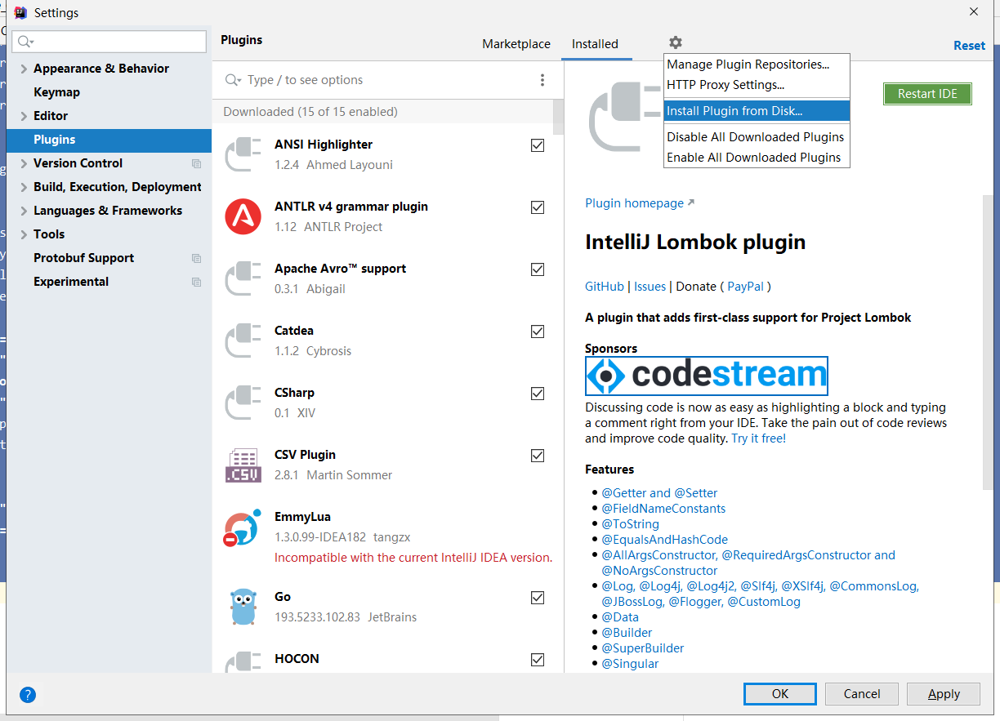

# 实时数仓第3天讲义
**课程目标**

* 能够编写Flink程序解析Kafka中的ProtoBuf
* 能够实现维度数据全量装载、增量更新
* 能够使用Logparsing框架解析Nginx点击流日志
* 能够实现点击流消息实时etl落地dwd

## ods层接入kafka

### 抽取Flink整合Kafka配置

因为后续的ETL处理，都是从Kafka中拉取数据，都需要共用Kafka的配置，所以将Kafka的配置单独抽取到工具类中


在utils包下创建KafkaConsumerProp

```scala
import java.util.Properties

object KafkaProp {
  /**
    * 读取Kafka属性配置
    * @return
    */
  def getProperties() = {
    // 1. 读取Kafka配置
    val properties = new Properties()
    properties.setProperty("bootstrap.servers", GlobalConfigUtil.`bootstrap.servers`)
    properties.setProperty("zookeeper.connect", GlobalConfigUtil.`zookeeper.connect`)
    properties.setProperty("group.id", GlobalConfigUtil.`group.id`)
    properties.setProperty("enable.auto.commit", GlobalConfigUtil.`enable.auto.commit`)
    properties.setProperty("auto.commit.interval.ms", GlobalConfigUtil.`auto.commit.interval.ms`)
    properties.setProperty("auto.offset.reset", GlobalConfigUtil.`auto.offset.reset`)
    properties.setProperty("key.serializer", GlobalConfigUtil.`key.serializer`)
    properties.setProperty("key.deserializer", GlobalConfigUtil.`key.deserializer`)

    properties
  }
}
```

### Flink整合kafka数据源

数据来源主要是分为三个途径：

- 对于商品、订单、订单明细等等数据主要是来自于mysql的binlog日志
- 对于购物车、评论等数据主要是java后台程序直接推送到kafka集群中
- 对于点击流日志主要来自于nginx服务器使用flume采集到kafka集群中

#### 整合Kafka消费binlog消息

在抽象类MySqlBaseETL中，实现Flink整合Kafka。

操作步骤：

1、自定义ProtoBuf反序列化

* 因为Canal采集到的数据是以ProtoBuf形式推入到Kafka中的，故应该使用ProtoBuf来进行反序列化

2、Flink整合Kafka

3、创建订单实时etl处理类

4、编写App测试

##### 自定义ProtoBuf反序列化

反序列化主要是将Byte数组转换为之前封装在common工程的RowData类


在com.itcast.shop.realtime.utils包下创建CanalRowDataDeserializationSchema实现类

```scala
import com.itcast.canal.bean.RowData
import org.apache.flink.api.common.serialization.AbstractDeserializationSchema

/**
  * 自定义ProtoBuf反序列化
  */
class CanalRowDataDeserializationSchema extends AbstractDeserializationSchema[RowData]{
  override def deserialize(bytes: Array[Byte]): RowData = {
    new RowData(bytes)
  }
}
```

##### 定义MySQL消息etl抽象类

后面不少的业务逻辑（订单、订单明细、商品等）需要共用一份Kafka数据（从一个topic中拉取），抽取抽象类的目的是共用一个FlinkKafkaConsumer，因为后面创建FlinkKafkaConsumer整合Kafka需要使用到Flink流式运行环境，需要在主构造器中传入Flink流式运行环境。该ETL抽象类需要从BaseETL继承。


在etl包下创建MySqlBaseETL：

```scala
import org.apache.flink.streaming.api.scala.StreamExecutionEnvironment

/**
 * 消费canal-kafka中的数据
 * @param env
 */
abstract class MySqlBaseETL(env:StreamExecutionEnvironment) extends BaseETL[RowData] {

  //获取到canal中消费出来的RowData对象
  override def getKafkaDataStream(topic:String = GlobalConfigUtil.`input.topic.canal`): DataStream[RowData] = {
    // 获取canal中的数据
    val canalKafkaConsumer: FlinkKafkaConsumer011[RowData] = new FlinkKafkaConsumer011[RowData](
      topic,
      new CanalRowDataDeserializationSchema(),
      KafkaProp.getProperties()
    )

    // 添加source到DataStream中
    val canalRowDataDS: DataStream[bean.RowData] = env.addSource(canalKafkaConsumer)
    canalRowDataDS
  }
}
```

##### 创建订单实时etl处理类

在etl包下创建OrderETL类，用于后续订单实时拉宽处理，此时只用来进行测试

```scala
import org.apache.flink.streaming.api.scala.StreamExecutionEnvironment

/**
  * 订单实时ETL处理
  * @param env Flink运行环境
  */
class OrderETL(env:StreamExecutionEnvironment) extends MySqlBaseETL(env) {
  override def process(): Unit = {
    kafkaDS.print()
  }
}
```

##### 编写App测试

* 创建OrderETL实例对象，并调用process方法执行测试
* 启动canal-client客户端程序订阅binlog消息

```scala
val orderETL = new OrderETL(env)
orderETL.process()
```


在mysql中修改一条数据，确保Flink能够消费并打印ProtoBuf消息：

```json
{"columns":{"bankId":"25","createTime":"2019-12-04 10:00:41","bankName":"杭州发展银行","dataFlag":"1"},"eventType":"update","executeTime":1575442948000,"logfilename":"mysql-bin.000025","logfileoffset":51945936,"tableName":"itcast_banks"}
```


#### 整合kafka消费字符串类型消息

##### 定义MQBase消息etl抽象类

后面不少的业务逻辑（购物车、评论、点击流等）需要共用一份Kafka数据，抽取抽象类的目的是共用一个FlinkKafkaConsumer，因为后面创建FlinkKafkaConsumer整合Kafka需要使用到Flink流式运行环境，需要在主构造器中传入Flink流式运行环境。该ETL抽象类需要从BaseETL继承。

```scala
/**
 * 消费kafka中的数据
 * @param env
 */
abstract class MQBaseETL(env:StreamExecutionEnvironment)  extends BaseETL[String] {
  /**
   * 获取数据源
   * @return
   */
  override def getKafkaDataStream(topic:String): DataStream[String] = {
    // 获取cart中的数据
    val kafkaConsumer: FlinkKafkaConsumer011[String] = new FlinkKafkaConsumer011[String](
      topic,
      new SimpleStringSchema(),
      KafkaProp.getProperties()
    )

    //将消费者添加到数据源
    val jsonDataStream: DataStream[String] = env.addSource(kafkaConsumer)
    jsonDataStream
  }
}
```


#### 整合Kafka消费购物车消息

##### 在application.conf中添加配置

```properties
# Kafka 购物车 topic名称
input.topic.cart="ods_itcast_cart"
```

##### 读取配置

```scala
val `input.topic.cart` = config.getString("input.topic.cart")
```

##### 创建CartETL类，整合Kafka

* 在etl包下创建CartETL，从MQBaseETL继承
* 实现process方法
* 实现getKafkaDS方法，在该方法中整合Kafka，并测试打印消费数据

```scala
/**
  * 购物车实时ETL处理
  * @param env Flink执行环境
  */
class CartETL(env: StreamExecutionEnvironment) extends MQBaseETL(env) {
  /**
    * 业务处理接口
    */
  override def process(): Unit = {
    // 1. 整合Kafka
    val cartDS: DataStream[String] = getKafkaDataStream(GlobalConfigUtil.`input.topic.cart`)
    cartDS.print()
  }
}
```

##### 修改App测试

1、在App对象中创建CartETL对象，并调用process方法

```scala
val cartETL = new CartETL(env)
cartETL.process()
```

2、在Kafka中创建ods层购物车topic

```shell
bin/kafka-topics.sh --create --zookeeper node1:2181 --topic ods_itcast_shop_cart --replication-factor 3 --partitions 3 
```

3、在Kafka中启动控制台生产程序

```shell
bin/kafka-console-producer.sh --broker-list node1:9092 --topic ods_itcast_shop_cart
```

4、启动Flink测试

5、在控制台生产程序中贴入以下消息测试Flink是否能够消费成功

```json
{"addTime":"Mon Dec 16 18:01:41 CST 2019","count":1,"goodsId":"100106","guid":"fd3e6beb-2ce3-4eda-bcaa-bc6221f85016","ip":"123.125.71.102","userId":"100208"}
```

#### 整合Kafka消费评论消息

##### 在application.conf中添加配置

```properties
# kafka 评论 topic名称
input.topic.comments="ods_itcast_shop_comments"
```

##### 读取配置

```scala
val `input.topic.comments` = config.getString("input.topic.comments")
```

##### 创建CommentsETL类，整合Kafka

* 在etl包下创建CommentsETL，从MQBaseETL继承
* 实现process方法，并测试打印消费数据

```scala
/**
  * 点击流处理逻辑
  */
class CommentsETL(env:StreamExecutionEnvironment) extends BaseETL[String] {

  /**
   * 业务处理接口
   */
  override def process(): Unit = {
    // 1. 整合Kafka
    val commentsDS: DataStream[String] = getKafkaDataStream(GlobalConfigUtil.`input.topic.comments`)
    commentsDS.print()
  }
}
```

##### 修改App测试

1、在App对象中创建ClickLogETL对象，并调用process方法

```scala
    val commentsETL = new CommentsETL(env)
    commentsETL.process()
```

2、在Kafka中创建ods层评论topic

```shell
bin/kafka-topics.sh --create --zookeeper node1:2181 --topic ods_itcast_shop_comments --replication-factor 3 --partitions 3 
```

3、在Kafka中启动控制台生产程序

```shell
bin/kafka-console-producer.sh --broker-list node1:9092 --topic ods_itcast_shop_comments
```

4、启动Flink测试

5、在控制台生产程序中贴入以下消息测试Flink是否能够消费成功

```json
{"comments":"外观不错，音效不错，性价比高，值得购买的一款机器","goodsId":112575,"imageViedoJSON":"[\"itcast.com/t1/99554/6/1122/267221/5dba725bE3a436c24/434bf88bc0a2a108.jpg\"]","orderGoodsId":"478845","starScore":1,"timestamp":1577091729997,"userId":"100719","userName":"商区苏"}
```

#### 整合Kafka消费点击流消息

##### 在application.conf中添加配置

```properties
# Kafka click_log topic名称
input.topic.click_log="ods_itcast_click_log"
```

##### 读取配置

```scala
val `input.topic.click_log` = config.getString("input.topic.click_log")
```

##### 创建ClickLogETL类，整合Kafka

* 在etl包下创建ClickLogETL，从MQBaseETL继承
* 实现process方法，整合Kafka，并测试打印消费数据

```scala
/**
  * 点击流处理逻辑
  */
class ClickLogETL(env:StreamExecutionEnvironment) extends BaseETL[String] {
  /**
    * 业务处理接口
    */
  override def process(): Unit = {
      // 1. 整合kafka
    val clickLogDS: DataStream[String] = getKafkaDataStream(GlobalConfigUtil.`input.topic.click_log`)
    clickLogDS.print()
  }
}
```

##### 修改App测试

1、在App对象中创建ClickLogETL对象，并调用process方法

2、在Kafka中创建ods层购物车topic

```shell
bin/kafka-topics.sh --create --zookeeper node1:2181 --topic ods_itcast_click_log --replication-factor 3 --partitions 3 
```

3、在Kafka中启动控制台生产程序

```shell
bin/kafka-console-producer.sh --broker-list node1:9092 --topic ods_itcast_click_log
```

4、启动Flink测试

5、在控制台生产程序中贴入以下消息测试Flink是否能够消费成功

```json
2001:980:91c0:1:8d31:a232:25e5:85d 222.68.172.190 - [05/Sep/2010:11:27:50 +0200] "GET /images/my.jpg HTTP/1.1" 404 23617 "http://www.angularjs.cn/A00n" "Mozilla/5.0 (Macintosh; U; Intel Mac OS X 10_6_4; nl-nl) AppleWebKit/533.17.8 (KHTML, like Gecko) Version/5.0.1 Safari/533.17.8"
```

## Flink实时etl

### 开发环境准备

#### 维度数据全量装载

为了后续将订单、订单明细等数据进行实时ETL拉宽，需要提前将一些维度数据加载一个高性能存储中。此处，选择Redis作为商品维度、商品分类维度、门店维度、运营组织机构维度存储。先一次性将所有MySQL中的维度数据全量装载到Redis中，后续只要MySQL中的维度数据更新，马上使用Flink更新Redis中的维度数据

##### 创建样例类

* 在 com.itcast.shop.realtime.bean 的 DimEntity 类中创建以下样例类

* DimGoodsDBEntity 商品维度样例类

| 列名       | 描述       |
| ---------- | ---------- |
| goodsName  | 商品名称   |
| shopId     | 店铺id     |
| goodsCatId | 商品分类id |
| shopPrice  | 商品价格   |
| goodsId    | 商品id     |

* DimGoodsCatDBEntity 商品分类维度样例类

| 列名      | 描述         |
| --------- | ------------ |
| catId     | 商品分类id   |
| parentId  | 商品分类父id |
| catName   | 商品分类名称 |
| cat_level | 商品分类级别 |

* DimShopsDBEntity 店铺维度样例类

| 列名        | 描述         |
| ----------- | ------------ |
| shopId      | 店铺id       |
| areaId      | 区域id       |
| shopName    | 店铺名称     |
| shopCompany | 店铺公司名称 |

* DimOrgDBEntity 机构维度样例表

| 列名     | 描述     |
| -------- | -------- |
| orgId    | 机构id   |
| parentId | 父机构id |
| orgName  | 机构名称 |
| orgLevel | 机构级别 |

- DimShopCatsDBEntity门店商品分类维度样例表

| 列名     | 描述             |
| -------- | ---------------- |
| catId    | 门店商品分类id   |
| parentId | 门店商品分类父id |
| catName  | 门店商品分类名称 |
| catSort  | 门店商品分类级别 |

参考代码：

```scala
/**
 * 定义维度表的样例类
 *
 * @BeanProperty：生成set和get方法
 */
// 商品维度样例类
case class DimGoodsDBEntity(@BeanProperty goodsId:Long = 0,		// 商品id
                            @BeanProperty goodsName:String = "",	// 商品名称
                            @BeanProperty shopId:Long = 0,			// 店铺id
                            @BeanProperty goodsCatId:Int = 0,   // 商品分类id
                            @BeanProperty shopPrice:Double = 0) // 商品价格
/**
 * 商品的伴生对象
 */
object DimGoodsDBEntity{
  def apply(json:String): DimGoodsDBEntity = {
    //正常的话，订单明细表的商品id会存在与商品表中，假如商品id不存在商品表，这里解析的时候就会抛出异常
    if(json != null){
      val jsonObject: JSONObject = JSON.parseObject(json)
      new DimGoodsDBEntity(
        jsonObject.getLong("goodsId"),
        jsonObject.getString("goodsName"),
        jsonObject.getLong("shopId"),
        jsonObject.getInteger("goodsCatId"),
        jsonObject.getDouble("shopPrice"))
    }else{
      new DimGoodsDBEntity
    }
  }
}


// 商品分类维度样例类
case class DimGoodsCatDBEntity(@BeanProperty catId:String = "",	    // 商品分类id
                               @BeanProperty parentId:String = "",	// 商品分类父id
                               @BeanProperty catName:String = "",	  // 商品分类名称
                               @BeanProperty cat_level:String = "")	// 商品分类级别

object DimGoodsCatDBEntity {
  def apply(json:String): DimGoodsCatDBEntity = {
    if(json != null) {
      val jsonObj = JSON.parseObject(json)

      val catId = jsonObj.getString("catId")
      val catName = jsonObj.getString("catName")
      val cat_level = jsonObj.getString("cat_level")
      val parentId = jsonObj.getString("parentId")
      DimGoodsCatDBEntity(catId, parentId, catName, cat_level)
    }else{
      new DimGoodsCatDBEntity
    }
  }
}

// 店铺维度样例类
case class DimShopsDBEntity(@BeanProperty shopId:Int  = 0,		      // 店铺id
                            @BeanProperty areaId:Int  = 0,		      // 店铺所属区域id
                            @BeanProperty shopName:String  = "",	  // 店铺名称
                            @BeanProperty shopCompany:String  = "")	// 公司名称

object DimShopsDBEntity {
  def apply(json:String): DimShopsDBEntity = {
    if(json != null) {
      val jsonObject = JSON.parseObject(json)
      val areaId = jsonObject.getString("areaId")
      val shopCompany = jsonObject.getString("shopCompany")
      val shopId = jsonObject.getString("shopId")
      val shopName = jsonObject.getString("shopName")

      DimShopsDBEntity(shopId.toInt, areaId.toInt, shopName, shopCompany)
    }else{
      new DimShopsDBEntity
    }
  }
}

// 组织结构维度样例类
case class DimOrgDBEntity(@BeanProperty orgId:Int = 0,			  // 机构id
                          @BeanProperty parentId:Int = 0,		  // 机构父id
                          @BeanProperty orgName:String = "",	// 组织机构名称
                          @BeanProperty orgLevel:Int = 0)		  // 组织机构级别

object DimOrgDBEntity {
  def apply(json:String): DimOrgDBEntity = {
    if(json != null) {
      val jsonObject = JSON.parseObject(json)
      val orgId = jsonObject.getString("orgId")
      val orgLevel = jsonObject.getString("orgLevel")
      val orgName = jsonObject.getString("orgName")
      val parentId = jsonObject.getString("parentId")

      DimOrgDBEntity(orgId.toInt, parentId.toInt, orgName, orgLevel.toInt)
    }else{
      new DimOrgDBEntity()
    }
  }
}

// 门店商品分类维度样例类
case class DimShopCatDBEntity(@BeanProperty catId:String = "",	      // 商品分类id
                              @BeanProperty parentId:String = "",	  // 商品分类父id
                              @BeanProperty catName:String = "", 	  // 商品分类名称
                              @BeanProperty catSort:String = "")	    // 商品分类级别

object DimShopCatDBEntity {
  def apply(json:String): DimShopCatDBEntity = {
    if(json != null) {
      val jsonObj = JSON.parseObject(json)
      val catId = jsonObj.getString("catId")
      val catName = jsonObj.getString("catName")
      val catSort = jsonObj.getString("catSort")
      val parentId = jsonObj.getString("parentId")
      DimShopCatDBEntity(catId, parentId, catName, catSort)
    }else{
      new DimShopCatDBEntity()
    }
  }
}
```

##### 在配置文件中添加Redis配置、MySQL配置

```properties
# Redis配置
redis.server.ip="node2"
redis.server.port=6379

# MySQL配置
mysql.server.ip="node1"
mysql.server.port=3306
mysql.server.database="itcast_shop"
mysql.server.username="root"
mysql.server.password="123456"
```

##### 编写配置工具类

```scala
val `redis.server.ip` = config.getString("redis.server.ip")
val `redis.server.port` = config.getString("redis.server.port")
val `mysql.server.ip` = config.getString("mysql.server.ip")
val `mysql.server.port` = config.getString("mysql.server.port")
val `mysql.server.database` = config.getString("mysql.server.database")
val `mysql.server.username` = config.getString("mysql.server.username")
val `mysql.server.password` = config.getString("mysql.server.password")
```

##### 编写Redis操作工具类

在utils类中添加RedisUtils类，使用Redis连接池操作Redis

```scala
object RedisUtil {
  val config = new JedisPoolConfig()

  //是否启用后进先出, 默认true
  config.setLifo(true)
  //最大空闲连接数, 默认8个
  config.setMaxIdle(8)
  //最大连接数, 默认8个
  config.setMaxTotal(1000)
  //获取连接时的最大等待毫秒数(如果设置为阻塞时BlockWhenExhausted),如果超时就抛异常, 小于零:阻塞不确定的时间,  默认-1
  config.setMaxWaitMillis(-1)
  //逐出连接的最小空闲时间 默认1800000毫秒(30分钟)
  config.setMinEvictableIdleTimeMillis(1800000)
  //最小空闲连接数, 默认0
  config.setMinIdle(0)
  //每次逐出检查时 逐出的最大数目 如果为负数就是 : 1/abs(n), 默认3
  config.setNumTestsPerEvictionRun(3)
  //对象空闲多久后逐出, 当空闲时间>该值 且 空闲连接>最大空闲数 时直接逐出,不再根据MinEvictableIdleTimeMillis判断  (默认逐出策略)
  config.setSoftMinEvictableIdleTimeMillis(1800000)
  //在获取连接的时候检查有效性, 默认false
  config.setTestOnBorrow(false)
  //在空闲时检查有效性, 默认false
  config.setTestWhileIdle(false)

  var jedisPool: JedisPool = new JedisPool(config, GlobalConfigUtil.`redis.server.ip`, GlobalConfigUtil.`redis.server.port`.toInt)

  /**
    * 获取Redis连接
    * @return
    */
  def getResouce() = {
    jedisPool.getResource
  }
}
```

##### 读取MySQL商品维度数据到Redis 

在 cn.itcast.shop.realtime.etl.dataloader 包中创建 DimensionDataLoader 单例对象，实现装载商品维度数据


实现步骤：

1、先从MySQL的 itcast_goods 表中加载数据

2、将数据保存到键为 itcast_goods:dim_goods 的 HASH 结构中

3、关闭资源


参考代码：

```scala
  def main(args: Array[String]): Unit = {
    Class.forName("com.mysql.jdbc.Driver")

    val connection = DriverManager.getConnection("jdbc:mysql://node1:3306/itcast_shop", "root", "123456")
    val jedis = RedisUtil.getJedis()

    loadDimGoods(connection, jedis)
  }

  // 加载商品维度数据到Redis
  def loadDimGoods(connection: Connection, jedis: Jedis) = {
    val querySql: String =
      """
        |SELECT
        |	t1.`goodsId`,
        |	t1.`goodsName`,
        |	t1.`goodsCatId`,
        | t1.`shopPrice`,
        |	t1.`shopId`
        |FROM
        |	itcast_goods t1
      """.stripMargin
    val statement: Statement = connection.createStatement
    val resultSet: ResultSet = statement.executeQuery(querySql)

    while (resultSet.next) {
      val goodsId: Long = resultSet.getLong("goodsId")
      val goodsName: String = resultSet.getString("goodsName")
      val goodsCatId: Long = resultSet.getLong("goodsCatId")
      val shopPrice:Double = resultSet.getDouble("shopPrice")
      val shopId: Long = resultSet.getLong("shopId")

      val entity = DimGoodsDBEntity(goodsId, goodsName, shopId, goodsCatId.toInt, shopPrice)
      println(entity)

      jedis.hset("itcast_shop:dim_goods", goodsId + "", JSON.toJSONString(entity, SerializerFeature.DisableCircularReferenceDetect))
    }
    resultSet.close()
    statement.close()
  }

```


##### 读取MySQL店铺维度数据到Redis

实现步骤：

1、先从MySQL的 itcast_shops 表中加载数据

2、将数据保存到键为 itcast_goods:dim_shops 的 HASH 结构中

3、关闭资源


参考代码：

```scala
// 加载商铺维度数据到Redis
  // 加载商铺维度数据到Redis
  def loadDimShops(connection: Connection, jedis: Jedis) = {
    val sql =
      """
        |SELECT
        |	t1.`shopId`,
        |	t1.`areaId`,
        |	t1.`shopName`,
        |	t1.`shopCompany`
        |FROM
        |	itcast_shops t1
      """.stripMargin

    val statement = connection.createStatement()
    val resultSet = statement.executeQuery(sql)

    while (resultSet.next()) {
      val shopId = resultSet.getInt("shopId")
      val areaId = resultSet.getInt("areaId")
      val shopName = resultSet.getString("shopName")
      val shopCompany = resultSet.getString("shopCompany")

      val dimShop = DimShopsDBEntity(shopId, areaId, shopName, shopCompany)
      println(dimShop)
      jedis.hset("itcast_shop:dim_shops", shopId + "", JSON.toJSONString(dimShop, SerializerFeature.DisableCircularReferenceDetect))
    }

    resultSet.close()
    statement.close()
  }
```


##### 读取MySQL商品分类维度数据到Redis

实现步骤：

1、先从MySQL的 itcast_goods_cats 表中加载数据

2、将数据保存到键为 itcast_shop:dim_goods_cats 的 HASH 结构中

3、关闭资源


参考代码：

```scala
  def loadDimGoodsCats(connection: Connection, jedis: Jedis) = {
    val sql = """
                |SELECT
                |	t1.`catId`,
                |	t1.`parentId`,
                |	t1.`catName`,
                |	t1.`cat_level`
                |FROM
                |	itcast_goods_cats t1
              """.stripMargin

    val statement = connection.createStatement()
    val resultSet = statement.executeQuery(sql)

    while(resultSet.next()) {
      val catId = resultSet.getString("catId")
      val parentId = resultSet.getString("parentId")
      val catName = resultSet.getString("catName")
      val cat_level = resultSet.getString("cat_level")

      val entity = DimGoodsCatDBEntity(catId, parentId, catName, cat_level)
      println(entity)

      jedis.hset("itcast_shop:dim_goods_cats", catId, JSON.toJSONString(entity, SerializerFeature.DisableCircularReferenceDetect))
    }

    resultSet.close()
    statement.close()
  }
```


##### 读取MySQL组织结构数据到Redis

实现步骤：

1、先从MySQL的 itcast_org 表中加载数据

2、将数据保存到键为 itcast_shop:dim_org 的 HASH 结构中

3、关闭资源


参考代码：

```scala
  // 加载组织结构维度数据
  def loadDimOrg(connection: Connection, jedis: Jedis) = {
    val sql = """
                |SELECT
                |	orgid,
                |	parentid,
                |	orgName,
                |	orgLevel
                |FROM
                |	itcast_org
              """.stripMargin

    val statement = connection.createStatement()
    val resultSet = statement.executeQuery(sql)

    while(resultSet.next()) {
      val orgId = resultSet.getInt("orgId")
      val parentId = resultSet.getInt("parentId")
      val orgName = resultSet.getString("orgName")
      val orgLevel = resultSet.getInt("orgLevel")

      val entity = DimOrgDBEntity(orgId, parentId, orgName, orgLevel)
      println(entity)
      jedis.hset("itcast_shop:dim_org", orgId + "", JSON.toJSONString(entity, SerializerFeature.DisableCircularReferenceDetect))
    }
  }
```

##### 读取MySQL门店商品分类维度数据到Redis

实现步骤：

1、先从MySQL的 itcast_shop_cats表中加载数据

2、将数据保存到键为 itcast_shop:dim_shop_cats 的 HASH 结构中

3、关闭资源


参考代码：

```scala
// 加载门店商品分类维度数据到Redis
  def LoadDimShopCats(connection: Connection, jedis: Jedis): Unit ={
    val sql = """
                |SELECT
                |	t1.`catId`,
                |	t1.`parentId`,
                |	t1.`catName`,
                |	t1.`catSort`
                |FROM
                |	itcast_shop_cats t1
              """.stripMargin

    val statement = connection.createStatement()
    val resultSet = statement.executeQuery(sql)

    while(resultSet.next()) {
      val catId = resultSet.getString("catId")
      val parentId = resultSet.getString("parentId")
      val catName = resultSet.getString("catName")
      val cat_level = resultSet.getString("catSort")

      val entity = DimShopCatDBEntity(catId, parentId, catName, cat_level)
      println(entity)

      jedis.hset("itcast_shop:dim_shop_cats", catId, JSON.toJSONString(entity, SerializerFeature.DisableCircularReferenceDetect))
    }

    resultSet.close()
    statement.close()
  }
```


维度数据增量更新

#### 创建同步Redis中维度数据ETL处理类

在etl包下创建SyncDimDataETL类，继承MySqlBaseETL特质，实现process方法

```scala
/**
  * Redis维度数据同步业务
  */
class SyncDimDataETL(env: StreamExecutionEnvironment) extends MySqlBaseETL(env) {
  /**
    * 业务处理接口
    */
  override def process(): Unit = {
    
  }
}
```


##### 过滤维度表消息

只过滤出来维度表的数据流

```scala
// 过滤维度表消息
val dimRowDataDS = canalRowDataDS.filter {
    rowData =>
    rowData.getTableName match {
        case "itcast_goods" => true
        case "itcast_shops" => true
        case "itcast_goods_cats" => true
        case "itcast_org" => true
        case _ => false
    }
}
```

##### 处理新增/更新维度消息

使用Redis处理增量同步，insert和update消息统一处理，直接将Redis中的Hash结构更新

```scala
/**
  * Redis维度数据同步业务
  */
class SyncDimDataETL(env: StreamExecutionEnvironment) extends MySqlBaseETL(env) {
    ........

    // 更新Redis
    dimRowDataDS.addSink(new RichSinkFunction[RowData] {
      var jedis: Jedis = _

      override def open(parameters: Configuration): Unit = {
        jedis = RedisUtil.getResouce()
        jedis.select(1)
      }

      override def close(): Unit = {
        if (jedis != null) {
          jedis.close()
        }
      }

      override def invoke(rowData: RowData, context: SinkFunction.Context[_]): Unit = {
        rowData.getEventType match {
          case eventType if(eventType == "insert" || eventType == "update") => updateDimData(rowData)
        }
      }

      private def updateDimData(rowData:RowData) = {
        rowData.getTableName match {
          case "itcast_goods" => {
            val goodsId = rowData.getColumns.get("goodsId")
            val goodsName = rowData.getColumns.get("goodsName")
            val goodsCatId = rowData.getColumns.get("goodsCatId")
            val shopId = rowData.getColumns.get("shopId")
            val shopPrice = rowData.getColumns.get("shopPrice")

            val entity = DimGoodsDBEntity(goodsId.toLong, goodsName, shopId.toLong, goodsCatId.toInt, shopPrice.toDouble)
            println("增量更新：" + entity)

            jedis.hset("itcast_shop:dim_goods", goodsId, JSON.toJSONString(entity, SerializerFeature.DisableCircularReferenceDetect))
          }
          case "itcast_shops" => {
            val shopId = rowData.getColumns.get("shopId")
            val areaId = rowData.getColumns.get("areaId")
            val shopName = rowData.getColumns.get("shopName")
            val shopCompany = rowData.getColumns.get("shopCompany")

            val dimShop = DimShopsDBEntity(shopId.toInt, areaId.toInt, shopName, shopCompany)
            println("增量更新：" + dimShop)
            jedis.hset("itcast_shop:dim_shops", shopId + "", JSON.toJSONString(dimShop, SerializerFeature.DisableCircularReferenceDetect))
          }
          case "itcast_goods_cats" => {
            val catId = rowData.getColumns.get("catId")
            val parentId = rowData.getColumns.get("parentId")
            val catName = rowData.getColumns.get("catName")
            val cat_level = rowData.getColumns.get("cat_level")

            val entity = DimGoodsCatDBEntity(catId, parentId, catName, cat_level)
            println("增量更新：" + entity)

            jedis.hset("itcast_shop:dim_goods_cats", catId, JSON.toJSONString(entity, SerializerFeature.DisableCircularReferenceDetect))
          }
          case "itcast_org" => {
            val orgId = rowData.getColumns.get("orgId")
            val parentId = rowData.getColumns.get("parentId")
            val orgName = rowData.getColumns.get("orgName")
            val orgLevel = rowData.getColumns.get("orgLevel")

            val entity = DimOrgDBEntity(orgId.toInt, parentId.toInt, orgName, orgLevel.toInt)
            println("增量更新：" + entity)
            jedis.hset("itcast_shop:dim_org", orgId + "", JSON.toJSONString(entity, SerializerFeature.DisableCircularReferenceDetect))

          }
        }
      }
    })
  }
}
```


##### 处理删除维度消息

当接收到Kafka中的binlog消息是delete时，需要将Redis中的维度数据删除

```scala
/**
  * Redis维度数据同步业务
  */
class SyncDimDataETL(env: StreamExecutionEnvironment) extends MySqlBaseETL(env) {
  /**
    * 业务处理接口
    */
  override def process(): Unit = {
    ....

    // 更新Redis
    dimRowDataDS.addSink(new RichSinkFunction[RowData] {
      .......

      override def invoke(rowData: RowData, context: SinkFunction.Context[_]): Unit = {
        rowData.getEventType match {
          case eventType if(eventType == "insert" || eventType == "update") => updateDimData(rowData)
          case "delete" => deleteDimData(rowData)
        }
      }

      private def deleteDimData(rowData: RowData) = {
        rowData.getTableName match {
          case "itcast_goods" => {
            jedis.hdel("itcast_shop:dim_goods", rowData.getColumns.get("goodsId"))
          }
          case "itcast_shops" => {
            jedis.hdel("itcast_shop:dim_shops", rowData.getColumns.get("shopId"))
          }
          case "itcast_goods_cats" => {
            jedis.hdel("itcast_shop:dim_goods_cats", rowData.getColumns.get("catId"))
          }
          case "itcast_org" => {
            jedis.hdel("itcast_shop:dim_org", rowData.getColumns.get("orgId"))
          }
        }
      }
    })
  }
}
```

##### 在App中调用同步ETL

1、在App中创建实时同步ETL，并调用处理方法

```scala
    val syncRedisDimDataETL = new SyncRedisDimDataETL(env)
    syncRedisDimDataETL.process()
```

2、启动Flink程序

3、测试

* 新增MySQL中的一条表数据，测试Redis中的数据是否同步更新

* 修改MySQL中的一条表数据，测试Redis中的数据是否同步更新
* 删除MySQL中的一条表数据，测试Redis中的数据是否同步更新

查看redis中的数据

```shell
192.168.88.121:0>select 1
"OK"
192.168.88.121:1>hget itcast_shop:dim_goods 115912
"{"goodsCatId":10361,"goodsId":115912,"goodsName":"机械革命深海泰坦X9Ti-R","shopId":100364,"shopPrice":13999.0}"
```

导入

### 点击流消息实时拉宽处理

#### Apache HTTPD和NGINX访问日志解析器

这是一个Logparsing框架，旨在简化[Apache HTTPD](https://httpd.apache.org/)和[NGINX](https://nginx.org/)访问日志文件的解析。

基本思想是，您应该能够拥有一个解析器，可以通过简单地告诉该行写入了哪些配置选项来构造该解析器。这些配置选项是访问日志行的架构。

github地址：https://github.com/nielsbasjes/logparser


##### idea安装插件

Lombok能以简单的注解形式来简化java代码，提高开发人员的开发效率。例如开发中经常需要写的javabean，都需要花时间去添加相应的getter/setter，也许还要去写构造器、equals等方法，而且需要维护，当属性多时会出现大量的getter/setter方法，这些显得很冗长也没有太多技术含量，一旦修改属性，就容易出现忘记修改对应方法的失误。

Lombok能通过注解的方式，在编译时自动为属性生成构造器、getter/setter、equals、hashcode、toString方法。出现的神奇就是在源码中没有getter和setter方法，但是在编译生成的字节码文件中有getter和setter方法。这样就省去了手动重建这些代码的麻烦，使代码看起来更简洁些。


**安装步骤：**

- 打开idea，进入插件安装窗口
- 选择从磁盘安装



- 选择插件所在路径
- 重启idea即可生效


##### 导入依赖

```xml
<dependency>
    <groupId>nl.basjes.parse.httpdlog</groupId>
    <artifactId>httpdlog-parser</artifactId>
    <version>5.2</version>
</dependency>
```

##### nginx日志样本

在nginx的conf目录下的nginx.conf文件中可以配置日志打印的格式，如下：

```
 #log_format  main   '$remote_addr - $remote_user [$time_local] [$msec] 	
 						[$request_time] [$http_host] "$request" '
                    '$status $body_bytes_sent "$request_body" "$http_referer" '
                    '"$http_user_agent" $http_x_forwarded_for'
```

$remote_addr  对应客户端的地址

$remote_user   是请求客户端请求认证的用户名，如果没有开启认证模块的话是值为空。

$time_local   表示nginx服务器时间

$msec   访问时间与时区字符串形式

$request_time  请求开始到返回时间

$http_host   请求域名

$request   请求的url与http协议

$status    请求状态,如成功200

$body_bytes_sent   表示从服务端返回给客户端的body数据大小

$request_body   访问url时参数

$http_referer     记录从那个页面链接访问过来的

$http_user_agent    记录客户浏览器的相关信息

$http_x_forwarded_for  请求转发f过来的地址

$upstream_response_time:从 Nginx 建立连接 到 接收完数据并关闭连接


范例:

125.88.xxx.xx - - [02/Nov/2018:14:28:49 +0800] [1541140129.431] [0.095] [ma.xx.game.com] "POST /?log3/gameReport HTTP/1.1" 200 358 "type=1&id=NaN" "http://ma.xx.game.com/?log3/gameReport2" "Mozilla/5.0 (Windows NT 6.1; Win64; x64) AppleWebKit/537.36 (KHTML, like Gecko) Chrome/70.0.3538.77 Safari/537.36" -

##### 点击日流日志样本

```
2001-980:91c0:1:8d31:a232:25e5:85d 222.68.172.190 - [05/Sep/2010:11:27:50 +0200] \"GET /images/my.jpg HTTP/1.1\" 404 23617 \"http://www.angularjs.cn/A00n\" \"Mozilla/5.0 (Macintosh; U; Intel Mac OS X 10_6_4; nl-nl) AppleWebKit/533.17.8 (KHTML, like Gecko) Version/5.0.1 Safari/533.17.8\" \"jquery-ui-theme=Eggplant; BuI=SomeThing; Apache=127.0.0.1.1351111543699529\" \"beijingshi\"
```

##### 定义格式化字符串

参考：https://httpd.apache.org/docs/current/mod/mod_log_config.html

```
%u %h %l %t \"%r\" %>s %b \"%{Referer}i\" \"%{User-Agent}i\" \"%{Cookie}i\" \"%{Addr}i\"
```

##### 使用方式

打印日志格式字符串的所有参数

```java
public class Test {
    public static void main(String[] args) throws MissingDissectorsException, NoSuchMethodException, DissectionFailure, InvalidDissectorException {
        new Test().run();
    }

    String logformat = "%u %h %l %t \"%r\" %>s %b \"%{Referer}i\" \"%{User-Agent}i\" \"%{Cookie}i\" \"%{Addr}i\"";
    String logline = "2001-980:91c0:1:8d31:a232:25e5:85d 222.68.172.190 - [05/Sep/2010:11:27:50 +0200] \"GET /images/my.jpg HTTP/1.1\" 404 23617 \"http://www.angularjs.cn/A00n\" \"Mozilla/5.0 (Macintosh; U; Intel Mac OS X 10_6_4; nl-nl) AppleWebKit/533.17.8 (KHTML, like Gecko) Version/5.0.1 Safari/533.17.8\" \"jquery-ui-theme=Eggplant; BuI=SomeThing; Apache=127.0.0.1.1351111543699529\" \"beijingshi\"";

    private void run() throws InvalidDissectorException, MissingDissectorsException, NoSuchMethodException, DissectionFailure {
        //打印日志格式的参数列表
        printAllPossibles(logformat);
}

    private static final Logger LOG = LoggerFactory.getLogger(Test.class);

    //打印所有参数
    private void printAllPossibles(String logformat) throws NoSuchMethodException, MissingDissectorsException, InvalidDissectorException {
        Parser<Object> dummyParser = new HttpdLoglineParser<>(Object.class, logformat);
        List<String> possiblePaths = dummyParser.getPossiblePaths();
        dummyParser.addParseTarget(String.class.getMethod("indexOf", String.class), possiblePaths);

        LOG.info("==================================");
        System.out.println("==================================");
        LOG.info("Possible output:");
        System.out.println("Possible output:");
        for (String path : possiblePaths) {
            System.out.println(path + "     " + dummyParser.getCasts(path));
            LOG.info("{}     {}", path, dummyParser.getCasts(path));
        }
        System.out.println("==================================");
        LOG.info("==================================");
    }
}
```


##### 入门案例

定义实体对象

```java
public class MyRecord {
    @Getter @Setter private String connectionClientUser = null;
    @Getter @Setter private String connectionClientHost = null;
    @Getter @Setter private String requestReceiveTime   = null;
    @Getter @Setter private String method               = null;
    @Getter @Setter private String referrer             = null;
    @Getter @Setter private String screenResolution     = null;
    @Getter @Setter private String requestStatus        = null;
    @Getter @Setter private String responseBodyBytes    = null;
    @Getter @Setter private Long   screenWidth          = null;
    @Getter @Setter private Long   screenHeight         = null;
    @Getter @Setter private String googleQuery          = null;
    @Getter @Setter private String bui                  = null;
    @Getter @Setter private String useragent            = null;

    @Getter @Setter private String asnNumber            = null;
    @Getter @Setter private String asnOrganization      = null;
    @Getter @Setter private String ispName              = null;
    @Getter @Setter private String ispOrganization      = null;

    @Getter @Setter private String continentName        = null;
    @Getter @Setter private String continentCode        = null;
    @Getter @Setter private String countryName          = null;
    @Getter @Setter private String countryIso           = null;
    @Getter @Setter private String subdivisionName      = null;
    @Getter @Setter private String subdivisionIso       = null;
    @Getter @Setter private String cityName             = null;
    @Getter @Setter private String postalCode           = null;
    @Getter @Setter private Double locationLatitude     = null;
    @Getter @Setter private Double locationLongitude    = null;

    private final Map<String, String> results = new HashMap<>(32);

    @Field("STRING:request.firstline.uri.query.*")
    public void setQueryDeepMany(final String name, final String value) {
        results.put(name, value);
    }

    @Field("STRING:request.firstline.uri.query.img")
    public void setQueryImg(final String name, final String value) {
        results.put(name, value);
    }

    @Field("IP:connection.client.host")
    public void setIP(final String value) {
        results.put("IP:connection.client.host", value);
    }

    public String getUser() {
        return results.get("IP:connection.client.host");
    }


    @Field({
            "STRING:connection.client.user",
            "HTTP.HEADER:request.header.addr",
            "IP:connection.client.host.last",
            "TIME.STAMP:request.receive.time.last",
            "TIME.DAY:request.receive.time.last.day",
            "TIME.MONTHNAME:request.receive.time.last.monthname",
            "TIME.MONTH:request.receive.time.last.month",
            "TIME.WEEK:request.receive.time.last.weekofweekyear",
            "TIME.YEAR:request.receive.time.last.weekyear",
            "TIME.YEAR:request.receive.time.last.year",
            "TIME.HOUR:request.receive.time.last.hour",
            "TIME.MINUTE:request.receive.time.last.minute",
            "TIME.SECOND:request.receive.time.last.second",
            "TIME.MILLISECOND:request.receive.time.last.millisecond",
            "TIME.MICROSECOND:request.receive.time.last.microsecond",
            "TIME.NANOSECOND:request.receive.time.last.nanosecond",
            "TIME.DATE:request.receive.time.last.date",
            "TIME.TIME:request.receive.time.last.time",
            "TIME.ZONE:request.receive.time.last.timezone",
            "TIME.EPOCH:request.receive.time.last.epoch",
            "TIME.DAY:request.receive.time.last.day_utc",
            "TIME.MONTHNAME:request.receive.time.last.monthname_utc",
            "TIME.MONTH:request.receive.time.last.month_utc",
            "TIME.WEEK:request.receive.time.last.weekofweekyear_utc",
            "TIME.YEAR:request.receive.time.last.weekyear_utc",
            "TIME.YEAR:request.receive.time.last.year_utc",
            "TIME.HOUR:request.receive.time.last.hour_utc",
            "TIME.MINUTE:request.receive.time.last.minute_utc",
            "TIME.SECOND:request.receive.time.last.second_utc",
            "TIME.MILLISECOND:request.receive.time.last.millisecond_utc",
            "TIME.MICROSECOND:request.receive.time.last.microsecond_utc",
            "TIME.NANOSECOND:request.receive.time.last.nanosecond_utc",
            "TIME.DATE:request.receive.time.last.date_utc",
            "TIME.TIME:request.receive.time.last.time_utc",
            "HTTP.URI:request.referer",
            "HTTP.PROTOCOL:request.referer.protocol",
            "HTTP.USERINFO:request.referer.userinfo",
            "HTTP.HOST:request.referer.host",
            "HTTP.PORT:request.referer.port",
            "HTTP.PATH:request.referer.path",
            "HTTP.QUERYSTRING:request.referer.query",
            "STRING:request.referer.query.*",
            "HTTP.REF:request.referer.ref",
            "TIME.STAMP:request.receive.time",
            "TIME.DAY:request.receive.time.day",
            "TIME.MONTHNAME:request.receive.time.monthname",
            "TIME.MONTH:request.receive.time.month",
            "TIME.WEEK:request.receive.time.weekofweekyear",
            "TIME.YEAR:request.receive.time.weekyear",
            "TIME.YEAR:request.receive.time.year",
            "TIME.HOUR:request.receive.time.hour",
            "TIME.MINUTE:request.receive.time.minute",
            "TIME.SECOND:request.receive.time.second",
            "TIME.MILLISECOND:request.receive.time.millisecond",
            "TIME.MICROSECOND:request.receive.time.microsecond",
            "TIME.NANOSECOND:request.receive.time.nanosecond",
            "TIME.DATE:request.receive.time.date",
            "TIME.TIME:request.receive.time.time",
            "TIME.ZONE:request.receive.time.timezone",
            "TIME.EPOCH:request.receive.time.epoch",
            "TIME.DAY:request.receive.time.day_utc",
            "TIME.MONTHNAME:request.receive.time.monthname_utc",
            "TIME.MONTH:request.receive.time.month_utc",
            "TIME.WEEK:request.receive.time.weekofweekyear_utc",
            "TIME.YEAR:request.receive.time.weekyear_utc",
            "TIME.YEAR:request.receive.time.year_utc",
            "TIME.HOUR:request.receive.time.hour_utc",
            "TIME.MINUTE:request.receive.time.minute_utc",
            "TIME.SECOND:request.receive.time.second_utc",
            "TIME.MILLISECOND:request.receive.time.millisecond_utc",
            "TIME.MICROSECOND:request.receive.time.microsecond_utc",
            "TIME.NANOSECOND:request.receive.time.nanosecond_utc",
            "TIME.DATE:request.receive.time.date_utc",
            "TIME.TIME:request.receive.time.time_utc",
            "HTTP.URI:request.referer.last",
            "HTTP.PROTOCOL:request.referer.last.protocol",
            "HTTP.USERINFO:request.referer.last.userinfo",
            "HTTP.HOST:request.referer.last.host",
            "HTTP.PORT:request.referer.last.port",
            "HTTP.PATH:request.referer.last.path",
            "HTTP.QUERYSTRING:request.referer.last.query",
            "STRING:request.referer.last.query.*",
            "HTTP.REF:request.referer.last.ref",
            "NUMBER:connection.client.logname",
            "BYTESCLF:response.body.bytes",
            "BYTES:response.body.bytes",
            "HTTP.USERAGENT:request.user-agent.last",
            "HTTP.COOKIES:request.cookies.last",
            "HTTP.COOKIE:request.cookies.last.*",
            "STRING:request.status.last",
            "HTTP.USERAGENT:request.user-agent",
            "STRING:connection.client.user.last",
            "HTTP.FIRSTLINE:request.firstline.original",
            "HTTP.METHOD:request.firstline.original.method",
            "HTTP.URI:request.firstline.original.uri",
            "HTTP.PROTOCOL:request.firstline.original.uri.protocol",
            "HTTP.USERINFO:request.firstline.original.uri.userinfo",
            "HTTP.HOST:request.firstline.original.uri.host",
            "HTTP.PORT:request.firstline.original.uri.port",
            "HTTP.PATH:request.firstline.original.uri.path",
            "HTTP.QUERYSTRING:request.firstline.original.uri.query",
            "STRING:request.firstline.original.uri.query.*",
            "HTTP.REF:request.firstline.original.uri.ref",
            "HTTP.PROTOCOL_VERSION:request.firstline.original.protocol",
            "HTTP.PROTOCOL:request.firstline.original.protocol",
            "HTTP.PROTOCOL.VERSION:request.firstline.original.protocol.version",
            "BYTESCLF:response.body.bytes.last",
            "BYTES:response.body.bytes.last",
            "NUMBER:connection.client.logname.last",
            "HTTP.FIRSTLINE:request.firstline",
            "HTTP.METHOD:request.firstline.method",
            "HTTP.URI:request.firstline.uri",
            "HTTP.PROTOCOL:request.firstline.uri.protocol",
            "HTTP.USERINFO:request.firstline.uri.userinfo",
            "HTTP.HOST:request.firstline.uri.host",
            "HTTP.PORT:request.firstline.uri.port",
            "HTTP.PATH:request.firstline.uri.path",
            "HTTP.QUERYSTRING:request.firstline.uri.query",
            "STRING:request.firstline.uri.query.*",
            "HTTP.REF:request.firstline.uri.ref",
            "HTTP.PROTOCOL_VERSION:request.firstline.protocol",
            "HTTP.PROTOCOL:request.firstline.protocol",
            "HTTP.PROTOCOL.VERSION:request.firstline.protocol.version",
            "HTTP.COOKIES:request.cookies",
            "HTTP.COOKIE:request.cookies.*",
            "BYTES:response.body.bytesclf",
            "BYTESCLF:response.body.bytesclf",
            "IP:connection.client.host",
    })
    public void setValue(final String name, final String value) {
        results.put(name, value);
    }

    public String toString() {
        StringBuilder sb = new StringBuilder();
        TreeSet<String> keys = new TreeSet<>(results.keySet());
        for (String key : keys) {
            sb.append(key).append(" = ").append(results.get(key)).append('\n');
        }

        return sb.toString();
    }

    public void clear() {
        results.clear();
    }
}
```

核心代码实现：

```java
public class Test {
    public static void main(String[] args) throws MissingDissectorsException, NoSuchMethodException, DissectionFailure, InvalidDissectorException {
        new Test().run();
    }

    String logformat = "%u %h %l %t \"%r\" %>s %b \"%{Referer}i\" \"%{User-Agent}i\" \"%{Cookie}i\" \"%{Addr}i\"";
    String logline = "2001-980:91c0:1:8d31:a232:25e5:85d 222.68.172.190 - [05/Sep/2010:11:27:50 +0200] \"GET /images/my.jpg HTTP/1.1\" 404 23617 \"http://www.angularjs.cn/A00n\" \"Mozilla/5.0 (Macintosh; U; Intel Mac OS X 10_6_4; nl-nl) AppleWebKit/533.17.8 (KHTML, like Gecko) Version/5.0.1 Safari/533.17.8\" \"jquery-ui-theme=Eggplant; BuI=SomeThing; Apache=127.0.0.1.1351111543699529\" \"beijingshi\"";

    private void run() throws InvalidDissectorException, MissingDissectorsException, NoSuchMethodException, DissectionFailure {
        //打印日志格式的参数列表
        printAllPossibles(logformat);

        //将日志参数映射成对象
        Parser<MyRecord> parser = new HttpdLoglineParser<>(MyRecord.class, logformat);

        parser.addParseTarget("setConnectionClientUser", "STRING:connection.client.user");
        parser.addParseTarget("setConnectionClientHost", "IP:connection.client.host");
        parser.addParseTarget("setRequestReceiveTime", "TIME.STAMP:request.receive.time");
        parser.addParseTarget("setMethod", "HTTP.METHOD:request.firstline.method");
        parser.addParseTarget("setRequestStatus", "STRING:request.status.last");
        parser.addParseTarget("setScreenResolution", "HTTP.URI:request.firstline.uri");
        parser.addParseTarget("setResponseBodyBytes", "BYTES:response.body.bytes");
        parser.addParseTarget("setReferrer", "HTTP.URI:request.referer");
        parser.addParseTarget("setUseragent", "HTTP.USERAGENT:request.user-agent");

        MyRecord record = new MyRecord(); 		
        System.out.println("==============================================");
        parser.parse(record, logline);
        LOG.info(record.toString());
        System.out.println(record.toString());
        System.out.println("==============================================");
        System.out.println(record.getConnectionClientUser());
        System.out.println(record.getConnectionClientHost());
        System.out.println(record.getRequestReceiveTime());
        System.out.println(record.getMethod());
        System.out.println(record.getScreenResolution());
        System.out.println(record.getRequestStatus());
        System.out.println(record.getResponseBodyBytes());
        System.out.println(record.getReferrer());
        System.out.println(record.getUseragent());
    }

    //打印所有参数
    private void printAllPossibles(String logformat) throws NoSuchMethodException, MissingDissectorsException, InvalidDissectorException {
        Parser<Object> dummyParser = new HttpdLoglineParser<>(Object.class, logformat);
        List<String> possiblePaths = dummyParser.getPossiblePaths();
        dummyParser.addParseTarget(String.class.getMethod("indexOf", String.class), possiblePaths);
        System.out.println("==================================");
        System.out.println("Possible output:");
        for (String path : possiblePaths) {
            System.out.println(path + "     " + dummyParser.getCasts(path));
        }
        System.out.println("==================================");
    }
}
```


#### 创建点击流样例类

参考代码

```scala
import com.alibaba.fastjson.JSON

class ClickLogBean {

  //用户id信息
  private[this] var _connectionClientUser: String = _
  def setConnectionClientUser (value: String): Unit = { _connectionClientUser = value }
  def getConnectionClientUser = { _connectionClientUser }

  //ip地址
  private[this] var _ip: String = _
  def setIp (value: String): Unit = { _ip = value }
  def getIp = {  _ip }

  //请求时间
  private[this] var _requestTime: String = _
  def setRequestTime (value: String): Unit = { _requestTime = value }
  def getRequestTime = { _requestTime }

  //请求方式
  private[this] var _method:String = _
  def setMethod(value:String) = {_method = value}
  def getMethod = {_method}

  //请求资源
  private[this] var _resolution:String = _
  def setResolution(value:String) = { _resolution = value}
  def getResolution = { _resolution }

  //请求协议
  private[this] var _requestProtocol: String = _
  def setRequestProtocol (value: String): Unit = { _requestProtocol = value }
  def getRequestProtocol = { _requestProtocol }

  //响应码
  private[this] var _responseStatus: String = _
  def setRequestStatus (value: String): Unit = { _responseStatus = value }
  def getRequestStatus = { _responseStatus }

  //返回的数据流量
  private[this] var _responseBodyBytes: String = _
  def setResponseBodyBytes (value: String): Unit = { _responseBodyBytes = value }
  def getResponseBodyBytes = { _responseBodyBytes }

  //访客的来源url
  private[this] var _referer: String = _
  def setReferer (value: String): Unit = { _referer = value }
  def getReferer = { _referer }

  //客户端代理信息
  private[this] var _userAgent: String = _
  def setUserAgent (value: String): Unit = { _userAgent = value }
  def getUserAgent = { _userAgent }

  //跳转过来页面的域名:HTTP.HOST:request.referer.host
  private[this] var _referDomain: String = _
  def setReferDomain (value: String): Unit = { _referDomain = value }
  def getReferDomain = { _referDomain }
}

object ClickLogBean{
  //定义点击流日志解析规则
  val getLogFormat: String = "%u %h %l %t \"%r\" %>s %b \"%{Referer}i\" \"%{User-Agent}i\""

  //解析字符串转换成对象
  def apply(parser:HttpdLoglineParser[ClickLogBean], clickLog:String): ClickLogBean ={
    val clickLogBean = new ClickLogBean
    parser.parse(clickLogBean, clickLog)
    clickLogBean
  }

  //创建点击流日志解析规则
  def createClickLogParser() ={
    val parser = new HttpdLoglineParser[ClickLogBean](classOf[ClickLogBean], getLogFormat)
    parser.addTypeRemapping("request.firstline.uri.query.g", "HTTP.URI")
    parser.addTypeRemapping("request.firstline.uri.query.r", "HTTP.URI")

    parser.addParseTarget("setConnectionClientUser", "STRING:connection.client.user")
    parser.addParseTarget("setIp", "IP:connection.client.host")
    parser.addParseTarget("setRequestTime", "TIME.STAMP:request.receive.time")
    parser.addParseTarget("setMethod", "HTTP.METHOD:request.firstline.method")
    parser.addParseTarget("setResolution", "HTTP.URI:request.firstline.uri")
    parser.addParseTarget("setRequestProtocol", "HTTP.PROTOCOL_VERSION:request.firstline.protocol")
    parser.addParseTarget("setResponseBodyBytes", "BYTES:response.body.bytes")
    parser.addParseTarget("setReferer", "HTTP.URI:request.referer")
    parser.addParseTarget("setUserAgent", "HTTP.USERAGENT:request.user-agent")
    parser.addParseTarget("setReferDomain", "HTTP.HOST:request.referer.host")

    //返回点击流日志解析规则
    parser
  }

  def main(args: Array[String]): Unit = {
    val logline = "2001:980:91c0:1:8d31:a232:25e5:85d 222.68.172.190 - [05/Sep/2010:11:27:50 +0200] \"GET /images/my.jpg HTTP/1.1\" 404 23617 \"http://www.angularjs.cn/A00n\" \"Mozilla/5.0 (Macintosh; U; Intel Mac OS X 10_6_4; nl-nl) AppleWebKit/533.17.8 (KHTML, like Gecko) Version/5.0.1 Safari/533.17.8\""

    val record = new ClickLogBean()
    val parser = createClickLogParser()
    parser.parse(record, logline)
    println(record.getConnectionClientUser)
    println(record.getIp)
    println(record.getRequestTime)
    println(record.getMethod)
    println(record.getResolution)
    println(record.getRequestProtocol)
    println(record.getResponseBodyBytes)
    println(record.getReferer)
    println(record.getUserAgent)
    println(record.getReferDomain)
  }
}

case class ClickLogWideBean(@BeanProperty uid:String,            //用户id信息
                            @BeanProperty ip:String,             //ip地址
                            @BeanProperty requestTime:String,    //请求时间
                            @BeanProperty requestMethod:String,  //请求方式
                            @BeanProperty requestUrl:String,     //请求地址
                            @BeanProperty requestProtocol:String, //请求协议
                            @BeanProperty responseStatus:Int,      //响应码
                            @BeanProperty responseBodyBytes:String,//返回的数据流量
                            @BeanProperty referrer:String,        //访客的来源url
                            @BeanProperty userAgent:String,       //客户端代理信息
                            @BeanProperty referDomain: String,    //跳转过来页面的域名:HTTP.HOST:request.referer.host
                            var province: String,                //ip所对应的省份
                            var city: String,                    //ip所对应的城市
                            var timestamp:Long                   //时间戳
                           )

object ClickLogWideBean {
  def apply(clickLogBean: ClickLogBean): ClickLogWideBean = {
    ClickLogWideBean(
      clickLogBean.getConnectionClientUser,
      clickLogBean.getIp,
      "",
      //DateUtil.datetime2date(clickLogBean.getRequestTime),
      clickLogBean.getMethod,
      clickLogBean.getResolution,
      clickLogBean.getRequestProtocol,
      clickLogBean.getRequestStatus,
      clickLogBean.getResponseBodyBytes,
      clickLogBean.getReferer,
      clickLogBean.getUserAgent,
      clickLogBean.getReferDomain,
      "",
      "",
      0)
  }
}
```

