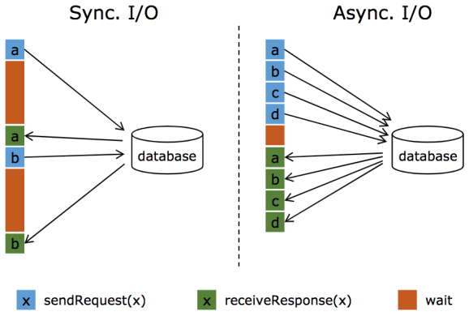
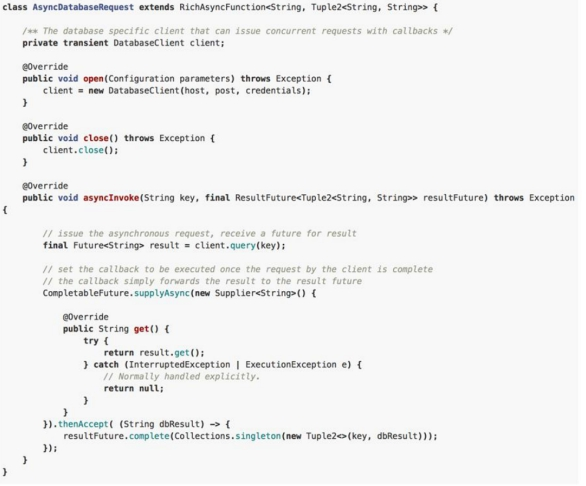
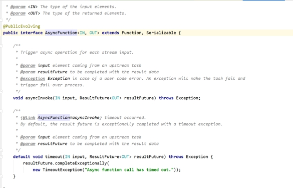
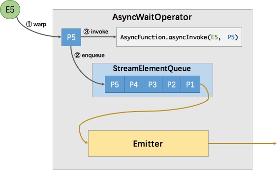
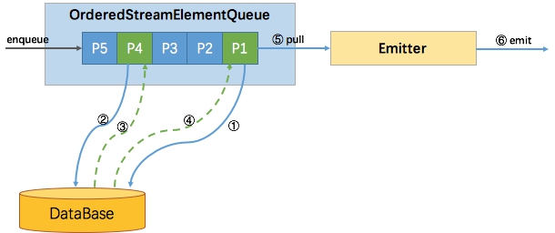
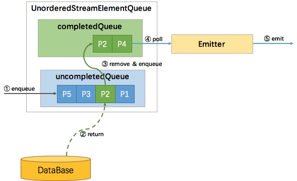
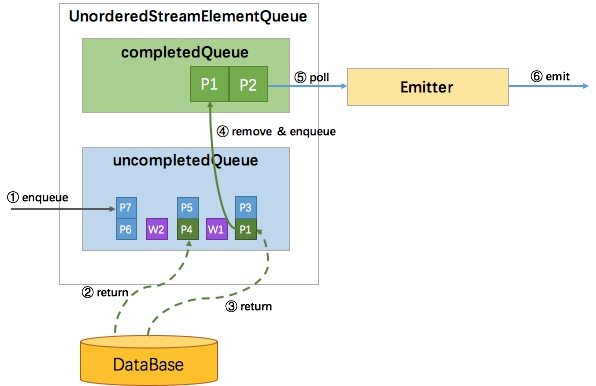
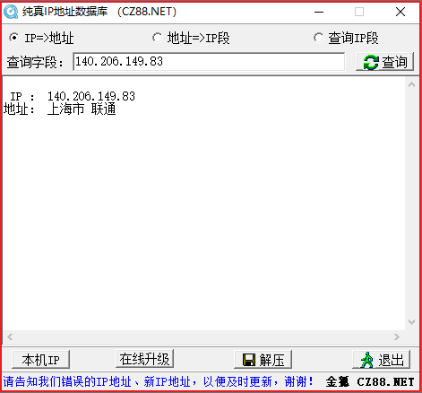

# 实时数仓项目第04天

**课程目标**

* 能够点击流日志实时拉宽处理
* 能够对订单数据以及订单明细数据进行实时etl处理
* 能够使用Flink异步IO拉取Redis维度数据
* 能够对商品数据以及购物车和评论数据实时etl处理

## Flink实时etl

### 点击流消息实时拉宽处理

#### 拉宽点击流消息处理

1、在etl包下创建ClickLogETL类，实现MQBaseETL

2、将nginx日志转换为点击流实体类

3、对点击流实体对象进行拉宽操作，返回拉宽后的点击流实体类

4、将拉宽后的点击流实体类转换成json字符串

5、将json字符串写入到kafka集群中，供Druid进行摄取分析

参考代码

```scala
import java.io.File

import cn.itcast.shop.realtime.etl.bean.{ClickLogBean, ClickLogWideBean}
import cn.itcast.shop.realtime.etl.process.base.{BaseETL, MQBaseETL}
import cn.itcast.shop.realtime.etl.utils.{GlobalConfigUtil, KafkaProp}
import cn.itcast.util.ip.IPSeeker
import com.alibaba.fastjson.JSON
import com.alibaba.fastjson.serializer.SerializerFeature
import nl.basjes.parse.httpdlog.HttpdLoglineParser
import org.apache.flink.api.common.functions.RichMapFunction
import org.apache.flink.configuration.Configuration
import org.apache.flink.streaming.api.scala.{StreamExecutionEnvironment, _}

/**
  * 点击流处理逻辑
  */
class ClickLogETL(env:StreamExecutionEnvironment) extends MQBaseETL(env) {

  /**
    * 业务处理接口
    */
  override def process(): Unit = {
    // 1. 整合kafka
    val clickLogDS: DataStream[String] = getKafkaDataStream(GlobalConfigUtil.`input.topic.click_log`)

    clickLogDS.printToErr()
    // 2. 实时ETL
    val clickLogWideDataStream: DataStream[ClickLogWideBean] = etl(clickLogDS)
    clickLogWideDataStream.print("点击流日志>>>")

    //3：将clickLogWideBeanDS转换成json字符串返回，因为kafka中需要传入字符串类型的数据
    val clickLogWideJsonDataStream: DataStream[String] = clickLogWideDataStream.map(clickLogWideEntityEntity => {
      JSON.toJSONString(clickLogWideEntityEntity, SerializerFeature.DisableCircularReferenceDetect)
    })
    clickLogWideJsonDataStream.printToErr("拉宽后的点击流日志>>>")

    //5：将关联维度表后的数据写入到kafka中，供Druid进行指标分析
    clickLogWideJsonDataStream.addSink(kafkaProducer(GlobalConfigUtil.`output.topic.clicklog`))
  }

  /**
   * 数据实时ETL
   * @param clicklogDS
   * @return
   */
  private def etl(clicklogDS:DataStream[String]) = {
    // 1. 基于JSON解析字段
    val clickLogBeanDS: DataStream[ClickLogBean] = clicklogDS.map(new RichMapFunction[String, ClickLogBean] {
      var parser: HttpdLoglineParser[ClickLogBean] = null
      override def open(parameters: Configuration): Unit = {
        parser = ClickLogBean.createClickLogParser()
      }
      override def map(clickLog: String): ClickLogBean = {
        ClickLogBean(parser, clickLog)
      }
    })

    // 2. 使用JavaURL解析URL地址，获取host名称
    clickLogBeanDS.map(new RichMapFunction[ClickLogBean, ClickLogWideBean] {
      var ipSeeker:IPSeeker = _

      override def open(parameters: Configuration): Unit = {
        val dataFile: File = getRuntimeContext.getDistributedCache.getFile("qqwry.dat")
        ipSeeker = new IPSeeker(dataFile)
      }

      override def map(in: ClickLogBean): ClickLogWideBean = {
        // 拷贝原有属性
        val wideBean = ClickLogWideBean(in)
       // wideBean.timestamp = DateUtil.datetime2timestamp(in.getRequestTime)

        val country = ipSeeker.getCountry(wideBean.ip)
        var areaArray = country.split("省");
        if(areaArray.length > 1) {
          wideBean.province = areaArray(0) + "省";
          wideBean.city = areaArray(1)
        }
        else {
          areaArray = country.split("市");
          if(areaArray.length > 1) {
            wideBean.province = areaArray(0) + "市";
            wideBean.city = areaArray(1)
          }
          else {
            wideBean.province = areaArray(0);
            wideBean.city = ""
          }
        }
        wideBean
      }
    })
  }
}
```

#### 点击流消息实时拉宽测试

实现步骤：

1、启动zk集群，三台节点依次启动

```
/export/servers/zookeeper-3.4.9/bin/zkServer.sh start
```

2、启动 Kafka 集群，三台节点依次启动

```
nohup /export/servers/kafka_2.11-1.0.0/bin/kafka-server-start.sh /export/servers/kafka_2.11-1.0.0/config/server.properties >/dev/null 2>&1 &
```

3、打开Kafka-Manager，创建 **ods_itcast_click_log** topic和**dwd_click_log **topic

4、启动Flink程序确保控制台能够生产数据

```
bin/kafka-console-producer.sh --broker-list node1:9092 --topic ods_itcast_click_log
```

```
2001:980:91c0:1:8d31:a232:25e5:85d 222.68.172.190 - [05/Sep/2010:11:27:50 +0200] "GET /images/my.jpg HTTP/1.1" 404 23617 "http://www.angularjs.cn/A00n" "Mozilla/5.0 (Macintosh; U; Intel Mac OS X 10_6_4; nl-nl) AppleWebKit/533.17.8 (KHTML, like Gecko) Version/5.0.1 Safari/533.17.8"
```

5、启动kafka消费者确保能够消费到数据

```
bin/kafka-console-consumer.sh --bootstrap-server node1:9092,node2:9092,node3:9092 --from-beginning --topic dwd_click_log
```

```
{"ip":"222.88.169.207","referDomain":"www.baidu.com","referrer":"https://www.baidu.com","requestMethod":"GET","requestProtocol":"HTTP/1.1","requestTime":"","requestUrl":"/acl_users/credentials_cookie_auth/require_login?came_from=http%3A//howto.basjes.nl/join_form","responseBodyBytes":"2787","responseStatus":0,"uid":"8a98b475-0a14-4cef-9336-93983e974320","userAgent":"Mozilla/5.0 (Windows NT 6.1) AppleWebKit/537.36 (KHTML, like Gecko) Dragon/36.1.1.21 Chrome/36.0.1985.97 Safari/537.36"}
{"ip":"182.83.81.252","referDomain":"www.itcast.cn","referrer":"https://www.itcast.cn","requestMethod":"GET","requestProtocol":"HTTP/1.1","requestTime":"","requestUrl":"/acl_users/credentials_cookie_auth/require_login?came_from=http%3A//howto.basjes.nl/join_form","responseBodyBytes":"3298","responseStatus":0,"uid":"4fb1b852-d509-47c3-82bf-09584391a2ef","userAgent":"Mozilla/5.0 (Windows NT 6.1; rv:32.0) Gecko/20100101 Firefox/32.0"}
```


### 订单数据实时处理

#### 操作步骤

1、在etl包下创建OrderETL类，实现MySqlBaseETL

2、过滤出来表名为itcast_orders，且事件类型为 "insert" 的binlog消息

3、将RowData数据流转换为 OrderDBEntity数据源

4、为了方便落地到 Kafka，再将OrderDBEntity 转换为JSON字符串

5、将转换后的json字符串写入到kafka的**dwd_order**topic中


#### 创建订单样例类

```scala
/**
 * 订单数据实体
 */
case class OrderDBEntity(@BeanProperty orderId:Long,          //订单id
                         @BeanProperty orderNo:String,        //订单编号
                         @BeanProperty userId:Long,           //用户id
                         @BeanProperty orderStatus:Int,       //订单状态 -3:用户拒收-2:未付款的订单-1：用户取消 0:待发货 1:配送中 2:用户确认收货
                         @BeanProperty goodsMoney:Double,     //商品金额
                         @BeanProperty deliverType:Int,       //收货方式0:送货上门1:自提
                         @BeanProperty deliverMoney:Double,   //运费
                         @BeanProperty totalMoney:Double,     //订单金额（包括运费）
                         @BeanProperty realTotalMoney:Double, //实际订单金额（折扣后金额）
                         @BeanProperty payType:Int,           //支付方式
                         @BeanProperty isPay:Int,             //是否支付0:未支付1:已支付
                         @BeanProperty areaId:Int,            //区域最低一级
                         @BeanProperty areaIdPath:String,     //区域idpath
                         @BeanProperty userName:String,       //收件人姓名
                         @BeanProperty userAddress:String,    //收件人地址
                         @BeanProperty userPhone:String,      //收件人电话
                         @BeanProperty orderScore:Int,        //订单所得积分
                         @BeanProperty isInvoice:Int,         //是否开发票1:需要0:不需要
                         @BeanProperty invoiceClient:String,  //发票抬头
                         @BeanProperty orderRemarks:String,   //订单备注
                         @BeanProperty orderSrc:Int,          //订单来源0:商城1:微信2:手机版3:安卓App4:苹果App
                         @BeanProperty needPay:Double,        //需缴费用
                         @BeanProperty payRand:Int,           //货币单位
                         @BeanProperty orderType:Int,         //订单类型
                         @BeanProperty isRefund:Int,          //是否退款0:否1：是
                         @BeanProperty isAppraise:Int,        //是否点评0:未点评1:已点评
                         @BeanProperty cancelReason:Int,      //取消原因ID
                         @BeanProperty rejectReason:Int,      //用户拒绝原因ID
                         @BeanProperty rejectOtherReason:String, //用户拒绝其他原因
                         @BeanProperty isClosed:Int,          //订单是否关闭
                         @BeanProperty goodsSearchKeys:String,
                         @BeanProperty orderunique:String,    //订单流水号
                         @BeanProperty receiveTime:String,    //收货时间
                         @BeanProperty deliveryTime:String,   //发货时间
                         @BeanProperty tradeNo:String,        //在线支付交易流水
                         @BeanProperty dataFlag:Int,          //订单有效标志 -1：删除 1:有效
                         @BeanProperty createTime:String,     //下单时间
                         @BeanProperty settlementId:Int,      //是否结算，大于0的话则是结算ID
                         @BeanProperty commissionFee:Double,  //订单应收佣金
                         @BeanProperty scoreMoney:Double,     //积分抵扣金额
                         @BeanProperty useScore:Int,          //花费积分
                         @BeanProperty orderCode:String,
                         @BeanProperty extraJson:String,      //额外信息
                         @BeanProperty orderCodeTargetId:Int,
                         @BeanProperty noticeDeliver:Int,     //提醒发货 0:未提醒 1:已提醒
                         @BeanProperty invoiceJson:String,    //发票信息
                         @BeanProperty lockCashMoney:Double,  //锁定提现金额
                         @BeanProperty payTime:String,        //支付时间
                         @BeanProperty isBatch:Int,           //是否拼单
                         @BeanProperty totalPayFee:Int,       //总支付金额
                         @BeanProperty isFromCart:String      //是否来自购物车 0：直接下单  1：购物车
                        )
object OrderDBEntity {
  def apply(rowData:RowData): OrderDBEntity = {
    OrderDBEntity(
      rowData.getColumns.get("orderId").toLong,
      rowData.getColumns.get("orderNo"),
      rowData.getColumns.get("userId").toLong,
      rowData.getColumns.get("orderStatus").toInt,
      rowData.getColumns.get("goodsMoney").toDouble,
      rowData.getColumns.get("deliverType").toInt,
      rowData.getColumns.get("deliverMoney").toDouble,
      rowData.getColumns.get("totalMoney").toDouble,
      rowData.getColumns.get("realTotalMoney").toDouble,
      rowData.getColumns.get("payType").toInt,
      rowData.getColumns.get("isPay").toInt,
      rowData.getColumns.get("areaId").toInt,
      rowData.getColumns.get("areaIdPath"),
      rowData.getColumns.get("userName"),
      rowData.getColumns.get("userAddress"),
      rowData.getColumns.get("userPhone"),
      rowData.getColumns.get("orderScore").toInt,
      rowData.getColumns.get("isInvoice").toInt,
      rowData.getColumns.get("invoiceClient"),
      rowData.getColumns.get("orderRemarks"),
      rowData.getColumns.get("orderSrc").toInt,
      rowData.getColumns.get("needPay").toDouble,
      rowData.getColumns.get("payRand").toInt,
      rowData.getColumns.get("orderType").toInt,
      rowData.getColumns.get("isRefund").toInt,
      rowData.getColumns.get("isAppraise").toInt,
      rowData.getColumns.get("cancelReason").toInt,
      rowData.getColumns.get("rejectReason").toInt,
      rowData.getColumns.get("rejectOtherReason"),
      rowData.getColumns.get("isClosed").toInt,
      rowData.getColumns.get("goodsSearchKeys"),
      rowData.getColumns.get("orderunique"),
      rowData.getColumns.get("receiveTime"),
      rowData.getColumns.get("deliveryTime"),
      rowData.getColumns.get("tradeNo"),
      rowData.getColumns.get("dataFlag").toInt,
      rowData.getColumns.get("createTime"),
      rowData.getColumns.get("settlementId").toInt,
      rowData.getColumns.get("commissionFee").toDouble,
      rowData.getColumns.get("scoreMoney").toDouble,
      rowData.getColumns.get("useScore").toInt,
      rowData.getColumns.get("orderCode"),
      rowData.getColumns.get("extraJson"),
      rowData.getColumns.get("orderCodeTargetId").toInt,
      rowData.getColumns.get("noticeDeliver").toInt,
      rowData.getColumns.get("invoiceJson"),
      rowData.getColumns.get("lockCashMoney").toDouble,
      rowData.getColumns.get("payTime"),
      rowData.getColumns.get("isBatch").toInt,
      rowData.getColumns.get("totalPayFee").toInt,
      rowData.getColumns.get("isFromCart")
    )
  }
}
```


#### 订单数据实时处理

```scala
import com.alibaba.fastjson.JSON
import com.alibaba.fastjson.serializer.SerializerFeature
import cn.itcast.canal.bean.RowData
import cn.itcast.shop.realtime.etl.bean.OrderDBEntity
import cn.itcast.shop.realtime.etl.process.base.MySqlBaseETL
import cn.itcast.shop.realtime.etl.utils.GlobalConfigUtil
import org.apache.flink.api.scala._
import org.apache.flink.streaming.api.scala.{DataStream, StreamExecutionEnvironment}

/**
  * 订单实时ETL处理
  */
class OrderETL(env:StreamExecutionEnvironment) extends MySqlBaseETL(env) {
  /**
    * 业务处理接口
    */
  override def process(): Unit = {
    // 1. 只过滤出来 itcast_order_goods 表的日志，并进行转换
    val ordersCanalDS: DataStream[RowData] = getKafkaDataStream()
      .filter(_.getTableName == "itcast_orders")
      .filter(_.getEventType == "insert")

    //2：将订单表数据转换成OrderDBEntity对象
    val orderDBEntityDataStream: DataStream[OrderDBEntity] = ordersCanalDS.map(canalEntity => {
      OrderDBEntity(canalEntity)
    })

    //3：将orderDBEntityDataStream转换成json字符串返回，因为kafka中需要传入字符串类型的数据
    val orderJsonDataStream: DataStream[String] = orderDBEntityDataStream.map(orderEntityEntity => {
      JSON.toJSONString(orderEntityEntity, SerializerFeature.DisableCircularReferenceDetect)
    })

    orderJsonDataStream.printToErr("订单明细>>>")

    //4：将关联维度表后的数据写入到kafka中，供Druid进行指标分析
    orderJsonDataStream.addSink(kafkaProducer(GlobalConfigUtil.`output.topic.order`))
  }
}
```


#### 订单数据实时处理测试

实现步骤：

1、启动zk集群，三台节点依次启动

```
/export/servers/zookeeper-3.4.9/bin/zkServer.sh start
```

2、启动 Canal 

```
/export/servers/canal/bin/startup.sh 
```

3、启动 Kafka 集群，三台节点依次启动

```
nohup /export/servers/kafka_2.11-1.0.0/bin/kafka-server-start.sh /export/servers/kafka_2.11-1.0.0/config/server.properties >/dev/null 2>&1 &
```

4、打开Kafka-Manager，创建**dwd_order **topic

5、启动子模块itcast_shop_canal_client，接入canal服务器，同步binlog日志

6、打开sqlyog，插入一条订单数据

```sql
INSERT INTO itcast_shop.itcast_orders 
(orderNo,userId,goodsMoney,totalMoney,areaId,userName,userAddress,orderunique,createTime,payTime,isFromCart) 
VALUES(123456,20,'0.12','0.12','123','徐牧','江苏省 无锡市 北塘区','8021250f-0e82-48dd-bc23-d9cb2908bfc0',DATE_FORMAT(NOW(), '%Y-%m-%d %H:%i:%s'),DATE_FORMAT(NOW(), '%Y-%m-%d %H:%i:%s'),1)
```

7、启动kafka消费者确保能够消费到数据

```
bin/kafka-console-consumer.sh --bootstrap-server node1:9092,node2:9092,node3:9092 --from-beginning --topic dwd_order
```

```
{"areaId":123,"areaIdPath":"","cancelReason":0,"commissionFee":0.0,"createTime":"2019-12-02 17:34:23","dataFlag":1,"deliverMoney":0.0,"deliverType":0,"deliveryTime":"","extraJson":"","goodsMoney":0.12,"goodsSearchKeys":"","invoiceClient":"","invoiceJson":"","isAppraise":0,"isBatch":0,"isClosed":0,"isFromCart":"1","isInvoice":0,"isPay":0,"isRefund":0,"lockCashMoney":0.0,"needPay":0.0,"noticeDeliver":0,"orderCode":"order","orderCodeTargetId":0,"orderId":229400,"orderNo":"123456","orderRemarks":"","orderScore":0,"orderSrc":0,"orderStatus":-2,"orderType":0,"orderunique":"8021250f-0e82-48dd-bc23-d9cb2908bfc0","payRand":1,"payTime":"2019-12-02 17:51:48","payType":0,"realTotalMoney":0.0,"receiveTime":"","rejectOtherReason":"","rejectReason":0,"scoreMoney":0.0,"settlementId":0,"totalMoney":0.12,"totalPayFee":0,"tradeNo":"","useScore":0,"userAddress":"江苏省 无锡市 北塘区","userId":20,"userName":"徐牧","userPhone":""}
```


### 订单明细数据实时拉宽处理

#### 操作步骤

1、在etl包下创建OrderGoodsEtl类，实现MySqlBaseETl

2、先过滤出表名为 itcast_order_goods，且事件类型为 "insert" 的binlog消息

3、为了方便落地到 Kafka，再将OrderGoodsWideEntity转换为JSON字符串

4、根据以下方式拉宽订单明细数据

* 根据商品id，从redis中商品维度Hash获取商品数据
* 根据店铺id，从redis中门店维护Hash获取门店数据
* 根据商品数据的三级分类id，从redis中的商品分类Hash获取三级分类数据
* 根据三级分类数据的parentid，从redis中的商品分类Hash获取二级分类数据
* 根据二级分类数据的parentid，从redis中的商品分类Hash获取一级分类数据
* 根据门店数据的areaId，从redis中的组织机构Hash获取城市机构数据
* 根据城市机构数据的parentId，从redis中的组织机构Hash获取省份机构数据

5、将拉宽后的订单明细数据写入到hbase数据库中


#### 创建订单明细样例类

```scala
// 订单明细拉宽数据
case class OrderGoodsWideEntity(@BeanProperty ogId:Long,
                                @BeanProperty orderId:Long,
                                @BeanProperty goodsId:Long,
                                @BeanProperty goodsNum:Long,
                                @BeanProperty goodsPrice:Double,
                                @BeanProperty goodsName:String,
                                @BeanProperty shopId:Long,
                                @BeanProperty goodsThirdCatId:Int,
                                @BeanProperty goodsThirdCatName:String,
                                @BeanProperty goodsSecondCatId:Int,
                                @BeanProperty goodsSecondCatName:String,
                                @BeanProperty goodsFirstCatId:Int,
                                @BeanProperty goodsFirstCatName:String,
                                @BeanProperty areaId:Int,
                                @BeanProperty shopName:String,
                                @BeanProperty shopCompany:String,
                                @BeanProperty cityId:Int,
                                @BeanProperty cityName:String,
                                @BeanProperty regionId:Int,
                                @BeanProperty regionName:String)
```


#### 订单明细数据实时拉宽处理

```scala
import java.util.concurrent.TimeUnit
import com.alibaba.fastjson.JSON
import com.alibaba.fastjson.serializer.SerializerFeature
import cn.itcast.canal.bean.RowData
import cn.itcast.shop.realtime.etl.async.AsyncOrderDetailRedisRequest
import cn.itcast.shop.realtime.etl.bean.OrderGoodsWideEntity
import cn.itcast.shop.realtime.etl.process.base.MySqlBaseETL
import cn.itcast.shop.realtime.etl.utils.{GlobalConfigUtil, HbaseUtil}
import org.apache.flink.configuration.Configuration
import org.apache.flink.streaming.api.functions.sink.{RichSinkFunction, SinkFunction}
import org.apache.flink.streaming.api.scala.{StreamExecutionEnvironment, _}
import org.apache.hadoop.hbase.TableName
import org.apache.hadoop.hbase.client.{Connection, Put, Table}
import org.apache.hadoop.hbase.util.Bytes

/**
  * 订单明细实时ETL处理
  */
class OrderGoodsEtl(env: StreamExecutionEnvironment) extends MySqlBaseETL(env) {
  /**
    * 业务处理接口
    */
  override def process(): Unit = {
    // 1. 只过滤出来 itcast_order_goods 表的日志，并进行转换
    val orderGoodsCanalDS: DataStream[RowData] = getKafkaDataStream()
      .filter(_.getTableName == "itcast_order_goods")
      .filter(_.getEventType == "insert")

    //     2. 使用异步IO方式拉取Redis关联维度数据
    //     参数1: 要关联的流
    //     参数2: 超时时间
    //     参数3: 时间单位
    //     参数4：异步IO最大并发数
    val orderGoodsWideDS: DataStream[OrderGoodsWideEntity] = AsyncDataStream.unorderedWait(orderGoodsCanalDS, new AsyncOrderDetailRedisRequest(), 1, TimeUnit.SECONDS, 100)

    //3：将orderDBEntityDataStream转换成json字符串返回，因为kafka中需要传入字符串类型的数据
    val orderGoodsWideJsonDataStream: DataStream[String] = orderGoodsWideDS.map(orderGoodsWideEntity => {
      //wirteToHbase(orderGoodsWideEntity)
      JSON.toJSONString(orderGoodsWideEntity, SerializerFeature.DisableCircularReferenceDetect)
    })

    //4：将关联维度表后的数据写入到kafka中，供Druid进行指标分析
    orderGoodsWideJsonDataStream.addSink(kafkaProducer(GlobalConfigUtil.`output.topic.order_detail`))
    orderGoodsWideDS.printToErr("订单明细数据>>>")

    //5：将订单明细数据写入到hbase
    orderGoodsWideDS.addSink(new RichSinkFunction[OrderGoodsWideEntity] {
      //定义连接对象
      var connection: Connection = _
      var table: Table = _

      //初始化资源，获取连接对象
      override def open(parameters: Configuration): Unit = {
        //获取连接对象
        connection = HbaseUtil.getPool().getConnection
        table = connection.getTable(TableName.valueOf(GlobalConfigUtil.`hbase.table.orderdetail`))
      }

      //释放资源，关闭连接
      override def close(): Unit = {
        if (table != null) table.close()
        if (!connection.isClosed) {
          HbaseUtil.getPool().returnConnection(connection)
        }
      }

      //将数据一条条的写入到数据库
      override def invoke(orderGoodsWideEntity: OrderGoodsWideEntity, context: SinkFunction.Context[_]): Unit = {
        //2：构建put对象
        val rowKey = Bytes.toBytes(orderGoodsWideEntity.ogId.toString)
        val put = new Put(rowKey)
        val family = Bytes.toBytes(GlobalConfigUtil.`hbase.table.family`)

        val ogIdCol = Bytes.toBytes("ogId")
        val orderIdCol = Bytes.toBytes("orderId")
        val goodsIdCol = Bytes.toBytes("goodsId")
        val goodsNumCol = Bytes.toBytes("goodsNum")
        val goodsPriceCol = Bytes.toBytes("goodsPrice")
        val goodsNameCol = Bytes.toBytes("goodsName")
        val shopIdCol = Bytes.toBytes("shopId")
        val goodsThirdCatIdCol = Bytes.toBytes("goodsThirdCatId")
        val goodsThirdCatNameCol = Bytes.toBytes("goodsThirdCatName")
        val goodsSecondCatIdCol = Bytes.toBytes("goodsSecondCatId")
        val goodsSecondCatNameCol = Bytes.toBytes("goodsSecondCatName")
        val goodsFirstCatIdCol = Bytes.toBytes("goodsFirstCatId")
        val goodsFirstCatNameCol = Bytes.toBytes("goodsFirstCatName")
        val areaIdCol = Bytes.toBytes("areaId")
        val shopNameCol = Bytes.toBytes("shopName")
        val shopCompanyCol = Bytes.toBytes("shopCompany")
        val cityIdCol = Bytes.toBytes("cityId")
        val cityNameCol = Bytes.toBytes("cityName")
        val regionIdCol = Bytes.toBytes("regionId")
        val regionNameCol = Bytes.toBytes("regionName")

        put.addColumn(family, ogIdCol, Bytes.toBytes(orderGoodsWideEntity.ogId.toString))
        put.addColumn(family, orderIdCol, Bytes.toBytes(orderGoodsWideEntity.orderId.toString))
        put.addColumn(family, goodsIdCol, Bytes.toBytes(orderGoodsWideEntity.goodsId.toString))
        put.addColumn(family, goodsNumCol, Bytes.toBytes(orderGoodsWideEntity.goodsNum.toString))
        put.addColumn(family, goodsPriceCol, Bytes.toBytes(orderGoodsWideEntity.goodsPrice.toString))
        put.addColumn(family, goodsNameCol, Bytes.toBytes(orderGoodsWideEntity.goodsName.toString))
        put.addColumn(family, shopIdCol, Bytes.toBytes(orderGoodsWideEntity.shopId.toString))
        put.addColumn(family, goodsThirdCatIdCol, Bytes.toBytes(orderGoodsWideEntity.goodsThirdCatId.toString))
        put.addColumn(family, goodsThirdCatNameCol, Bytes.toBytes(orderGoodsWideEntity.goodsThirdCatName.toString))
        put.addColumn(family, goodsSecondCatIdCol, Bytes.toBytes(orderGoodsWideEntity.goodsSecondCatId.toString))
        put.addColumn(family, goodsSecondCatNameCol, Bytes.toBytes(orderGoodsWideEntity.goodsSecondCatName.toString))
        put.addColumn(family, goodsFirstCatIdCol, Bytes.toBytes(orderGoodsWideEntity.goodsFirstCatId.toString))
        put.addColumn(family, goodsFirstCatNameCol, Bytes.toBytes(orderGoodsWideEntity.goodsFirstCatName.toString))
        put.addColumn(family, areaIdCol, Bytes.toBytes(orderGoodsWideEntity.areaId.toString))
        put.addColumn(family, shopNameCol, Bytes.toBytes(orderGoodsWideEntity.shopName.toString))
        put.addColumn(family, shopCompanyCol, Bytes.toBytes(orderGoodsWideEntity.shopCompany.toString))
        put.addColumn(family, cityIdCol, Bytes.toBytes(orderGoodsWideEntity.cityId.toString))
        put.addColumn(family, cityNameCol, Bytes.toBytes(orderGoodsWideEntity.cityName.toString))
        put.addColumn(family, regionIdCol, Bytes.toBytes(orderGoodsWideEntity.regionId.toString))
        put.addColumn(family, regionNameCol, Bytes.toBytes(orderGoodsWideEntity.regionName.toString))

        //3：执行put操作
        table.put(put)
      }
    })
  }
}

```

#### 异步IO实现拉宽操作

Async I/O 是阿里巴巴贡献给社区的一个呼声非常高的特性，于1.2版本引入。主要目的是为了解决与外部系统交互时网络延迟成为了系统瓶颈的问题。

##### 异步IO操作的需求

Flink在做流数据计算时，很多时候需要与外部系统进行交互（比如数据库、Redis、Hive、HBase等等存储系统）。
 往往需要注意系统间通信延迟是否会拖慢整个Flink作业，影响整体吞吐量和实时性。


场景：

流计算系统中经常需要于外部系统进行交互，比如需要查询外部数据库以关联上用户的额外信息，通常，我们的实现方式是向数据库发送用户a的查询请求（例如在MapFunction中），然后等待结果返回，在这之前，我们无法发送用户b的查询请求，这是一种同步访问的模式，如下图左边所示。



图中棕色的长条标识等待时间，可以发现网络等待时间极大的阻碍了吞吐和延迟，为了解决同步访问的问题，异步模式可以并发的处理多个请求和回复，也就是说，你可以连续的向数据库发送用户a、b、c、d等的请求，与此同时，哪个请求的回复先返回了就处理哪个回复，从而连续的请求之间不需要阻塞等待，如上图右边所示，这也正是Async I/O的实现原理。

实现的目标：提高吞吐量

| ***\*方式\****                  | ***\*说明\****                                               |
| ------------------------------- | ------------------------------------------------------------ |
| 同步、提高并行度（MapFunction） | 非常高的资源成本；高并行度MapFunction意味着更多的subtask，线程，网络连接，数据库连接，缓冲区等等 |
| Async I/O                       | 与数据库的异步交互意味着一个并行函数实例可以同时处理多个请求并同时接收响应（资源复用），这样等待时间可以与发送其他请求和接收响应重叠，至少等待时间是在多个请求上平摊的，这在大多数据情况下会导致更高的流吞吐量 |

##### 使用Aysnc I/O的前提条件

1) 对外部系统进行异步IO访问的客户端API。（比如使用vertx，但是目前只支持scala 2.12的版本，可以使用java类库来做）

2) 或者在没有这样的客户端的情况下，可以通过创建多个客户端并使用线程池处理同步调用来尝试将同步客户端转变为有限的并发客户端。但是，这种方法通常比适当的异步客户端效率低。（比如可以写ExecutorService来实现）

##### Async I/O API实现异步流式转换

Async I/O API允许用户在数据流中使用异步客户端访问外部存储，该API处理与数据流的集成，以及消息顺序性（Order），事件时间（EventTime），一致性（容错）等脏活累活，用户只专注于业务

 

如果目标数据库中有异步客户端，则三步即可实现异步流式转换操作（针对该数据库的异步）：

1) 实现用来分发请求的AsyncFunction，用来向数据库发送异步请求并设置回调

2) 获取操作结果的callback，并将它提交给ResultFuture

3) 将异步I/O操作应用于DataStream

 

伪代码如下：

 

当异步I/O请求超时时，默认情况下会抛出异常并重新启动Job，如果希望处理超时，可以覆盖AsyncFunction的timeout方法



##### Asycn IO应用于DataStream

AsyncDataStream是一个工具类，用于将AsyncFunction应用于DataStream，AsyncFunction发出的并发请求都是无序的，该顺序基于哪个请求先完成，为了控制结果记录的发出顺序，flink提供了两种模式，分别对应AsyncDataStream的两个静态方法，OrderedWait和unorderedWait

AsyncDataStream.orderedWait();

AsyncDataStream.unorderWait();

 

orderedWait（有序）：消息的发送顺序与接收到的顺序相同（包括 watermark ），也就是先进先出。

unorderWait（无序）：

1）在ProcessingTime中，完全无序，即哪个请求先返回结果就先发送（最低延迟和最低消耗）。

2）在EventTime中，以watermark为边界，介于两个watermark之间的消息可以乱序，但是watermark和消息之间不能乱序，这样既认为在无序中又引入了有序，这样就有了与有序一样的开销。（具体我们会在后面的原理中讲解）。

##### 代码实现

```scala
class AsyncOrderDetailRedisRequest extends RichAsyncFunction[RowData, OrderGoodsWideEntity]{
  var jedis:Jedis = _

  override def open(parameters: Configuration): Unit = {
    jedis = RedisUtil.getJedis()
    jedis.select(1)
  }

  override def close(): Unit = {
    if(jedis != null) {
      jedis.close()
    }
  }

  override def timeout(input: RowData, resultFuture: ResultFuture[OrderGoodsWideEntity]): Unit = {
    println("超时")
  }

  // 2. 定义Future回调的执行上下文（当前线程）
  // ExecutionContext: scala.concurrent.ExecutionContext
  // Executors: org.apache.flink.runtime.concurrent.Executors
  implicit lazy val executor = ExecutionContext.fromExecutor(Executors.directExecutor())

  override def asyncInvoke(rowData: RowData, resultFuture: ResultFuture[OrderGoodsWideEntity]): Unit = {
    // 发起异步请求，获取请求结果Future，调用的是Future代码
    Future {
      if(!jedis.isConnected){
        println("重新获取redis连接")
        jedis = RedisUtil.getJedis()
        jedis.select(1)
      }
      // 1. 根据 goodsId 获取商品名称
      val goodsJSON = jedis.hget("itcast_shop:dim_goods", rowData.getColumns.get("goodsId"))
      //print(goodsJSON)
      val dimGoods = DimGoodsDBEntity(goodsJSON)

      val shopJSON = jedis.hget("itcast_shop:dim_shops", dimGoods.shopId + "")
      //print(shopJSON)
      val dimShop = DimShopsDBEntity(shopJSON)

      val thirdCatJSON = jedis.hget("itcast_shop:dim_goods_cats", dimGoods.goodsCatId + "")
      //print(thirdCatJSON)
      val dimThirdCat = DimGoodsCatDBEntity(thirdCatJSON)

      val secondCatJSON = jedis.hget("itcast_shop:dim_goods_cats", dimThirdCat.parentId)
      //print(secondCatJSON)
      val dimSecondCat = DimGoodsCatDBEntity(secondCatJSON)

      val firstCatJSON = jedis.hget("itcast_shop:dim_goods_cats", dimSecondCat.parentId)
      //print(firstCatJSON)
      val dimFirstCat = DimGoodsCatDBEntity(firstCatJSON)

      val cityJSON = jedis.hget("itcast_shop:dim_org", dimShop.areaId + "")
      //print(cityJSON)
      val dimOrgCity = DimOrgDBEntity(cityJSON)

      val regionJSON = jedis.hget("itcast_shop:dim_org", dimOrgCity.parentId + "")
      //print(regionJSON)
      val dimOrgRegion = DimOrgDBEntity(regionJSON)

      val orderGoods = OrderGoodsWideEntity(rowData.getColumns.get("ogId").toLong,
        rowData.getColumns.get("orderId").toLong,
        rowData.getColumns.get("goodsId").toLong,
        rowData.getColumns.get("goodsNum").toLong,
        rowData.getColumns.get("goodsPrice").toDouble,
        dimGoods.goodsName,
        dimShop.shopId,
        dimThirdCat.catId.toInt,
        dimThirdCat.catName,
        dimSecondCat.catId.toInt,
        dimSecondCat.catName,
        dimFirstCat.catId.toInt,
        dimThirdCat.catName,
        dimShop.areaId,
        dimShop.shopName,
        dimShop.shopCompany,
        dimOrgCity.orgId,
        dimOrgCity.orgName,
        dimOrgRegion.orgId,
        dimOrgRegion.orgName)

      // 异步IO拉取数据
      print("异步IO拉取数据" + orderGoods)

      resultFuture.complete(Array(orderGoods))
    }
  }
}
```

##### 原理实现

AsyncDataStream.(un)orderedWait 的主要工作就是创建了一个 AsyncWaitOperator。AsyncWaitOperator 是支持异步 IO 访问的算子实现，该算子会运行 AsyncFunction 并处理异步返回的结果，其内部原理如下图所示。

 

 

如图所示，AsyncWaitOperator 主要由两部分组成：StreamElementQueue 和 Emitter。StreamElementQueue 是一个 Promise 队列，所谓 Promise 是一种异步抽象表示将来会有一个值（海底捞排队给你的小票），这个队列是未完成的 Promise 队列，也就是进行中的请求队列。Emitter 是一个单独的线程，负责发送消息（收到的异步回复）给下游。

图中E5表示进入该算子的第五个元素（”Element-5”），在执行过程中首先会将其包装成一个 “Promise” P5，然后将P5放入队列。最后调用 AsyncFunction 的 ayncInvoke 方法，该方法会向外部服务发起一个异步的请求，并注册回调。该回调会在异步请求成功返回时调用 AsyncCollector.collect 方法将返回的结果交给框架处理。实际上 AsyncCollector 是一个 Promise ，也就是 P5，在调用 collect 的时候会标记 Promise 为完成状态，并通知 Emitter 线程有完成的消息可以发送了。Emitter 就会从队列中拉取完成的 Promise ，并从 Promise 中取出消息发送给下游。

##### 消息的顺序性

 上文提到 Async I/O 提供了两种输出模式。其实细分有三种模式: 有序，ProcessingTime 无序，EventTime 无序。Flink 使用队列来实现不同的输出模式，并抽象出一个队列的接口（StreamElementQueue），这种分层设计使得AsyncWaitOperator和Emitter不用关心消息的顺序问题。StreamElementQueue有两种具体实现，分别是 OrderedStreamElementQueue 和

UnorderedStreamElementQueue。UnorderedStreamElementQueue 比较有意思，它使用了一套逻辑巧妙地实现完全无序和 EventTime 无序。

 

***\*有序\****

有序比较简单，使用一个队列就能实现。所有新进入该算子的元素（包括 watermark），都会包装成 Promise 并按到达顺序放入该队列。如下图所示，尽管P4的结果先返回，但并不会发送，只有 P1 （队首）的结果返回了才会触发 Emitter 拉取队首元素进行发送。

 

 

***\*ProcessingTime 无序\****

 ProcessingTime 无序也比较简单，因为没有 watermark，不需要协调 watermark 与消息的顺序性，所以使用两个队列就能实现，一个 uncompletedQueue 一个 completedQueue。所有新进入该算子的元素，同样的包装成 Promise 并放入 uncompletedQueue 队列，当uncompletedQueue队列中任意的Promise返回了数据，则将该 Promise 移到 completedQueue 队列中，并通知 Emitter 消费。如下图所示：

 

 

***\*EventTime 无序\****

EventTime 无序类似于有序与 ProcessingTime 无序的结合体。因为有 watermark，需要协调 watermark 与消息之间的顺序性，所以uncompletedQueue中存放的元素从原先的 Promise 变成了 Promise 集合。如果进入算子的是消息元素，则会包装成 Promise 放入队尾的集合中。如果进入算子的是 watermark，也会包装成 Promise 并放到一个独立的集合中，再将该集合加入到 uncompletedQueue 队尾，最后再创建一个空集合加到 uncompletedQueue 队尾。这样，watermark 就成了消息顺序的边界。只有处在队首的集合中的 Promise 返回了数据，才能将该 Promise 移到 completedQueue 队列中，由 Emitter 消费发往下游。只有队首集合空了，才能处理第二个集合。这样就保证了当且仅当某个 watermark 之前所有的消息都已经被发送了，该 watermark 才能被发送。过程如下图所示：




#### 数据落地HBase 

要将数据落地到HBase中，可以先在HBase中创建表：

```shell
create 'dwd_order_detail','detail'
```


实现步骤：

1、创建一个 RichSinkFunction

2、使用 HBaseConfiguration.create() 创建配置，并设置 hbase属性

3、使用 连接池对象HbaseUtil创建连接


参考代码：

```scala
orderGoodsWideDS.addSink(new RichSinkFunction[OrderGoodsWideEntity] {
      //定义连接对象
      var connection: Connection = _
      var table: Table = _

      //初始化资源，获取连接对象
      override def open(parameters: Configuration): Unit = {
        //获取连接对象
        connection = HbaseUtil.getPool().getConnection
        table = connection.getTable(TableName.valueOf(GlobalConfigUtil.`hbase.table.orderdetail`))
      }

      //释放资源，关闭连接
      override def close(): Unit = {
        if (table != null) table.close()
        if (!connection.isClosed) {
          HbaseUtil.getPool().returnConnection(connection)
        }
      }

      //将数据一条条的写入到数据库
      override def invoke(orderGoodsWideEntity: OrderGoodsWideEntity, context: SinkFunction.Context[_]): Unit = {
        //2：构建put对象
        val rowKey = Bytes.toBytes(orderGoodsWideEntity.ogId.toString)
        val put = new Put(rowKey)
        val family = Bytes.toBytes(GlobalConfigUtil.`hbase.table.family`)

        val ogIdCol = Bytes.toBytes("ogId")
        val orderIdCol = Bytes.toBytes("orderId")
        val goodsIdCol = Bytes.toBytes("goodsId")
        val goodsNumCol = Bytes.toBytes("goodsNum")
        val goodsPriceCol = Bytes.toBytes("goodsPrice")
        val goodsNameCol = Bytes.toBytes("goodsName")
        val shopIdCol = Bytes.toBytes("shopId")
        val goodsThirdCatIdCol = Bytes.toBytes("goodsThirdCatId")
        val goodsThirdCatNameCol = Bytes.toBytes("goodsThirdCatName")
        val goodsSecondCatIdCol = Bytes.toBytes("goodsSecondCatId")
        val goodsSecondCatNameCol = Bytes.toBytes("goodsSecondCatName")
        val goodsFirstCatIdCol = Bytes.toBytes("goodsFirstCatId")
        val goodsFirstCatNameCol = Bytes.toBytes("goodsFirstCatName")
        val areaIdCol = Bytes.toBytes("areaId")
        val shopNameCol = Bytes.toBytes("shopName")
        val shopCompanyCol = Bytes.toBytes("shopCompany")
        val cityIdCol = Bytes.toBytes("cityId")
        val cityNameCol = Bytes.toBytes("cityName")
        val regionIdCol = Bytes.toBytes("regionId")
        val regionNameCol = Bytes.toBytes("regionName")

        put.addColumn(family, ogIdCol, Bytes.toBytes(orderGoodsWideEntity.ogId.toString))
        put.addColumn(family, orderIdCol, Bytes.toBytes(orderGoodsWideEntity.orderId.toString))
        put.addColumn(family, goodsIdCol, Bytes.toBytes(orderGoodsWideEntity.goodsId.toString))
        put.addColumn(family, goodsNumCol, Bytes.toBytes(orderGoodsWideEntity.goodsNum.toString))
        put.addColumn(family, goodsPriceCol, Bytes.toBytes(orderGoodsWideEntity.goodsPrice.toString))
        put.addColumn(family, goodsNameCol, Bytes.toBytes(orderGoodsWideEntity.goodsName.toString))
        put.addColumn(family, shopIdCol, Bytes.toBytes(orderGoodsWideEntity.shopId.toString))
        put.addColumn(family, goodsThirdCatIdCol, Bytes.toBytes(orderGoodsWideEntity.goodsThirdCatId.toString))
        put.addColumn(family, goodsThirdCatNameCol, Bytes.toBytes(orderGoodsWideEntity.goodsThirdCatName.toString))
        put.addColumn(family, goodsSecondCatIdCol, Bytes.toBytes(orderGoodsWideEntity.goodsSecondCatId.toString))
        put.addColumn(family, goodsSecondCatNameCol, Bytes.toBytes(orderGoodsWideEntity.goodsSecondCatName.toString))
        put.addColumn(family, goodsFirstCatIdCol, Bytes.toBytes(orderGoodsWideEntity.goodsFirstCatId.toString))
        put.addColumn(family, goodsFirstCatNameCol, Bytes.toBytes(orderGoodsWideEntity.goodsFirstCatName.toString))
        put.addColumn(family, areaIdCol, Bytes.toBytes(orderGoodsWideEntity.areaId.toString))
        put.addColumn(family, shopNameCol, Bytes.toBytes(orderGoodsWideEntity.shopName.toString))
        put.addColumn(family, shopCompanyCol, Bytes.toBytes(orderGoodsWideEntity.shopCompany.toString))
        put.addColumn(family, cityIdCol, Bytes.toBytes(orderGoodsWideEntity.cityId.toString))
        put.addColumn(family, cityNameCol, Bytes.toBytes(orderGoodsWideEntity.cityName.toString))
        put.addColumn(family, regionIdCol, Bytes.toBytes(orderGoodsWideEntity.regionId.toString))
        put.addColumn(family, regionNameCol, Bytes.toBytes(orderGoodsWideEntity.regionName.toString))

        //3：执行put操作
        table.put(put)
      }
    })
```


#### 订单明细数据实时处理测试

实现步骤：

1、启动zk集群，三台节点依次启动

```
/export/servers/zookeeper-3.4.9/bin/zkServer.sh start
```

2、启动 Canal 

```
/export/servers/canal/bin/startup.sh 
```

3、启动 Kafka 集群，三台节点依次启动

```
nohup /export/servers/kafka_2.11-1.0.0/bin/kafka-server-start.sh /export/servers/kafka_2.11-1.0.0/config/server.properties >/dev/null 2>&1 &
```

4、启动hadoop

5、启动hbase

```
 bin/start-hbase.sh 
```

6、打开Kafka-Manager，创建**dwd_order_detail **topic

7、启动子模块itcast_shop_canal_client，接入canal服务器，同步binlog日志

8、打开sqlyog，插入一条订单明细数据

```
INSERT INTO itcast_shop.itcast_order_goods (orderId, goodsId, goodsNum, goodsPrice, goodsSpecId, goodsSpecNames, goodsName, goodsImg, extraJson, goodsType, commissionRate, goodsCode, promotionJson) 
VALUES (742, 107469, 1, 11.60, 33, '', '', '', NULL, 0, 0.02, NULL, NULL);
```

9、启动kafka消费者确保能够消费到数据

```
bin/kafka-console-consumer.sh --bootstrap-server node1:9092,node2:9092,node3:9092 --from-beginning --topic dwd_order_detail
```

```json
{"areaId":100312,"cityId":100312,"cityName":"中山市分公司","goodsFirstCatId":36,"goodsFirstCatName":"台灯","goodsId":105042,"goodsName":"LED充电台灯可三色调光宿舍书桌卧室床头夹子台灯学生学习护眼灯创意插电式工作儿童阅读折叠灯具夹子台灯-USB充电三色款（送磁性底座）","goodsNum":3,"goodsPrice":11.6,"goodsSecondCatId":10245,"goodsSecondCatName":"灯饰照明","goodsThirdCatId":10301,"goodsThirdCatName":"台灯","ogId":822744,"orderId":229411,"regionId":100008,"regionName":"华南大区","shopCompany":"芮八官方旗舰店","shopId":101752,"shopName":"芮八官方旗舰店"}
```

10、进入hbase命令行，能够输出写入的订单明细表数据

```
bin/hbase shell
scan 'dwd_order_detail'
```


### 商品消息实时拉宽处理

#### 操作步骤

1、在etl包下创建GoodsETL类，实现MySqlBaseETL

2、先过滤出表名为 itcast_goods

3、根据以下方式拉宽订单明细数据

* 根据商品id，从redis中商品维度Hash获取商品数据
* 根据店铺id，从redis中门店维护Hash获取门店数据
* 根据商品数据的三级分类id，从redis中的商品分类Hash获取三级分类数据
* 根据三级分类数据的parentid，从redis中的商品分类Hash获取二级分类数据
* 根据二级分类数据的parentid，从redis中的商品分类Hash获取一级分类数据
* 根据门店数据的areaId，从redis中的组织机构Hash获取城市机构数据
* 根据城市机构数据的parentId，从redis中的组织机构Hash获取省份机构数据

4、为了方便落地到 Kafka，再将GoodsWideBean转换为JSON字符串

#### 创建消息样例类

```scala
/**
 * 商品表宽表
 */
case class GoodsWideBean(
                          @BeanProperty goodsId:Long,           //商品id
                          @BeanProperty goodsSn:String,         //商品编号
                          @BeanProperty productNo:String,       //商品货号
                          @BeanProperty goodsName:String,       //商品名称
                          @BeanProperty goodsImg:String,        //商品图片
                          @BeanProperty shopId:String,          //门店ID
                          @BeanProperty shopName:String,        //门店名称      -》拉宽的字段
                          @BeanProperty goodsType:String,       //货物类型
                          @BeanProperty marketPrice:String,     //市场价
                          @BeanProperty shopPrice:String,       //门店价
                          @BeanProperty warnStock:String,       //预警库存
                          @BeanProperty goodsStock:String,      //商品总库存
                          @BeanProperty goodsUnit:String,       //单位
                          @BeanProperty goodsTips:String,       //促销信息
                          @BeanProperty isSale:String,          //是否上架	0:不上架 1:上架
                          @BeanProperty isBest:String,          //是否精品	0:否 1:是
                          @BeanProperty isHot:String,           //是否热销产品	0:否 1:是
                          @BeanProperty isNew:String,           //是否新品	0:否 1:是
                          @BeanProperty isRecom:String,         //是否推荐	0:否 1:是
                          @BeanProperty goodsCatIdPath:String,  //商品分类ID路径	catId1_catId2_catId3
                          //@BeanProperty goodsCatId:String,      //goodsCatId	最后一级商品分类ID
                          @BeanProperty goodsThirdCatId:Int,        //三级商品分类ID    -》拉宽的字段
                          @BeanProperty goodsThirdCatName:String,   //三级商品分类名称  -》拉宽的字段
                          @BeanProperty goodsSecondCatId:Int,       //二级商品分类ID    -》拉宽的字段
                          @BeanProperty goodsSecondCatName:String,  //二级商品分类名称  -》拉宽的字段
                          @BeanProperty goodsFirstCatId:Int,        //一级商品分类ID    -》拉宽的字段
                          @BeanProperty goodsFirstCatName:String,   //一级商品分类名称  -》拉宽的字段
                          @BeanProperty shopCatId1:String,          //门店商品分类第一级ID
                          @BeanProperty shopCatName1:String,        //门店商品分类第一级名称 -》拉宽的字段
                          @BeanProperty shopCatId2:String,          //门店商品第二级分类ID
                          @BeanProperty shopCatName2:String,        //门店商品第二级分类名称 -》拉宽的字段
                          @BeanProperty brandId:String,         //品牌ID
                          @BeanProperty goodsDesc:String,       //商品描述
                          @BeanProperty goodsStatus:String,     //商品状态	-1:违规 0:未审核 1:已审核
                          @BeanProperty saleNum:String,         //总销售量
                          @BeanProperty saleTime:String,        //上架时间
                          @BeanProperty visitNum:String,        //访问数
                          @BeanProperty appraiseNum:String,     //评价书
                          @BeanProperty isSpec:String,          //是否有规格	0:没有 1:有
                          @BeanProperty gallery:String,         //商品相册
                          @BeanProperty goodsSeoKeywords:String,  //商品SEO关键字
                          @BeanProperty illegalRemarks:String,  //状态说明	一般用于说明拒绝原因
                          @BeanProperty dataFlag:String,        //	删除标志	-1:删除 1:有效
                          @BeanProperty createTime:String,
                          @BeanProperty isFreeShipping:String,
                          @BeanProperty goodsSerachKeywords:String,
                          @BeanProperty modifyTime:String,      //修改时间
                          @BeanProperty cityId:Int,
                          @BeanProperty cityName:String,
                          @BeanProperty regionId:Int,
                          @BeanProperty regionName:String)
```

#### 商品消息实时拉宽处理

```scala
import com.alibaba.fastjson.JSON
import com.alibaba.fastjson.serializer.SerializerFeature
import cn.itcast.canal.bean.RowData
import cn.itcast.shop.realtime.etl.bean.{DimGoodsCatDBEntity, DimOrgDBEntity, DimShopCatDBEntity, DimShopsDBEntity, GoodsWideBean}
import cn.itcast.shop.realtime.etl.process.base.MySqlBaseETL
import cn.itcast.shop.realtime.etl.utils.{GlobalConfigUtil, RedisUtil}
import org.apache.flink.api.common.functions.RichMapFunction
import org.apache.flink.api.scala._
import org.apache.flink.configuration.Configuration
import org.apache.flink.streaming.api.scala.{DataStream, StreamExecutionEnvironment}
import redis.clients.jedis.Jedis

/**
 * 商品数据实时ETL处理
 * @param env
 */
class GoodsETL(env: StreamExecutionEnvironment) extends MySqlBaseETL(env) {
  /**
   * 业务处理接口
   */
  def process() = {
    // 1. 只过滤出来 itcast_goods 表的日志，并进行转换
    val goodsCanalDS: DataStream[RowData] = getKafkaDataStream()
      .filter(_.getTableName == "itcast_goods")

    // 1. 使用同步IO方式请求Redis拉取维度数据
    val goodsEntityDataStream: DataStream[GoodsWideBean] = goodsCanalDS.map(new RichMapFunction[RowData, GoodsWideBean] {
      var jedis: Jedis = _

      override def open(parameters: Configuration): Unit = {
        jedis = RedisUtil.getJedis()
        jedis.select(1)
      }

      override def map(rowData: RowData): GoodsWideBean = {
        val shopJSON = jedis.hget("itcast_shop:dim_shops", rowData.getColumns.get("shopId") + "")
        val dimShop = DimShopsDBEntity(shopJSON)

        val thirdCatJSON = jedis.hget("itcast_shop:dim_goods_cats", rowData.getColumns.get("goodsCatId") + "")
        val dimThirdCat = DimGoodsCatDBEntity(thirdCatJSON)

        val secondCatJSON = jedis.hget("itcast_shop:dim_goods_cats", dimThirdCat.parentId)
        val dimSecondCat = DimGoodsCatDBEntity(secondCatJSON)

        val firstCatJSON = jedis.hget("itcast_shop:dim_goods_cats", dimSecondCat.parentId)
        val dimFirstCat = DimGoodsCatDBEntity(firstCatJSON)

        val secondShopCatJson = jedis.hget("itcast_shop:dim_shop_cats", rowData.getColumns.get("shopCatId1"))
        val dimSecondShopCat = DimShopCatDBEntity(secondShopCatJson)

        val firstShopCatJson = jedis.hget("itcast_shop:dim_shop_cats", rowData.getColumns.get("shopCatId2"))
        val dimFirstShopCat = DimShopCatDBEntity(firstShopCatJson)

        val cityJSON = jedis.hget("itcast_shop:dim_org", dimShop.areaId + "")
        val dimOrgCity = DimOrgDBEntity(cityJSON)

        val regionJSON = jedis.hget("itcast_shop:dim_org", dimOrgCity.parentId + "")
        val dimOrgRegion = DimOrgDBEntity(regionJSON)

        GoodsWideBean(rowData.getColumns.get("goodsId").toLong,
          rowData.getColumns.get("goodsSn"),
          rowData.getColumns.get("productNo"),
          rowData.getColumns.get("goodsName"),
          rowData.getColumns.get("goodsImg"),
          rowData.getColumns.get("shopId"),
          dimShop.shopName,
          rowData.getColumns.get("goodsType"),
          rowData.getColumns.get("marketPrice"),
          rowData.getColumns.get("shopPrice"),
          rowData.getColumns.get("warnStock"),
          rowData.getColumns.get("goodsStock"),
          rowData.getColumns.get("goodsUnit"),
          rowData.getColumns.get("goodsTips"),
          rowData.getColumns.get("isSale"),
          rowData.getColumns.get("isBest"),
          rowData.getColumns.get("isHot"),
          rowData.getColumns.get("isNew"),
          rowData.getColumns.get("isRecom"),
          rowData.getColumns.get("goodsCatIdPath"),
          dimThirdCat.catId.toInt,
          dimThirdCat.catName,
          dimSecondCat.catId.toInt,
          dimSecondCat.catName,
          dimFirstCat.catId.toInt,
          dimFirstCat.catName,
          dimFirstShopCat.getCatId,
          dimFirstShopCat.catName,
          dimSecondShopCat.getCatId,
          dimSecondShopCat.catName,
          rowData.getColumns.get("brandId"),
          rowData.getColumns.get("goodsDesc"),
          rowData.getColumns.get("goodsStatus"),
          rowData.getColumns.get("saleNum"),
          rowData.getColumns.get("saleTime"),
          rowData.getColumns.get("visitNum"),
          rowData.getColumns.get("appraiseNum"),
          rowData.getColumns.get("isSpec"),
          rowData.getColumns.get("gallery"),
          rowData.getColumns.get("goodsSeoKeywords"),
          rowData.getColumns.get("illegalRemarks"),
          rowData.getColumns.get("dataFlag"),
          rowData.getColumns.get("createTime"),
          rowData.getColumns.get("isFreeShipping"),
          rowData.getColumns.get("goodsSerachKeywords"),
          rowData.getColumns.get("modifyTime"),
          dimOrgCity.orgId,
          dimOrgCity.orgName,
          dimOrgRegion.orgId,
          dimOrgRegion.orgName)
      }

      override def close(): Unit = {
        if(jedis.isConnected){
          jedis.close()
        }
      }
    })

    goodsEntityDataStream.print("商品表数据>>>")

    //3：将goodsEntityDataStream转换成json字符串返回，因为kafka中需要传入字符串类型的数据
    val goodsWideJsonDataStream: DataStream[String] = goodsEntityDataStream.map(goodsWideEntity => {
      JSON.toJSONString(goodsWideEntity, SerializerFeature.DisableCircularReferenceDetect)
    })
    goodsWideJsonDataStream.print()

    //4：将关联维度表后的数据写入到kafka中，供Druid进行指标分析
    goodsWideJsonDataStream.addSink(kafkaProducer(GlobalConfigUtil.`output.topic.goods`))
  }
}
```


#### 商品消息实时拉宽处理测试

实现步骤：

1、启动zk集群，三台节点依次启动

```
/export/servers/zookeeper-3.4.9/bin/zkServer.sh start
```

2、启动 Canal 

```
/export/servers/canal/bin/startup.sh 
```

3、启动 Kafka 集群，三台节点依次启动

```
nohup /export/servers/kafka_2.11-1.0.0/bin/kafka-server-start.sh /export/servers/kafka_2.11-1.0.0/config/server.properties >/dev/null 2>&1 &
```

4、启动hadoop

6、打开Kafka-Manager，创建**dwd_goods**topic

7、启动子模块itcast_shop_canal_client，接入canal服务器，同步binlog日志

8、打开sqlyog，插入一条商品明细数据

```sql
INSERT INTO `itcast_goods` (`goodsSn`, `productNo`, `goodsName`, `goodsImg`, `shopId`, `goodsType`, `marketPrice`, `shopPrice`, `warnStock`, `goodsStock`, 
	`goodsUnit`, `goodsTips`, `isSale`, `isBest`, `isHot`, `isNew`, `isRecom`, `goodsCatIdPath`, `goodsCatId`, `shopCatId1`, `shopCatId2`, `brandId`, `goodsDesc`, `goodsStatus`, 
	`saleNum`, `saleTime`, `visitNum`, `appraiseNum`, `isSpec`, `gallery`, `goodsSeoKeywords`, `illegalRemarks`, `dataFlag`, `createTime`, `isFreeShipping`, `goodsSerachKeywords`, `modifyTime`) 
VALUES('53290970000','53290970000','法国Cep国AA级LED护眼台灯儿童学习学生护眼灯书桌保视力阅读宿舍卧室床头灯AA级12W白色APP控制-底座款白光暖光亮度可调','https://item.jd.com/53290970000.html','100782','0',
	'0.00','399.00','0','0','个',NULL,'1','0','0','0','0',NULL,'10301','0','0','0','','0','0',DATE_FORMAT(NOW(), '%Y-%m-%d %H:%i:%s'),'0','0','0',NULL,NULL,NULL,'1',DATE_FORMAT(NOW(), '%Y-%m-%d %H:%i:%s'),'0',NULL,NOW());
```

8、启动kafka消费者确保能够消费到数据

```
bin/kafka-console-consumer.sh --bootstrap-server node1:9092,node2:9092,node3:9092 --from-beginning --topic dwd_goods
```

```json
{"appraiseNum":"0","brandId":"0","cityId":100037,"cityName":"鄂尔多斯市分公司","createTime":"2019-12-20 13:49:25","dataFlag":"1","gallery":"","goodsCatIdPath":"","goodsDesc":"","goodsFirstCatId":43,"goodsFirstCatName":"二手商品","goodsId":116076,"goodsImg":"https://item.jd.com/53760541789.html","goodsName":"【二手95新】荣耀Magic2手机魔术2AI智能超广角AI三摄4G全网通蓝色8GB+128GB","goodsSecondCatId":10203,"goodsSecondCatName":"二手手机通讯","goodsSeoKeywords":"","goodsSerachKeywords":"","goodsSn":"53760541789","goodsStatus":"0","goodsStock":"0","goodsThirdCatId":10273,"goodsThirdCatName":"二手手机","goodsTips":"","goodsType":"0","goodsUnit":"个","illegalRemarks":"","isBest":"0","isFreeShipping":"0","isHot":"0","isNew":"0","isRecom":"0","isSale":"0","isSpec":"0","marketPrice":"0.0","modifyTime":"2019-02-23 15:38:59","productNo":"53760541789","regionId":100006,"regionName":"华北大区","saleNum":"0","saleTime":"2019-12-20 13:49:25","shopCatId1":"","shopCatId2":"","shopCatName1":"","shopCatName2":"","shopId":"101848","shopName":"闲至优品二手手机专营店","shopPrice":"2299.0","visitNum":"0","warnStock":"0"}
```


### 购物车消息实时拉宽处理

#### 使用纯真IP库解析用户访问区域




1、拷贝资料中的工具类到 itcast_shop_common 模块中的 com.itcast.util.ip 包中

2、拷贝资料中 qqwry.dat 到项目的 data 目录中  

3、编写测试，解析IP地址

```java
import org.junit.Test;

import java.io.File;

public class IpSeekerTest {
    @Test
    public void ipTest() {
        IPSeeker ipSeeker = new IPSeeker(new File("D:\\project\\itcast_shop_parent\\data\\qqwry.dat"));
        IPLocation ipLocation = ipSeeker.getIPLocation("123.125.71.91");
        System.out.println(ipLocation.getCountry() + "\t" + ipLocation.getArea());
    }
}
```

#### 创建购物车样例类

在com.itcast.shop.realtime.bean 包中创建样例类

```scala
import com.alibaba.fastjson.JSON
import org.apache.commons.lang.time.DateFormatUtils

import scala.beans.BeanProperty

/**
  * 购物车样例类
  */
case class CartBean(goodsId: String,
                 userId: String,
                 count: Integer,
                 guid: String,
                 addTime: String,
                 ip: String);

object CartBean {
  def apply(json: String): CartBean = {
    val jsonObject = JSON.parseObject(json)
    CartBean(
      jsonObject.getString("goodsId"),
      jsonObject.getString("userId"),
      jsonObject.getInteger("count"),
      jsonObject.getString("guid"),
      jsonObject.getString("addTime"),
      jsonObject.getString("ip"))
  }
}
```

#### 创建购物车拉宽样例类

```scala
case class CartWideBean(
                         @BeanProperty goodsId: String, //商品id
                         @BeanProperty userId: String, //用户id
                         @BeanProperty count: Integer, //商品数量
                         @BeanProperty guid: String, //用户唯一标识
                         @BeanProperty addTime: String, //添加购物车时间
                         @BeanProperty ip: String, //ip地址
                         @BeanProperty var goodsPrice:Double, //商品价格
                         @BeanProperty var goodsName:String, //商品名称
                         @BeanProperty var goodsCat3:String, //商品三级分类
                         @BeanProperty var goodsCat2:String, //商品二级分类
                         @BeanProperty var goodsCat1:String, //商品一级分类
                         @BeanProperty var shopId:String, //门店id
                         @BeanProperty var shopName:String, //门店名称
                         @BeanProperty var shopProvinceId:String, //门店所在省份id
                         @BeanProperty var shopProvinceName:String, //门店所在省份名称
                         @BeanProperty var shopCityId:String, //门店所在城市id
                         @BeanProperty var shopCityName:String, //门店所在城市名称
                         @BeanProperty var clientProvince:String, //客户所在省份
                         @BeanProperty var clientCity:String //客户所在城市
                        );

object CartWideBean {
  def apply(cartBean: CartBean): CartWideBean = {
    CartWideBean(cartBean.goodsId,
      cartBean.userId,
      cartBean.count,
      cartBean.guid,
      DateFormatUtils.format(cartBean.addTime.toLong, "yyyy-MM-dd HH:mm:ss"),
      cartBean.ip,
      0, "", "", "", "", "", "", "", "", "", "", "", "")
  }
}
```

#### 注册IP库为Flink分布式缓存

```scala
env.registerCachedFile(GlobalConfigUtil.`ip.file.path`, "qqwry.dat")
```

#### 拉宽购物车数据

1、将Kafka的字符串消息转换为实体类

```scala
    // 将JSON转换为实体类
    val cartBeanDS = kafkaDS.map(CartBean(_))
```

2、使用RichMapFunction实现，从Redis中拉取维度数据

3、解析IP地址

4、拉宽日期时间

参考代码

```scala
import com.alibaba.fastjson.JSON
import com.alibaba.fastjson.serializer.SerializerFeature
import cn.itcast.shop.realtime.etl.bean.{CartBean, CartWideBean, DimGoodsCatDBEntity, DimGoodsDBEntity, DimOrgDBEntity, DimShopsDBEntity}
import cn.itcast.shop.realtime.etl.process.base.MQBaseETL
import cn.itcast.shop.realtime.etl.utils.{GlobalConfigUtil, KafkaProp, RedisUtil}
import cn.itcast.util.ip.IPSeeker
import org.apache.flink.api.common.functions.RichMapFunction
import org.apache.flink.configuration.Configuration
import org.apache.flink.streaming.api.scala.{StreamExecutionEnvironment, _}
import redis.clients.jedis.Jedis

/**
  * 购物车实时ETL处理
  * @param env
 *
 *  {"addTime":1576479746005,"count":1,"goodsId":"100106","guid":"f1eeb1d9-9ee9-4eec-88da-61f87ab0302c","ip":"123.125.71.102","userId":"100208"}
  */
class CartETL(env:StreamExecutionEnvironment) extends MQBaseETL(env) {
  /**
   * 业务处理接口
   */
  override def process(): Unit = {
    // 1. 整合Kafka
    val cartDS: DataStream[String] = getKafkaDataStream(GlobalConfigUtil.`input.topic.cart`)

    cartDS.print("购物车数据转换前>>>")
    // 2. Flink实时ETL
    // 将JSON转换为实体类
    val cartBeanDS: DataStream[CartBean] = cartDS.map(
      cartJson => {
        CartBean(cartJson)
      }
    )

    cartBeanDS.print("购物车数据转换后>>>")

    // 3：将购物车数据拉宽
    val cartWideBeanDS: DataStream[CartWideBean] = cartBeanDS.map(new RichMapFunction[CartBean, CartWideBean] {
      var jedis: Jedis = _
      var ipSeeker: IPSeeker = _

      override def open(parameters: Configuration): Unit = {
        jedis = RedisUtil.getJedis()
        jedis.select(1)
        ipSeeker = new IPSeeker(getRuntimeContext.getDistributedCache.getFile("qqwry.dat"))
      }

      override def close(): Unit = {
        if (jedis != null && jedis.isConnected) {
          jedis.close()
        }
      }

      override def map(cartBean: CartBean): CartWideBean = {
        val cartWideBean = CartWideBean(cartBean)

        try {
          // 拉宽商品
          val goodsJSON = jedis.hget("itcast_shop:dim_goods", cartWideBean.goodsId).toString
          val dimGoods = DimGoodsDBEntity(goodsJSON)
          // 获取商品三级分类数据
          val goodsCat3JSON = jedis.hget("itcast_shop:dim_goods_cats", dimGoods.getGoodsCatId.toString).toString
          val dimGoodsCat3 = DimGoodsCatDBEntity(goodsCat3JSON)
          // 获取商品二级分类数据
          val goodsCat2JSON = jedis.hget("itcast_shop:dim_goods_cats", dimGoodsCat3.parentId).toString
          val dimGoodsCat2 = DimGoodsCatDBEntity(goodsCat2JSON)
          // 获取商品一级分类数据
          val goodsCat1JSON = jedis.hget("itcast_shop:dim_goods_cats", dimGoodsCat2.parentId).toString
          val dimGoodsCat1 = DimGoodsCatDBEntity(goodsCat1JSON)

          // 获取商品店铺数据
          val shopJSON = jedis.hget("itcast_shop:dim_shops", dimGoods.shopId.toString).toString
          val dimShop = DimShopsDBEntity(shopJSON)

          // 获取店铺管理所属城市数据
          val orgCityJSON = jedis.hget("itcast_shop:dim_org", dimShop.areaId.toString).toString
          val dimOrgCity = DimOrgDBEntity(orgCityJSON)

          // 获取店铺管理所属省份数据
          val orgProvinceJSON = jedis.hget("itcast_shop:dim_org", dimOrgCity.parentId.toString).toString
          val dimOrgProvince = DimOrgDBEntity(orgProvinceJSON)

          // 设置商品数据
          cartWideBean.goodsPrice = dimGoods.shopPrice
          cartWideBean.goodsName = dimGoods.goodsName
          cartWideBean.goodsCat3 = dimGoodsCat3.catName
          cartWideBean.goodsCat2 = dimGoodsCat2.catName
          cartWideBean.goodsCat1 = dimGoodsCat1.catName
          cartWideBean.shopId = dimShop.shopId.toString
          cartWideBean.shopName = dimShop.shopName
          cartWideBean.shopProvinceId = dimOrgProvince.orgId.toString
          cartWideBean.shopProvinceName = dimOrgProvince.orgName
          cartWideBean.shopCityId = dimOrgCity.orgId.toString
          cartWideBean.shopCityName = dimOrgCity.orgName

          //解析IP数据
          val country = ipSeeker.getCountry(cartWideBean.ip)
          var areaArray = country.split("省");
          if (areaArray.length > 1) {
            cartWideBean.clientProvince = areaArray(0) + "省";
            cartWideBean.clientCity = areaArray(1)
          }
          else {
            areaArray = country.split("市");
            if (areaArray.length > 1) {
              cartWideBean.clientProvince = areaArray(0) + "市";
              cartWideBean.clientCity = areaArray(1)
            }
            else {
              cartWideBean.clientProvince = areaArray(0);
              cartWideBean.clientCity = ""
            }
          }

          // TODO: 拉宽时间数据, 这里会抛出异常，因为DateFormatUtils对象是非线程安全的
          // cartWideBean.year = DateFormatUtils.format(cartWideBean.addTime.toLong, "yyyy")
          // cartWideBean.month = DateFormatUtils.format(cartWideBean.addTime.toLong, "MM")
          // cartWideBean.day = DateFormatUtils.format(cartWideBean.addTime.toLong, "dd")
          // cartWideBean.hour = DateFormatUtils.format(cartWideBean.addTime.toLong, "HH")
        } catch {
          case ex => println(ex)
        }
        cartWideBean
      }
    })
    cartWideBeanDS.print("拉宽后的数据>>>")

    // 4：将cartWideBeanDS转换成json字符串返回，因为kafka中需要传入字符串类型的数据
    val cartWideJsonDataStream: DataStream[String] = cartWideBeanDS.map(cartWideEntityEntity => {
      JSON.toJSONString(cartWideEntityEntity, SerializerFeature.DisableCircularReferenceDetect)
    })

    cartWideJsonDataStream.printToErr("购物车>>>")

    //5：将关联维度表后的数据写入到kafka中，供Druid进行指标分析
    cartWideJsonDataStream.addSink(kafkaProducer(GlobalConfigUtil.`output.topic.cart`))
  }
}
```

#### 购物车消息实时拉宽测试

实现步骤：

1、启动zk集群，三台节点依次启动

```
/export/servers/zookeeper-3.4.9/bin/zkServer.sh start
```

2、启动 Kafka 集群，三台节点依次启动

```
nohup /export/servers/kafka_2.11-1.0.0/bin/kafka-server-start.sh /export/servers/kafka_2.11-1.0.0/config/server.properties >/dev/null 2>&1 &
```

3、打开Kafka-Manager，创建 **ods_itcast_shop_cart** topic和**dwd_cart **topic

4、启动Flink程序确保控制台能够生产数据

```
bin/kafka-console-producer.sh --broker-list node1:9092 --topic ods_itcast_shop_cart
```

```
{"addTime":"Mon Dec 16 18:01:41 CST 2019","count":1,"goodsId":"100106","guid":"fd3e6beb-2ce3-4eda-bcaa-bc6221f85016","ip":"123.125.71.102","userId":"100208"}
```

5、启动kafka消费者确保能够消费到数据

```
bin/kafka-console-consumer.sh --bootstrap-server node1:9092,node2:9092,node3:9092 --from-beginning --topic dwd_cart
```

```
{"addTime":"2019-12-20 13:43:01","clientCity":"","clientProvince":"","count":1,"goodsCat1":"","goodsCat2":"","goodsCat3":"","goodsId":"115909","goodsName":"","goodsPrice":0.0,"guid":"a3844db6-08be-437c-9bd5-b197e0dffd58","ip":"182.88.2.207","shopCityId":"","shopCityName":"","shopId":"","shopName":"","shopProvinceId":"","shopProvinceName":"","userId":"100208"}
```


### 评论消息实时拉宽处理

#### 操作步骤

1、在etl包下创建CommentsETL类，实现MQBaseETL

2、先过滤出表名为 itcast_goods

3、消费kafka的数据因为kafka的数据是字符串，消费出来需要转换成Comments对象

4、根据以下方式拉宽订单明细数据

* 根据商品id，从redis中商品维度Hash获取商品数据
* 根据店铺id，从redis中门店维护Hash获取门店数据
* 根据商品数据的三级分类id，从redis中的商品分类Hash获取三级分类数据
* 根据三级分类数据的parentid，从redis中的商品分类Hash获取二级分类数据
* 根据二级分类数据的parentid，从redis中的商品分类Hash获取一级分类数据
* 根据门店数据的areaId，从redis中的组织机构Hash获取城市机构数据
* 根据城市机构数据的parentId，从redis中的组织机构Hash获取省份机构数据

4、为了方便落地到 Kafka，再将CommentsWideEntity转换为JSON字符串


#### 创建评论消息样例类

```scala
/**
 * 评论样例类
 */
case class Comments(userId:String,    // 用户ID
                    userName:String,  // 用户名
                    orderGoodsId:String, // 订单明细ID
                    starScore:Int,    // 评分
                    comments:String,  // 评论
                    assetsViedoJSON:String, // 图片、视频JSO
                    goodsId:String, //商品id
                    timestamp:Long) // 评论时间
object Comments{
  def apply(json:String): Comments = {
    val jsonObject = JSON.parseObject(json)

    Comments(
      jsonObject.getString("userId"),
      jsonObject.getString("userName"),
      jsonObject.getString("orderGoodsId"),
      jsonObject.getInteger("starScore"),
      jsonObject.getString("comments"),
      jsonObject.getString("assetsViedoJSON"),
      jsonObject.getString("goodsId"),
      jsonObject.getLong("timestamp")
    )
  }
}
```


#### 创建评论消息宽表样例类

```scala
case class CommentsWideEntity(@BeanProperty userId:String,        // 用户ID
                              @BeanProperty userName:String,      // 用户名
                              @BeanProperty orderGoodsId:String,  // 订单明细ID
                              @BeanProperty starScore:Int,        // 评分
                              @BeanProperty comments:String,      // 评论
                              @BeanProperty assetsViedoJSON:String, // 图片、视频JSO
                              @BeanProperty createTime:String,     // 评论时间
                              @BeanProperty goodsId:String,       // 商品id
                              @BeanProperty goodsName:String,   //商品名称，
                              @BeanProperty shopId:Long         //商家id    ---扩宽后的字段
                             )
```

#### 评论消息实时拉宽处理

```scala
import java.sql.Timestamp
import java.util.Date
import com.alibaba.fastjson.JSON
import com.alibaba.fastjson.serializer.SerializerFeature
import cn.itcast.shop.realtime.etl.bean.{Comments, CommentsWideEntity, DimGoodsDBEntity}
import cn.itcast.shop.realtime.etl.process.base.MQBaseETL
import cn.itcast.shop.realtime.etl.utils.{DateUtil, GlobalConfigUtil, RedisUtil}
import org.apache.flink.api.common.functions.RichMapFunction
import org.apache.flink.api.scala._
import org.apache.flink.configuration.Configuration
import org.apache.flink.streaming.api.scala.{DataStream, StreamExecutionEnvironment}
import redis.clients.jedis.Jedis

class CommentsETL(env: StreamExecutionEnvironment) extends MQBaseETL(env) {
  /**
   * 业务处理接口
   */
  override def process(): Unit = {
    // 1. 整合Kafka
    val commentsDS: DataStream[String] = getKafkaDataStream(GlobalConfigUtil.`input.topic.comments`)

    // 2. Flink实时ETL
    // 将JSON转换为实体类
    val commentsBeanDS: DataStream[Comments] = commentsDS.map(
      commentsJson=>{
        Comments(commentsJson)
      }
    )

    commentsBeanDS.printToErr("评论信息>>>")
    //将评论信息表进行拉宽操作
    val commentsWideBeanDataStream: DataStream[CommentsWideEntity] = commentsBeanDS.map(new RichMapFunction[Comments, CommentsWideEntity] {
      var jedis: Jedis = _

      override def open(parameters: Configuration): Unit = {
        jedis = RedisUtil.getJedis()
        jedis.select(1)
      }

      //释放资源
      override def close(): Unit = {
        if (jedis !=null && jedis.isConnected) {
          jedis.close()
        }
      }

      //对数据进行拉宽
      override def map(comments: Comments): CommentsWideEntity = {
        // 拉宽商品
        println("goodsJson start..."+comments.goodsId)
        val goodsJSON = jedis.hget("itcast_shop:dim_goods", comments.goodsId)
        println("goodsJson"+goodsJSON)
        val dimGoods = DimGoodsDBEntity(goodsJSON)

        //将时间戳转换为时间类型
        val timestamp = new Timestamp(comments.timestamp)
        val date = new Date(timestamp.getTime)

        CommentsWideEntity(
          comments.userId,
          comments.userName,
          comments.orderGoodsId,
          comments.starScore,
          comments.comments,
          comments.assetsViedoJSON,
          DateUtil.date2DateStr(date, "yyyy-MM-dd HH:mm:ss"),
          comments.goodsId,
          dimGoods.goodsName,
          dimGoods.shopId
        )
      }
    })

    //3:将评论信息数据拉宽处理
    val commentsJsonDataStream: DataStream[String] = commentsWideBeanDataStream.map(commentsWideEntity => {
      JSON.toJSONString(commentsWideEntity, SerializerFeature.DisableCircularReferenceDetect)
    })

    commentsJsonDataStream.printToErr("拉宽后评论信息>>>")

    //4：将关联维度表后的数据写入到kafka中，供Druid进行指标分析
    commentsJsonDataStream.addSink(kafkaProducer(GlobalConfigUtil.`output.topic.comments`))
  }
}
```

#### 评论消息实时拉宽测试

实现步骤：

1、启动zk集群，三台节点依次启动

```
/export/servers/zookeeper-3.4.9/bin/zkServer.sh start
```

2、启动 Kafka 集群，三台节点依次启动

```
nohup /export/servers/kafka_2.11-1.0.0/bin/kafka-server-start.sh /export/servers/kafka_2.11-1.0.0/config/server.properties >/dev/null 2>&1 &
```

3、打开Kafka-Manager，创建 **ods_itcast_shop_comments** topic和**dwd_comments **topic

4、启动Flink程序确保控制台能够生产数据

```
bin/kafka-console-producer.sh --broker-list node1:9092 --topic ods_itcast_shop_comments
```

```
{"comments":"外观不错，音效不错，性价比高，值得购买的一款机器","goodsId":112575,"assetsViedoJSON":"[\"itcast.com/t1/99554/6/1122/267221/5dba725bE3a436c24/434bf88bc0a2a108.jpg\"]","orderGoodsId":"478845","starScore":1,"timestamp":1577091729997,"userId":"100719","userName":"商区苏"}
```

5、启动kafka消费者确保能够消费到数据

```
bin/kafka-console-consumer.sh --bootstrap-server node1:9092,node2:9092,node3:9092 --from-beginning --topic dwd_comments
```

```
{"comments":"外观不错，音效不错，性价比高，值得购买的一款机器","createTime":"2019-12-20 13:42:56","goodsId":"105995","goodsName":"赛途PSEAT电脑桌电竞游戏桌椅套装书桌家用卧室1.1米网红电竞主播LED铠甲氛围灯光Z1S觉醒【黑色】单桌","assetsViedoJSON":"[\"itcast.com/t1/99554/6/1122/267221/5dba725bE3a436c24/434bf88bc0a2a108.jpg\",\"itcast.com/t1/99554/6/1122/267221/5dba725bE3a436c24/as8df989asd.jpg\"]","orderGoodsId":"818654","shopId":102099,"starScore":4,"userId":"104371","userName":"宋烤肆","timestamp":"1584853180000"}
```


## 导入数据生成器

1：导入**资料**文件夹目录的itcast_shop_data_simulator模块到父工程目录中

2、修改 application.conf配置文件中的配置信息

